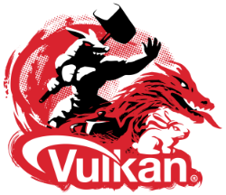

# Vulkan Tutorial Series
##### What is this?

This is a set of lessons intending to walk the reader through the process of learning the basics of Vulkan as used in the Vulkano Rust crate. We'll start with opening your first window and move to creating a toy rendering system that can be used to render simple scenes. In the process, we'll introduce most of the core ideas of Vulkan as well as the most common mechanisms of manipulating data within it. The goal of this series is not to turn you into an expert, it's to make Vulkan accessible and equip you with enough knowledge that you can experiment and research on your own.

One thing this tutorial tries hard to avoid is "rest of the owl syndrome," a common affliction in any piece of documentation written by programmers. The following image describes how it works.

This problem is particularly prevalent for topics that are highly technical or new. Unfortunately, both things apply to Vulkan. There are good tutorials out there, but many others are targeted at people already familiar with graphics programming in general or Vulkan's predecessor, OpenGL, in particular. This is, of course, a subjective interpretation of the subset of tutorials that I've seen; however, this tutorial came out of my dissatisfaction with the resources that are currently out there for people learning graphics programming for the first time with Vulkan.

##### Who is this for?

This tutorial is for anyone who wants to learn Vulkan and/or Rust. The primary audience, however, it mostly people learning graphics programming for the first time. This should still be useful for more advanced users, but you may find the pace of the tutorial slow if you already know the basics of graphics programming. Feel free to skip around or just read the example code if you want to know how to do some particular task using the Vulkano Rust crate.

This tutorial will try to introduce concepts one at a time. We'll walk through the process of creating a rendering system one step at a time, stopping to highlight the key patterns and design choices which you need to adopt to become adept at Vulkan programming.

##### Wait, why is {feature x} so late in the series?

This tutorial series makes a conscious decision to focus on learning the "big picture" of Vulkan as the priority. It's less interested in rushing to show you how to do super-cool effects than in learning the fundamentals you'll need to know if you want to go beyond making tiny toy programs. An example of this is the way we leave textures until after we have a first draft of an actual rendering system. Textures are neat and a requirement for most modern applications, but in my opinion learning textures before you learn, say, how to have a multi-stage rendering process is just getting ahead of ourselves. We have complex ideas we need to get the hang of such as the previously-mentioned multi-stage rendering and having more features than necessary involved just risks overwhelming the reader. Once we have a solid grasp of the fundamentals we can then move on to making it look cool.

## Introduction to Vulkan

#### What is it?

[Vulkan](https://www.khronos.org/vulkan/) is a graphics API. What is an API though? Normally, this would be explained via a Terrible Car Analogy as is tradition in computer science. But I prefer to explain it more as a set of promises that let two programs or computers talk to each other. An API is a list of promises made by an application or server (when talking about web apps) that say "if you give me _this_ data, I'll give you _that_ in return." The application that calls the API doesn't need to know anything about how the other application works, it just needs to know that it can call a certain set of functions to do what it wants.

The "graphics" part of "graphics API" is relatively simple. It's been decades since you could just draw a pixel to the screen directly. Since then, everything involved has gotten much more complicated. This leads to us needing an API to let user programs talk to multiple devices and complicated bits of supporting software. The most well-known of these APIs are Microsoft's DirectX and the Kronos Group's OpenGL. Vulkan is the successor to OpenGL designed to support the most modern graphical hardware and programming practices. In comparison to OpenGL it is harder to set up (as we will see later) but feels more natural in modern applications than OpenGL (which is straight out of the 80s) and directly supports features of more modern hardware that weren't even dreamed of when OpenGL first became popular.

#### How Does it Work?

Fundamentally, the Vulkan (or most other graphics API) workflow is reasonably simple. The program running on a user's computer (simplified as CPU) generates data which is sent to the graphics card (or GPU) with then sends that data through programs that run on the GPU called _shaders_, the output of which is then shown to the user.

Where Vulkan diverges from its predecessor is that you, the programmer, need to specifically tell Vulkan about every single step in the process. This can be very annoying but it does mean that your program will be far more configurable than it would have been in OpenGL.

Once you understand the different structures used by Vulkan it is usually pretty straight-forward to make it do what you want. However, the learning curve is heavily front-loaded, meaning that it can be hard to come to grips with all the different levers and options Vulkan gives you. Getting past that initial learning period is what this tutorial is aiming to help with.

## Introduction to Rust

#### What is it?

[Rust](https://www.rust-lang.org/) is a modern, high-performance language in the C family. It's imperative and strongly-typed and is not an Object Oriented language. It's also the language this tutorial series is written in

#### Why use it?

Rust has a number of compelling features. Foremost among them being:
* Performance - As a compiled language it performs with the speed and efficiency of C under most conditions
* Concurrency - Rust has native support for asynchronous (or *concurrent*) programming. This is a somewhat difficult subject but vital for modern applications.
* Memory Safety - Rust's type system means that you won't have to worry about use-after-free errors, race conditions, or any of a whole host of memory specific issues
* No Garbage Collector - Unlike other memory safe languages, Rust is able to achieve this statically at compile time rather than with a garbage collector (GC) running in the background. This is a major boost to performance over languages like Java.
* Active and friendly community - Every programmer needs to ask for help some times. I've found the Rust community to be very friendly and approachable.

The bit about memory safety and lack of a GC is particularly important for games. Video games or simulators need to move a ton of data around in memory while using as few CPU cycles as possible. Careless use of memory can easily tank the performance of your application or even cause crashes. A GC is one of the most common solutions in modern languages to helping the user keep track of data and removing it when it's no longer used; however, a GC uses memory and CPU cycles on its own. A highly-optimized app written in a garbage collected language can be tuned to avoid having the GC run as much as possible, but that requires a high level of skill. Rust makes that combination of memory safety and performance accessible to the general masses.   

#### Why not use it?

I love Rust but I'm going to be honest, there are some downsides you should know before heading in.
* Long compile times - non-trivial applications can take a much longer time to compile than a similar C or Java program
* Learning curve - Rust's memory model lets you write high-quality, high-performance code but it's different enough from other languages that it takes some getting used to.
* Missing features - Although Rust is *mostly* complete, there are some aspects that are still missing or under development. For example, Rust has supported multi-threading from the beginning but it's only been very recently that modern `async/await` syntax has been introduced and there are still some aspects that are considered unstable
* Immature ecosystem - The Rust language itself is well documented but it's still a young language (version 1.0 came out in 2015) and many of the community-provided libraries are unstable, incomplete, and poorly documented

In general, you can do anything in Rust that you can in any other language but you need to be prepared for a less polished experience than other languages might give you. Rust development will involve a degree of experimentation and extra work.

#### Why Does This Tutorial Use It?

This tutorial uses Rust because I like it. There's not really a deeper reason there. I find the process of writing Rust code enjoyable and (usually) intuitive. I'm also optimistic about Rust's future in the game development space because I think its unique features make it well-suited to the kind of demands that games place on the developer. There are plenty of people who've looked at the current state of Rust and decided it wasn't for them and I can't blame anyone for that. Whether Rust is right for you is entirely up to your own personal preference. Software developers can be prone to saying that "Real programmers use {X} instead of {Y}" but the only thing that actually matters about your choice of languages and tools is whether or not you can do what you want to and whether you, personally, enjoy the experience.

## Glossary

I'll define a few terms here that will be used throughout the tutorial series. This won't define every technical term but just a few that are needed for clarity.

 * CPU - [Central Processing Unit](https://en.wikipedia.org/wiki/Central_processing_unit). This is the part of your computer that runs most applications you're familiar with. The operating system, web browser, IDE, and most other programs are run here. In these lessons it's used mostly to differentiate the parts of our application that aren't running on the graphics hardware. Consider "CPU" another way of saying "our main application."
 * GPU - [Graphics Processing Unit](https://en.wikipedia.org/wiki/Graphics_processing_unit). This is the equivalent to the CPU except for our graphics hardware. In most cases this will be located in an external graphics card; however, modern CPUs also contain some GPU elements as well. An important thing to consider is that the GPU is basically a different computer located inside the same case as the CPU. In these lessons "GPU" is often used synonymously with "the parts of our program that aren't written in Rust."
 * Render Code - This refers to the actual code we call to render something to the screen.
 * Render System - This represents the abstract framework we're going to be building that can accept an arbitrary number of meshes and light sources and output a rendered scene. Note: This is *not* the same thing as a game engine. Game engines *contain* rendering systems but also contain far more than that. We will not move outside the realm of graphics to talk about any of these other things that real game engines do.
 * Shader - A program that runs on the GPU. Creating, uploading, the executing these shaders is a major part of graphics programming.
