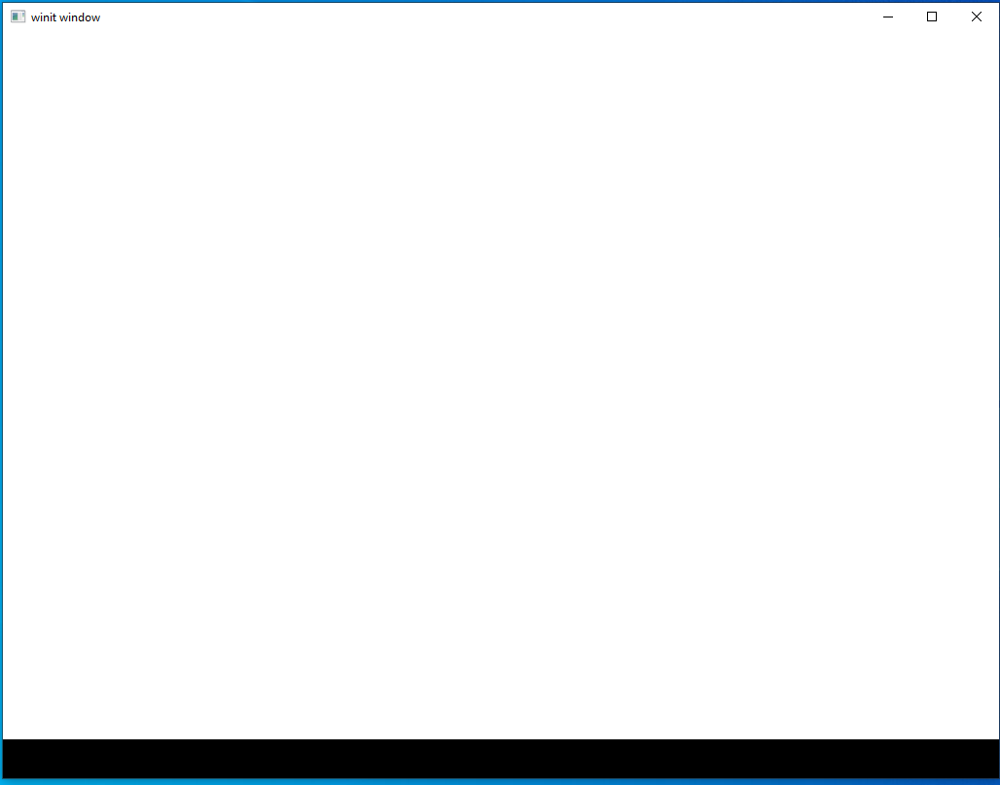
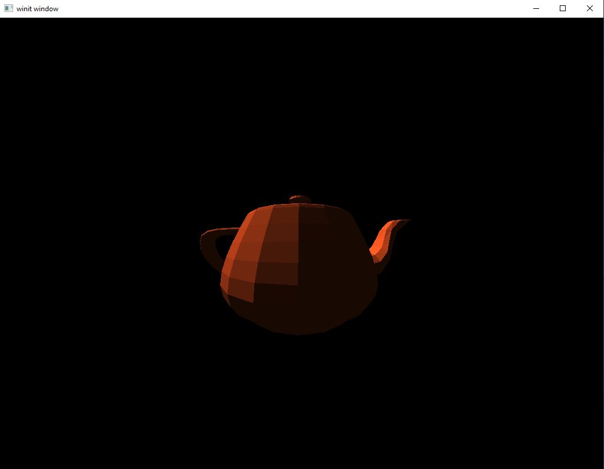
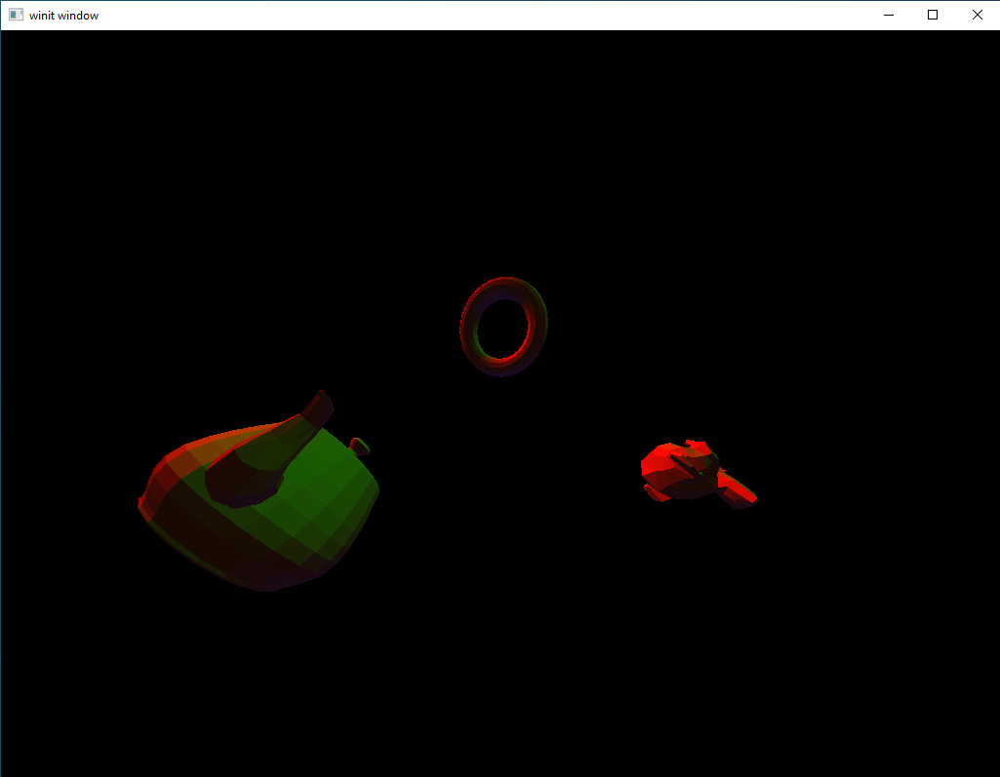

# Render System I

After completing 10 lessons in Vulkan let's take stock of where we are. At the start of this series we had a blank `main.rs` and no idea how to make it do anything interesting. At the end of a lengthy first lesson we had a blank screen that didn't do anything. However, now we have a multi-staged rendering pipeline running three sets of shaders to render models, ambient lighting, and directional lights. That we have not learned everything we might want to know about basic rendering should not take away from appreciating how far we've come to make it to this point.

This lesson will serve as a review, of a sort. We won't be learning anything new and we won't even be writing that much new code. Instead, we'll take the code we already have and see if we can't re-work it into a stand-alone rendering system.

#### Project Goals

The project we want to create must meet 5 criteria
1. It needs to exist outside of `main.rs`
2. It needs to accept an arbitrary number of model inputs
3. It needs to accept an arbitrary number of directional lights
4. It needs to accept a single ambient light argument
5. It needs to be about to output to the screen as part of our main program loop

Let's go through them item by item.

`1. It needs to exist outside of main.rs`

 We want to create a new module that our `main` function can use like any other module, rather than requiring `main` to be based entirely around handling Vulkan.

`2. It needs to accept an arbitrary number of model inputs`

We've only been rendering one model up until now. After the last lesson we've freed ourselves from that constraint. It's time to make use of that.

`3. It needs to accept an arbitrary number of directional lights`

We've already seen a way to include however many directional lights we want, so we just need to roll that existing capability into the new system.

`4. It needs to accept a single ambient light argument`

Ambient lighting, pretty much by definition, is a singular item.

`5. It needs to be about to output to the screen as part of our main program loop`

Self-explanatory, really. Our rendering system needs to be able to actually render things that the user can see.

#### Mock-up

The following [pseudocode](https://en.wikipedia.org/wiki/Pseudocode) will give us a look at how we want to use the final product.

```rust
mod render_system;
use render_system::System;

// ...

fn main() {
    let mut system = System::new();

    // ...

    loop {
        // ...

        system.start_frame();
        system.render_model(cube);
        system.render_model(teapot);
        system.render_light(directional_one);
        system.render_light(directional_two);
        system.render_ambient(ambient);
        system.finish_frame();

        // ...
    }
}
```

From the example here you can see that our main program loop will still handle creating the different models and lights and asking for them to be rendered. Our final render system will be set up to handle more of that automatically.

## Part 1: Back to Basics

Quick, what is the first thing you need to do in any Vulkan program? That's right: wade through more initialisation than you can handle!

Where we take care of this tedious but necessary task is suddenly an open question. Do we want to have our render system entirely encapsulate the Vulkan portions of our application, or do we want to do at least some of the initial setup in our main application? The answer can depend on exactly what we want out of our system. Do we want something that we can import into other projects as a plug-and-play solution to rendering things or are we fine with something that's more tightly coupled with the host application?

Part of the reason we need to ask this is that the more we encapsulate Vulkan setup the more work we have to do to expose the different settings to the calling code. In Rust this is usually accomplished with the [Builder Pattern](https://doc.rust-lang.org/1.0.0/style/ownership/builders.html). Personally, I like it and I encourage you to read the link if you're not familiar with it. However, the trade off is that for something with as many different options to choose and decisions to make as Vulkan, producing a builder that covers even a minimal number of them is going to be a lot of work.

Another option is to move most or all of the Vulkan code into its own sub-system but make little or no effort to let calling code configure it. Instead, changes are made directly to the Vulkan rendering sub-system. This is an *integrated* solution and it is what we'll be basing our rendering system on.

##### Setting up our System Module

Let's move our rendering system into its own module. Shaders should go in as a sub-module as well.

```
src/
    models/
    obj_loader/
    system/
        shaders/
        mod.rs
        system.rs
    main.rs
    model.rs
```

Let's look at the initial state of our files
`main.rs`
```rust
mod model;
mod obj_loader;
mod system;

use system::System;

fn main() {

}
```
We've blanked everything out in our `main.rs` file. The only thing we do here is import all our modules.

`system/system.rs`
```rust
pub struct System {

}
```

This *will* be exciting but for now it's nothing more than a place-holder. We'll be adding stuff shortly but for now I want to look at how it fits into the Rust project structure system, which can be a bit confusing to people just starting to work with Rust.

`system/mod.rs`
```rust
mod system;

pub use system::System as System;
```

If you aren't familiar with Rust's module declaration we are re-exporting our new `System` struct on the package level namespace. If we just had `pub mod system;` then it would need to be imported into `main.rs` by calling `use system::system::System;`.

A `mod.rs` file is the "root file" of each Rust module, with other files in the same directory being considered sub-modules. We need to gather up all the sub-modules using either `mod` or `pub mod` to have them be compiled. The difference between `mod` and `pub mod` is that the latter means that modules one level higher can use it.

As an example, let's say we add a file named `foo.rs` to our system directory. If we used `mod foo;` in our `mod.rs` file then `system.rs` could use code in `foo.rs` but `main.rs` could not. If we changed it to `pub mod foo;` then both `system.rs` and `main.rs` can see code inside `foo.rs`.

#### Instance

Let's take a look at moving our `Instance` inside `System`.

`system/system.rs`
```rust
pub struct System {
    instance: Arc<Instance>
}

impl System {
    pub fn new() -> System {
        let instance = {
            let extensions = vulkano_win::required_extensions();
            Instance::new(None, &extensions, None).unwrap()
        };

        System{
            instance
        }
    }
}
```

It's not much, but it shows the pattern we'll be using, with our struct saving the values we create as part of starting up.

Let's take a quick look at `main.rs`
```rust
fn main() {
    let mut system = System::new();
}
```

While we're at it, let's take care of another easy item.

`system/system.rs`
```rust
pub struct System {
    instance: Arc<Instance>
}

impl System {
    pub fn new() -> System {
        let instance = {
            let extensions = vulkano_win::required_extensions();
            Instance::new(None, &extensions, None).unwrap()
        };

        let physical = PhysicalDevice::enumerate(&instance).next().unwrap();

        System{
            instance
        }
    }
}
```

We don't need to store `physical` because we won't be using outside of this initialisation process.

#### Our Window

Now we reach the first complication, what to do with our `Window` and related code. Most of the places we need to know about this information can safely be moved inside the `System` struct but our main program loop will still be inside `main.rs` and for that we need to know about the `EventsLoop`. We can solve this by creating our `EventsLoop` inside `main()` and passing it as an argument to `System::new()`

`main.rs`
```rust
fn main() {

  let event_loop = EventLoop::new();
  let mut system = System::new(&event_loop);

  event_loop.run(move |event, _, control_flow| {
      match event {
          Event::WindowEvent { event: WindowEvent::CloseRequested, .. } => {
              *control_flow = ControlFlow::Exit;
          },
          Event::WindowEvent { event: WindowEvent::Resized(_), .. } => {
          },
          Event::RedrawEventsCleared => {
          },
          _ => ()
        }
      });
}
```

We have created our `EventLoop` object and created an empty main program loop that polls for window close events. If you run this (after also updating `system.rs`) you will see a blank window that closes when you click the "x" button.

`system.rs`
```rust
pub struct System {
    instance: Arc<Instance>,
    surface: Arc<Surface<Window>>,
}

impl System {
    pub fn new(event_loop: &EventLoop) -> System {
        let instance = {
            let extensions = vulkano_win::required_extensions();
            Instance::new(None, &extensions, None).unwrap()
        };

        let physical = PhysicalDevice::enumerate(&instance).next().unwrap();

        let surface = WindowBuilder::new().build_vk_surface(&event_loop, instance.clone()).unwrap();

        System{
            instance,
            surface
        }
    }
}
```

#### Devices and Queues

Let's set up our `Device` and `Queue` information now.

`system.rs`
```rust
pub struct System {
    // ...
    device: Arc<Device>,
    queue: Arc<Queue>,
}

impl System {
    pub fn new(event_loop: &EventLoop) -> System {
        // ...
        let device_ext = DeviceExtensions { khr_swapchain: true, .. DeviceExtensions::none() };
        let (device, mut queues) = Device::new(physical, physical.supported_features(), &device_ext,
            [(queue_family, 0.5)].iter().cloned()).unwrap();

        let queue = queues.next().unwrap();
        // ...
        System{
            // ...
            device,
            queue,
        }
    }
}
```

We need to know `device` and `queue` later in the rendering process, but the other variables are safe to allow to go out of scope once initialisation is done.

#### Swapchain

Now let's create our swapchain and images. However, before we can do that we need to handle the fact that our swapchain logic requires a View-Projection matrix object. This is an easy fix, we can just bring it into `system.rs` from `main.rs`. It can be consumed internally by `System` so we don't need to worry about letting other files use it.

`system.rs`
```rust
pub struct System {
    // ...
    vp: VP
}

#[derive(Debug, Clone)]
struct VP {
    view: TMat4<f32>,
    projection: TMat4<f32>
}

impl VP {
    fn new() -> VP {
        VP {
            view: identity(),
            projection: identity(),
        }
    }
}

impl System {
    pub fn new(event_loop: &EventLoop) -> System {
        // ...
        let mut vp = VP::new();
        System{
            // ...
            vp,
        }
    }
}
```

Now let's add the swapchain proper. We need to save `swapchain` and `images`, both of which have some *interesting* type declarations, but nothing we can't handle. Working out complex types is one of the reasons it's nice to use an IDE, as it lets you examine the types of different variables in cases where Rust lets you elide manually declaring the type.

`system.rs`
```rust
pub struct System {
    // ...
    swapchain: Arc<Swapchain<Window>>,
}

impl System {
    pub fn new(event_loop: &EventLoop) -> System {
        // ...

        let (swapchain, images) = {
            let caps = surface.capabilities(physical).unwrap();
            let usage = caps.supported_usage_flags;
            let alpha = caps.supported_composite_alpha.iter().next().unwrap();
            let format = caps.supported_formats[0].0;
            let dimensions: [u32; 2] = surface.window().inner_size().into();

            Swapchain::new(device.clone(), surface.clone(), caps.min_image_count, format,
                           dimensions, 1, usage, &queue, SurfaceTransform::Identity, alpha,
                           PresentMode::Fifo, FullscreenExclusive::Default, true, ColorSpace::SrgbNonLinear).unwrap()
        };

        System{
            // ...
            swapchain,
        }
    }
}
```

#### Shaders

Since we don't need our shaders to be used outside of `system.rs` we can just declare them there.

`system.rs`
```rust
mod deferred_vert {
    vulkano_shaders::shader!{
        ty: "vertex",
        path: "src/system/shaders/deferred.vert"
    }
}

mod deferred_frag {
    vulkano_shaders::shader!{
        ty: "fragment",
        path: "src/system/shaders/deferred.frag"
    }
}

mod directional_vert {
    vulkano_shaders::shader!{
        ty: "vertex",
        path: "src/system/shaders/directional.vert"
    }
}

mod directional_frag {
    vulkano_shaders::shader!{
        ty: "fragment",
        path: "src/system/shaders/directional.frag"
    }
}

mod ambient_vert {
    vulkano_shaders::shader!{
        ty: "vertex",
        path: "src/system/shaders/ambient.vert"
    }
}

mod ambient_frag {
    vulkano_shaders::shader!{
        ty: "fragment",
        path: "src/system/shaders/ambient.frag"
    }
}

impl System {
    pub fn new(event_loop: &EventLoop) -> System {
        // ...

        let deferred_vert = deferred_vert::Shader::load(device.clone()).unwrap();
        let deferred_frag = deferred_frag::Shader::load(device.clone()).unwrap();
        let directional_vert = directional_vert::Shader::load(device.clone()).unwrap();
        let directional_frag = directional_frag::Shader::load(device.clone()).unwrap();
        let ambient_vert = ambient_vert::Shader::load(device.clone()).unwrap();
        let ambient_frag = ambient_frag::Shader::load(device.clone()).unwrap();

        System{
            // ...
        }
    }
}
```

The shader declarations are pretty much the same as before, we've just had to update the `path` value to reflect the way we've moved the `shaders` directory. All shader paths are relative to the `Cargo.toml` file so it doesn't matter that we're calling them from `shaders/shaders.rs` instead of `main.rs`. Note also that we're seeing the data type of our shaders for the first time so far in our project. Looking at the data types of shaders as well as the data types contained *within* the shaders is an important part of being able to use them effectively. Despite the somewhat "hacky" nature of Vulkano's shader compile process it makes it easy to reason about them once you have them compiled.

#### Buffers

Declaring our buffer pools as well as our VP buffer is rather straight-forward but does involve figuring out the specific data types being output by Vulkano.

`systems.rs`
```rust
pub struct System {
    // ...
    vp_buffer:Arc<CpuAccessibleBuffer<deferred_vert::ty::VP_Data>>,
    model_uniform_buffer:CpuBufferPool<deferred_vert::ty::Model_Data>,
    ambient_buffer:CpuBufferPool<ambient_frag::ty::Ambient_Data>,
    directional_buffer:CpuBufferPool<directional_frag::ty::Directional_Light_Data>,
}

impl System {
    pub fn new(event_loop: &EventLoop) -> System {
        // ...

        let mut vp_buffer = CpuAccessibleBuffer::from_data(
            device.clone(),
            BufferUsage::all(),
            false,
            deferred_vert::ty::VP_Data {
                view: vp.view.into(),
                projection: vp.projection.into(),
            }
        ).unwrap();

        let model_uniform_buffer = CpuBufferPool::<deferred_vert::ty::Model_Data>::uniform_buffer(device.clone());
        let ambient_buffer = CpuBufferPool::<ambient_frag::ty::Ambient_Data>::uniform_buffer(device.clone());
        let directional_buffer = CpuBufferPool::<directional_frag::ty::Directional_Light_Data>::uniform_buffer(device.clone());

        System{
            // ...
            vp_buffer,
            model_uniform_buffer,
            ambient_buffer,
            directional_buffer,
        }
    }
}
```

#### Renderpass

Storing our renderpass object is fairly simple but we will not be storing our sub-pass information. This one is on me, I think. I just couldn't figure out the combination of types necessary to satisfy Vulkano's requirements. This is, in part, because the use of the `ordered_passes_renderpass!` macro means that it is generating a new data type when the code is executed. This makes it harder to reason about ahead of time. Nonetheless, we will see ways to pass subpasses around later.

`system.rs`
```rust
pub struct System {
    // ...
    render_pass: Arc<dyn RenderPassAbstract + Send + Sync>,
}

impl System {
    pub fn new(event_loop: &EventLoop) -> System {
        // ...

        let render_pass = Arc::new(vulkano::ordered_passes_renderpass!(device.clone(),
            attachments: {
                final_color: {
                    load: Clear,
                    store: Store,
                    format: swapchain.format(),
                    samples: 1,
                },
                color: {
                    load: Clear,
                    store: DontCare,
                    format: Format::A2B10G10R10UnormPack32,
                    samples: 1,
                },
                normals: {
                    load: Clear,
                    store: DontCare,
                    format: Format::R16G16B16A16Sfloat,
                    samples: 1,
                },
                depth: {
                    load: Clear,
                    store: DontCare,
                    format: Format::D16Unorm,
                    samples: 1,
                }
            },
            passes: [
                {
                    color: [color, normals],
                    depth_stencil: {depth},
                    input: []
                },
                {
                    color: [final_color],
                    depth_stencil: {},
                    input: [color, normals]
                }
            ]
        ).unwrap());

        let deferred_pass = Subpass::from(render_pass.clone(), 0).unwrap();
        let lighting_pass = Subpass::from(render_pass.clone(), 1).unwrap();

        System{
            // ...
            render_pass,
        }
    }
}
```

#### Graphics Pipelines

Now we need to declare our graphics pipelines. Luckily, these are much easier to store than our sub-passes. The only thing to note is that we need to import both `DummyVertex` and `NormalVertex` and run `impl_vertex!` on them.

`system.rs`
```rust
use crate::obj_loader::{DummyVertex, NormalVertex};

vulkano::impl_vertex!(DummyVertex, position);
vulkano::impl_vertex!(NormalVertex, position, normal, color);

pub struct System {
    // ...
    deferred_pipeline: Arc<dyn GraphicsPipelineAbstract + Send + Sync>,
    directional_pipeline: Arc<dyn GraphicsPipelineAbstract + Send + Sync>,
    ambient_pipeline: Arc<dyn GraphicsPipelineAbstract + Send + Sync>,
}

impl System {
    pub fn new(event_loop: &EventLoop) -> System {
        // ...

        let deferred_pipeline = Arc::new(GraphicsPipeline::start()
            .vertex_input_single_buffer::<NormalVertex>()
            .vertex_shader(deferred_vert.main_entry_point(), ())
            .triangle_list()
            .viewports_dynamic_scissors_irrelevant(1)
            .fragment_shader(deferred_frag.main_entry_point(), ())
            .depth_stencil_simple_depth()
            .front_face_counter_clockwise()
            .cull_mode_back()
            .render_pass(deferred_pass.clone())
            .build(device.clone())
            .unwrap());

        let directional_pipeline = Arc::new(GraphicsPipeline::start()
            .vertex_input_single_buffer::<DummyVertex>()
            .vertex_shader(directional_vert.main_entry_point(), ())
            .triangle_list()
            .viewports_dynamic_scissors_irrelevant(1)
            .fragment_shader(directional_frag.main_entry_point(), ())
            .blend_collective(AttachmentBlend {
                enabled: true,
                color_op: BlendOp::Add,
                color_source: BlendFactor::One,
                color_destination: BlendFactor::One,
                alpha_op: BlendOp::Max,
                alpha_source: BlendFactor::One,
                alpha_destination: BlendFactor::One,
                mask_red: true,
                mask_green: true,
                mask_blue: true,
                mask_alpha: true,
            })
            .front_face_counter_clockwise()
            .cull_mode_back()
            .render_pass(lighting_pass.clone())
            .build(device.clone())
            .unwrap());

        let ambient_pipeline = Arc::new(GraphicsPipeline::start()
            .vertex_input_single_buffer::<DummyVertex>()
            .vertex_shader(ambient_vert.main_entry_point(), ())
            .triangle_list()
            .viewports_dynamic_scissors_irrelevant(1)
            .fragment_shader(ambient_frag.main_entry_point(), ())
            .blend_collective(AttachmentBlend {
                enabled: true,
                color_op: BlendOp::Add,
                color_source: BlendFactor::One,
                color_destination: BlendFactor::One,
                alpha_op: BlendOp::Max,
                alpha_source: BlendFactor::One,
                alpha_destination: BlendFactor::One,
                mask_red: true,
                mask_green: true,
                mask_blue: true,
                mask_alpha: true,
            })
            .front_face_counter_clockwise()
            .cull_mode_back()
            .render_pass(lighting_pass.clone())
            .build(device.clone())
            .unwrap());

        System{
            // ...
            deferred_pipeline,
            directional_pipeline,
            ambient_pipeline,
        }
    }
}
```

#### Buffers and odds-and-ends

We're almost done, time to just wrap up with a few bits and pieces that don't really go anywhere else

`system.rs`
```rust
pub struct System {
    // ...
    dummy_verts: Arc<CpuAccessibleBuffer<[DummyVertex]>>,
    dynamic_state: DynamicState,
    framebuffers: Vec<Arc<dyn FramebufferAbstract + Send + Sync>>,
    color_buffer: Arc<AttachmentImage>,
    normal_buffer: Arc<AttachmentImage>,
    previous_frame_end: Box<dyn GpuFuture>,
    vp_set: Arc<dyn DescriptorSet + Send + Sync>,
}

impl System {
    pub fn new(event_loop: &EventLoop) -> System {
        // ...

        let dummy_verts = CpuAccessibleBuffer::from_iter(
            device.clone(),
            BufferUsage::all(),
            false,
            DummyVertex::list().iter().cloned()
        ).unwrap();

        let mut dynamic_state = DynamicState { line_width: None, viewports: None, scissors: None, compare_mask: None, write_mask: None, reference: None };

        let (framebuffers, color_buffer, normal_buffer) = System::window_size_dependent_setup(device.clone(), &images, render_pass.clone(), &mut dynamic_state);

        let vp_layout = deferred_pipeline.descriptor_set_layout(0).unwrap();
        let vp_set = Arc::new(PersistentDescriptorSet::start(vp_layout.clone())
            .add_buffer(vp_buffer.clone()).unwrap()
            .build().unwrap());

        System{
            // ...
            dummy_verts,
            dynamic_state,
            framebuffers,
            color_buffer,
            normal_buffer,
            vp_set,
        }
    }

    fn window_size_dependent_setup(
        device: Arc<Device>,
        images: &[Arc<SwapchainImage<Window>>],
        render_pass: Arc<dyn RenderPassAbstract + Send + Sync>,
        dynamic_state: &mut DynamicState
    ) -> (Vec<Arc<dyn FramebufferAbstract + Send + Sync>>, Arc<AttachmentImage>, Arc<AttachmentImage>) {
        let dimensions = images[0].dimensions();

        let viewport = Viewport {
            origin: [0.0, 0.0],
            dimensions: [dimensions[0] as f32, dimensions[1] as f32],
            depth_range: 0.0 .. 1.0,
        };
        dynamic_state.viewports = Some(vec!(viewport));

        let color_buffer = AttachmentImage::transient_input_attachment(device.clone(), dimensions, Format::A2B10G10R10UnormPack32).unwrap();
        let normal_buffer = AttachmentImage::transient_input_attachment(device.clone(), dimensions, Format::R16G16B16A16Sfloat).unwrap();
        let depth_buffer = AttachmentImage::transient_input_attachment(device.clone(), dimensions, Format::D16Unorm).unwrap();

        (images.iter().map(|image| {
            Arc::new(
                Framebuffer::start(render_pass.clone())
                    .add(image.clone()).unwrap()
                    .add(color_buffer.clone()).unwrap()
                    .add(normal_buffer.clone()).unwrap()
                    .add(depth_buffer.clone()).unwrap()
                    .build().unwrap()
            ) as Arc<dyn FramebufferAbstract + Send + Sync>
        }).collect::<Vec<_>>(), color_buffer.clone(), normal_buffer.clone())
    }

    pub fn set_view(&mut self, view: &TMat4<f32>) {
        self.vp.view = view.clone();
        self.vp_buffer = CpuAccessibleBuffer::from_data(
            self.device.clone(),
            BufferUsage::all(),
            false,
            deferred_vert::ty::VP_Data {
                view: self.vp.view.into(),
                projection: self.vp.projection.into(),
            }
        ).unwrap();

        let vp_layout = self.deferred_pipeline.descriptor_set_layout(0).unwrap();
        let self.vp_set = Arc::new(PersistentDescriptorSet::start(vp_layout.clone())
            .add_buffer(self.vp_buffer.clone()).unwrap()
            .build().unwrap());

        self.render_stage = RenderStage::Stopped;
    }
}
```

A quick note on what's going on with `vp_set` as it has the odd type of `Arc<dyn DescriptorSet + Send + Sync>`. If you tried to use just `Arc<dyn DescriptorSet>` it would work for now, however, we would run into problems later. The reason for this is limitations in something called _type inference_.

Rust has a very powerful [type inference](https://doc.rust-lang.org/rust-by-example/types/inference.html) system where it can automatically detect (or _infer_) the data types of our variables. However, there are cases where the automatic systems reach their limit and we have to manually tell Rust what type something has. We'll look at what this means in more detail when we actually use `vp_set`, but the key idea to take away right now is that `Arc<dyn DescriptorSet + Send + Sync>` is _not_ the same thing as `Arc<dyn DescriptorSet>` even if the data we store in the variable also implements the `Send + Sync` traits.

This is, in my opinion, one of the friction points in learning Rust that lingers even after you've mastered other challenges like the Borrow Checker. The errors put out by the compiler are much less helpful in this case than they usually are because the types involved are often complex and hard to read. Like with borrowing, however, this is definitely something you _can_ overcome. Just take things one step at a time and don't let yourself feel intimidated.  

#### Running the Code



This is what we expect to see without a rendering pipeline set up. The fact that we even see this much means that everything we just set up is working correctly and isn't causing any crashes.

## Part 2: Setting Up Rendering

#### Tracking State

First, let's create a new enum. This enum will let `System` keep track of what render stage it's in. Keeping track of the stage is important because each one could be called more than once and we want to be able to make sure that everything is being called in the right order.

`system.rs`
```rust
#[derive(Debug, Clone)]
enum RenderStage {
    Stopped,
    Deferred,
    Ambient,
    Directional,
    NeedsRedraw,
}

pub struct System {
    // ...
    render_stage: RenderStage,
}

impl System {
    pub fn new(event_loop: &EventLoop) -> System {
        // ...
        let render_stage = RenderStage::Stopped;
        System{
            // ...
            render_stage,
        }
    }
}
```

Those with some formal education in computer science or some professional experience might recognize that this is setting up a [state machine](https://en.wikipedia.org/wiki/Finite-state_machine). For those who don't know what that means, briefly it means that there are a certain number of _states_ our program can be in and, from any given state there are only a few states it could _transition_ into. There are crates that specifically implement fully-featured state machines but those are far more powerful than we need. So for this set of tutorials we will stick with what we write here.

#### Getting Started

Now let's create the method we can call to start a single render operation. The main things we need to accomplish in this method is to establish our command buffer builder and to get an image from the swapchain.

`system.rs`
```rust

pub struct System {
    // ...
    commands: Option<AutoCommandBufferBuilder>,
    img_index: usize,
    acquire_future: Option<SwapchainAcquireFuture<Window>>,
}

impl System {
    pub fn new(event_loop: &EventLoop) -> System {
        // ...
        let commands = None;
        let img_index = 0;
        let acquire_future = None;

        System{
            // ...
            commands,
            img_index,
            acquire_future,
        }   
    }

    pub fn start(&mut self) {
        let (img_index, suboptimal, acquire_future) = match swapchain::acquire_next_image(self.swapchain.clone(), None) {
            Ok(r) => r,
            Err(AcquireError::OutOfDate) => {
                self.recreate_swapchain();
                return;
            },
            Err(err) => panic!("{:?}", err)
        };

        if suboptimal {
          self.recreate_swapchain();
          return;
        }

        let clear_values = vec![[0.0, 0.0, 0.0, 1.0].into(), [0.0, 0.0, 0.0, 1.0].into(), [0.0, 0.0, 0.0, 1.0].into(), 1f32.into()];

        self.commands = Some(AutoCommandBufferBuilder::primary_one_time_submit(self.device.clone(), self.queue.family()).unwrap()
            .begin_render_pass(self.framebuffers[img_index].clone(), false, clear_values)
            .unwrap());

        self.img_index = img_index;

        self.acquire_future = Some(acquire_future);
    }
}
```

With this we see we need to add three new variables to our struct to track the index of our located image, the future which represents the point at which the image is available to use, and a command buffer builder.

If it seems odd that we use rendering commands like `.begin_render_pass` at this point remember that we're setting up a *queue* of commands. None of these commands are being executed right now, we're just telling Vulkano what order to run the commands in when we do want to run them.

Before finishing up, let's take advantage of the enum we added in the last section.

`system.rs`
```rust
impl System {
    pub fn start(&mut self) {
        match self.render_stage {
            RenderStage::Stopped => {
                self.render_stage = RenderStage::Deferred;
            },
            RenderStage::NeedsRedraw => {
                self.recreate_swapchain();
                self.commands = None;
                self.render_stage = RenderStage::Stopped;
                return;
            },
            _ => {
                self.render_stage = RenderStage::Stopped;
                self.commands = None;
                return;
            }
        }
        // ...
    }
}
```

This enforces the rules of our render system about what order everything can be called from. If this method is called out of order (when the `render_stage` is not `Stopped`) it resets the appropriate variables meaning that we'll need to start over and do it right if we want to do any rendering. In a real application we'd probably want this to be an error that we listen for somewhere else but for now we'll silently handle incorrect states.

#### Finishing Up

Now that we've added the `start` method to start a render operation let's skip ahead to the end. The things this method to do are simple: we need it to finish up our command buffer, submit it to our GPU, and handle the `future` objects which keep everything happening in the proper order. Most of this code is taken directly from the previous lesson with a couple important exceptions that we'll dedicate the next section to exploring.

`system.rs`
```rust
impl System {
    pub fn finish(&mut self, previous_frame_end: &mut Box<dyn GpuFuture>) {
        match self.render_stage {
            RenderStage::Directional => {
            },
            RenderStage::NeedsRedraw => {
                self.recreate_swapchain();
                self.commands = None;
                self.render_stage = RenderStage::Stopped;
                return;
            },
            _ => {
                self.commands = None;
                self.render_stage = RenderStage::Stopped;
                return;
            }
        }

        let command_buffer = self.commands.take()
            .unwrap()
            .end_render_pass()
            .unwrap()
            .build()
            .unwrap();

        let af = self.acquire_future.take().unwrap();

        let mut local_future:Option<Box<dyn GpuFuture>> = Some(Box::new(sync::now(self.device.clone())) as Box<dyn GpuFuture>);

        mem::swap(&mut local_future, previous_frame_end);

        let future = local_future.take().unwrap().join(af)
            .then_execute(self.queue.clone(), command_buffer).unwrap()
            .then_swapchain_present(self.queue.clone(), self.swapchain.clone(), self.img_index)
            .then_signal_fence_and_flush();

        match future {
            Ok(future) => {
                *previous_frame_end = Some(Box::new(future) as Box<_>);
            }
            Err(FlushError::OutOfDate) => {
                self.recreate_swapchain();
                *previous_frame_end = Some(Box::new(sync::now(self.device.clone())) as Box<_>);
            }
            Err(e) => {
                println!("Failed to flush future: {:?}", e);
                *previous_frame_end = Some(Box::new(sync::now(self.device.clone())) as Box<_>);
            }
        }

        self.commands = None;
        self.render_stage = RenderStage::Stopped;
    }
}
```

Like before, we open this method with some code to check that we're in the proper state to finish up our command queue and do to actually execute the commands. Connected to that is the code at the very end of the method where we make sure to set the state of our `System` to something that can be used with `System.start()`.

Something that we did not see in `start` is `previous_frame_end`. For now, we are having our main application hold on to `previous_frame_end` which, if you recall is the `future` object we use to keep track of all the asynchronous operations used to render to the screen. We could keep track of this inside `System` itself, but for now it's easier to leave that in the hands of our `main` function.

Other than that, there are only two surprises hiding in our code. At first glance everything seems nice and boring, just code we've seen in every lesson before now; however, on second glance you might notice that we aren't using `acquire_future` or `previous_frame_end`. Instead, we're doing something a bit unexpected and assigning them to local variables. Why? To understand this we have to look at that most (in)famous part of Rust: the borrow checker.

#### Wrestling with the Borrow Checker

Rust's memory model, the reason it's able to get C-level performance while having Java-level memory safety, comes from its system of *ownership*. This is a topic that we can't really get in depth here but the short version is this: every single bit of memory used by our application is "owned" by something. That memory can be "borrowed" by other things in the code but, just like in real life, there are rules about what you can do with something you borrowed from someone else. The [main Rust docs](https://doc.rust-lang.org/book/ch04-00-understanding-ownership.html) has a better explanation than I could give here but the key point for us right now is that Rust puts strict limits on when you can *transfer* ownership from one thing to another and this is a problem because we need to do that twice in our `finish` method.

The simplest of the two examples is probably how we handle our `acquire_future` variable. Let's quickly take a look back at what happens there.

```rust
let af = self.acquire_future.take().unwrap();
```

Remember that `acquire_future` is an `Option` that might either have a `SwapchainAcquireFuture` variable stored inside or be `None`. We want to take that `SwapchainAcquireFuture` variable and give it to something else a few lines later, transferring ownership away from the initial owner to our new code. This is a problem because `acquire_future` is owned by `System` itself. In Rust-speak we want to change the ownership of `acquire_future` while *inside* the code context which owns it.

Here `take()` comes to our rescue. A [method of the `Option` type](https://doc.rust-lang.org/std/option/enum.Option.html#method.take), `take()` "swaps out" the value being stored inside an `Option` with `None` and returns the initial value as a new variable, a process demonstrated by this technical presentation:


It might seem like we're "cheating" the compiler here because we're getting something that it initially doesn't want to give up. However, when we think about it we can intuit that we're actually working inside Rust's memory requirements just fine. The `acquire_future` variable still owns its own chunk of memory, it's just that that chunk now holds `None` and we have a *new* variable (in this case named `af`) which owns its own chunk of memory. Inside this second chunk of memory is the data that was initially inside the memory that `acquire_future` owned. So all our data is still owned by *someone* and the compiler can verify that, but we've moved the data we wanted into a new location.

Our second example might make this more clear.

```rust
let mut local_future:Option<Box<dyn GpuFuture>> = Some(Box::new(sync::now(self.device.clone())) as Box<dyn GpuFuture>);
mem::swap(&mut local_future, previous_frame_end);
```

With `previous_frame_end` we're in the same boat as `acquire_future` with some data we need to take ownership of locked behind a context which doesn't let us do that. In this case, `previous_frame_end` is owned by whoever is calling the `finish` method. What we do here is create a new local variable ourselves of the same type as `previous_frame_end` and then use `mem::swap` to, as the name implies, *swap* the data in each memory location. So `local_future` now contains the data that used to be inside `previous_frame_end` and `previous_frame_end` contains the (empty) data that used to be inside `local_future`. Here we do explicitly what `take()` does automatically for us with `acquire_future`.

Ownership can be a tricky subject, especially once you graduate from simple applications and start creating more complicated things. I'll admit that this particular example gave me a lot of trouble when I was initially coding this. The main advice I can give it to just keep at it. Experience is the best teacher in my opinion, and google is your friend. Soon enough thinking in terms of ownership will be second nature.

#### Adding Models

Now let's make a method that lets us add a model to our rendered scene. This will also give us a better look at some data type issues briefly mentioned earlier in this lesson.

`system.rs`
```rust
impl System {
    pub fn geometry(&mut self, model: &mut Model) {
        match self.render_stage {
            RenderStage::Deferred => {
            },
            RenderStage::NeedsRedraw => {
                self.recreate_swapchain();
                self.render_stage = RenderStage::Stopped;
                self.commands = None;
                return;
            },
            _ => {
                self.render_stage = RenderStage::Stopped;
                self.commands = None;
                return;
            }
        }

        let model_uniform_subbuffer = {
            let (model_mat, normal_mat) = model.model_matrices();

            let uniform_data = deferred_vert::ty::Model_Data {
                model: model_mat.into(),
                normals: normal_mat.into(),
            };

            self.model_uniform_buffer.next(uniform_data).unwrap()
        };

        let deferred_layout = self.deferred_pipeline.descriptor_set_layout(1).unwrap();
        let model_set:Arc<dyn DescriptorSet + Send + Sync> = Arc::new(
            PersistentDescriptorSet::start(deferred_layout.clone())
                .add_buffer(model_uniform_subbuffer.clone()).unwrap()
                .build().unwrap());

        let vertex_buffer:Arc<dyn BufferAccess + Send + Sync> = CpuAccessibleBuffer::from_iter(
            self.device.clone(),
            BufferUsage::all(),
            false,
            model.data().iter().cloned()).unwrap();

        self.commands = Some(self.commands.take().unwrap()
            .draw(self.deferred_pipeline.clone(),
                  &self.dynamic_state,
                  vec![vertex_buffer.clone()],
                  vec![self.vp_set.clone(), model_set.clone()],
                  ()
            )
            .unwrap());
    }
}
```

For the most part this looks like the code we had in previous lessons, just updated to use `self.` for fields like `device` or `deferred_pipeline` but what's going on with our use of `self.commands`?

The first thing you can see is that we use `.take()` as discussed in the last section. Remember also that we need to re-assign our command buffer to `self.commands` because calling `.take()` changes the value stored in `self.commands` to `None`. If we forget to re-assign the data we'll lose all our changes!

The second thing you might notice is that our `.draw()` command has sprouted two `vec![]` invocations even though our input is exactly the same as it was in our previous lessons. This seems a bit strange on first glance but it makes more sense when you consider the limits of Rust's *type inference* like we discussed earlier, particularly those limits when faced with the complex data types inside a complex API like Vulkano.

What does "complex data type" mean in practice? Let's take a look at how `.draw()` is actually defined inside Vulkano:
```rust
pub fn draw<V, Gp, S, Pc>(
    self,
    pipeline: Gp,
    dynamic: &DynamicState,
    vertex_buffer: V,
    sets: S,
    constants: Pc
) -> Result<Self, DrawError> where
    Gp: GraphicsPipelineAbstract + VertexSource<V> + Send + Sync + 'static + Clone,
    S: DescriptorSetsCollection
```

That's... a lot to take in if you're unfamiliar with Rust's system of [Generic Types](https://doc.rust-lang.org/book/ch10-01-syntax.html) but let's focus only on `sets`. You see that `sets` needs to be of type `S` which is further defined as a `DescriptorSetsCollection`. If we look at the Vulkano documentation we'll find that `DescriptorSetsCollection` is just a trait type without a concrete definition. This means that you can't just do something like `let my_sets = DescriptorSetsCollection::new(...)`. However, further down the documentation page we see that we *can* read vectors as an instance of `DescriptorSetsCollection`.

The actual declaration of this is `impl<T> DescriptorSetsCollection for Vec<T> where T: DescriptorSet + Send + Sync + 'static`. If this seems familiar it's because this is the same data type (minus the `'static` lifetime specifier) that we gave `vp_set`. This lets Rust automatically go from our `Vec<DescriptorSet + Send + Sync>` to a `DescriptorSetsCollection` without further work on our part.

This is, no doubt, deeply fascinating, but why now? After all, we've used this data before without having to manually specify the type. The reason is because where we declare the variables and where we use them are split between scopes. Before we declared our sets in the same scope we used them in, so Rust was able to reason about them as a "package" so to speak. However, now we're using variables that we declare in our `struct` definition. So by the time Rust gets to this method, where we actually use it, all Rust has to go by is the data type *we* gave it. Because of these reasons, we need to be extremely specific when declaring the variables.

#### Ambient Light

Previously, we've been calling our ambient light shader as the final step in the render process. There was no particular reason for this, it was just how things happened to end up. Now, though, order matters more and we'll move it to the middle. The reason for this is that it is the only shader in our pipeline that will only be executed once. As such, it makes sense to use that to separate our deferred model shaders and our directional light shaders.

First, let's add a method that lets our users change the data we store in our ambient buffer.

`system.rs`
```rust
impl System {
    pub fn set_ambient(&mut self, color: [f32;3], intensity: f32) {
        self.ambient_buffer = CpuAccessibleBuffer::from_data(
            self.device.clone(),
            BufferUsage::all(),
            self,
            ambient_frag::ty::Ambient_Data {
                color,
                intensity
            }
        ).unwrap();
    }
}
```

Next, let's look at the start of our actual ambient method that will need to be called once per frame.

`system.rs`
```rust
impl System {
    pub fn ambient(&mut self) {
        match self.render_stage {
            RenderStage::Deferred => {
                self.render_stage = RenderStage::Ambient;
            },
            RenderStage::Ambient => {
                return;
            }
            RenderStage::NeedsRedraw => {
                self.recreate_swapchain();
                self.commands = None;
                self.render_stage = RenderStage::Stopped;
                return;
            },
            _ => {
                self.commands = None;
                self.render_stage = RenderStage::Stopped;
                return;
            }
        }
    }
}
```

As mentioned before, we are setting up our render system to require that the ambient shader is run in between the geometry shaders and the directional lighting shaders. Because of this, this method provides the only way to transition out of `RenderStage::Deferred` and into `RenderStage::Ambient`. Likewise, our directional lighting method is the only way to transition from `RenderStage::Ambient` to `RenderStage::Directional`. If things are not called in this order, the render operations will be reset and the current command buffer will be emptied out.

Now for the rest of the method.

`system.rs`
```rust
impl System {
    pub fn ambient(&mut self) {
        // ...

        let ambient_layout = self.ambient_pipeline.descriptor_set_layout(0).unwrap();
        let ambient_set = Arc::new(PersistentDescriptorSet::start(ambient_layout.clone())
            .add_image(self.color_buffer.clone()).unwrap()
            .add_image(self.normal_buffer.clone()).unwrap()
            .add_buffer(self.ambient_buffer.clone()).unwrap()
            .build().unwrap());

        self.commands = Some(self.commands.take()
            .unwrap()
            .next_subpass(false)
            .unwrap()
            .draw(self.ambient_pipeline.clone(),
                  &self.dynamic_state,
                  vec![self.dummy_verts.clone()],
                  ambient_set.clone(),
                  ())
            .unwrap());
    }
}
```

The actual drawing part is pretty short and to the point. We see `vec!` make another appearance for our dummy verts but we don't need a second `vec!` around our sets since we only have one this time and it's declared in the same scope we use it. The thing I want to draw attention to is the way we call `.next_subpass`.

Remember that, although we have three sets of shaders, we only actually have two render sub-passes. Because of that, we need to call `.next_subpass` a single time only and we must do so the first time we use either of the shader sets that operate on the second sub-pass. We could write a check for this condition that gets executed whenever we want to invoke our ambient or directional lighting shaders, but that adds complexity as well as additional opportunities for bugs to creep in. By making the order we call the lighting shaders mandatory we can do away with this extra code while making sure that our command buffer doesn't produce an incorrect state.

#### Directional Light

Lastly, let's look at our directional lighting method. As with our ambient light method it's fairly short and to the point.

`system.rs`
```rust
impl System {
    pub fn directional(&mut self, directional_light: &DirectionalLight) {
        match self.render_stage {
            RenderStage::Ambient => {
                self.render_stage = RenderStage::Directional;
            },
            RenderStage::Directional => {
            }
            RenderStage::NeedsRedraw => {
                self.recreate_swapchain();
                self.commands = None;
                self.render_stage = RenderStage::Stopped;
                return;
            },
            _ => {
                self.commands = None;
                self.render_stage = RenderStage::Stopped;
                return;
            }
        }

        let directional_uniform_subbuffer = self.generate_directional_buffer(&self.directional_buffer, &directional_light);

        let directional_layout = self.directional_pipeline.descriptor_set_layout(0).unwrap();
        let directional_set = Arc::new(PersistentDescriptorSet::start(directional_layout.clone())
            PersistentDescriptorSet::start(self.directional_pipeline.clone(), 0)
            .add_image(self.color_buffer.clone()).unwrap()
            .add_image(self.normal_buffer.clone()).unwrap()
            .add_buffer(directional_uniform_subbuffer.clone()).unwrap()
            .build().unwrap());

        self.commands = Some(self.commands.take().unwrap()
            .draw(
                self.directional_pipeline.clone(),
                &self.dynamic_state,
                vec![self.dummy_verts.clone()],
                directional_set.clone(),
                ())
            .unwrap());
    }
}
```

As before, we create our uniform set in the same method where we use it and there's only one such set, so we don't need to wrap it in a `vec!`. Because we've made sure to take care of switching render passes in our ambient method we can just go ahead and assume that we're in the correct sub-pass for now.

#### Using Our System

And that just about does it! After a very long lesson we're ready to take a look at the system in action. Let's use something simple to start out with, just to prove it works.

`main.rs`
```rust
fn main() {
    let mut events_loop = EventsLoop::new();
    let mut system = System::new(&mut events_loop).unwrap();

    let mut previous_frame_end:Box<dyn GpuFuture> = Box::new(sync::now(system.device.clone()));

    let mut teapot = Model::new("./src/models/teapot.obj").build();
    teapot.translate(vec3(0.0, 0.0, -3.5));

    system.set_view(&look_at(&vec3(0.0, 0.0, 0.01), &vec3(0.0, 0.0, 0.0), &vec3(0.0, -1.0, 0.0)));

    let directional_light = DirectionalLight::new([-4.0, -4.0, 0.0, 1.0], [1.0, 1.0, 1.0]);

    event_loop.run(move |event, _, control_flow| {
        match event {
            Event::WindowEvent { event: WindowEvent::CloseRequested, .. } => {
                *control_flow = ControlFlow::Exit;
            },
            Event::WindowEvent { event: WindowEvent::Resized(_), .. } => {
                system.recreate_swapchain();
            },
            Event::RedrawEventsCleared => {
                previous_frame_end.as_mut().take().unwrap().cleanup_finished();

        system.start();
        system.geometry(&mut teapot);
        system.ambient();
        system.directional(&directional_light);
        system.finish(&mut previous_frame_end);
      },
      _ => ()
    }
  });
}
```

As you can see, we replaced what used to be a little over 200 lines of setup code with two, one to create an `EventsLoop` and the other to create our `System`.

After that we load a teapot model and translate it to a place where we can see it. We also create a single directional light to illuminate the scene.

The actual render system use itself is just as simple as we hoped for at the beginning. We `start` the render, use `geometry` to add our model, run `ambient` for our ambient lighting, use `directional` to add our directional light, and then call `finish` to run our commands.

Running the code we have here gives us the following scene.



#### Adding More

The above example is great and all, but that doesn't really improve on anything we've looked at before. So far, all we have is a few thousand words showing you how to do something you were already doing. Well, let's improve the scene a bit.

`main.rs`
```rust
fn main() {
    let event_loop = EventLoop::new();
    let mut system = System::new(&event_loop);

    system.set_view(&look_at(&vec3(0.0, 0.0, 0.01), &vec3(0.0, 0.0, 0.0), &vec3(0.0, -1.0, 0.0)));

    let mut previous_frame_end = Some(Box::new(sync::now(system.device.clone())) as Box<dyn GpuFuture>);

    let mut teapot = Model::new("./src/models/teapot.obj").build();
    teapot.translate(vec3(-5.0, 2.0, -5.0));

    let mut suzanne = Model::new("./src/models/suzanne.obj").build();
    suzanne.translate(vec3(5.0, 2.0, -5.0));

    let mut torus = Model::new("./src/models/torus.obj").build();
    torus.translate(vec3(0.0, -2.0, -5.0));

    let directional_light_r = DirectionalLight::new([-4.0, -4.0, 0.0, -2.0], [1.0, 0.0, 0.0]);
    let directional_light_g = DirectionalLight::new([4.0, -4.0, 0.0, -2.0], [0.0, 1.0, 0.0]);
    let directional_light_b = DirectionalLight::new([0.0, 4.0, 0.0, -2.0], [0.0, 0.0, 1.0]);

    let rotation_start = Instant::now();

    event_loop.run(move |event, _, control_flow| {
        match event {
            Event::WindowEvent { event: WindowEvent::CloseRequested, .. } => {
                *control_flow = ControlFlow::Exit;
            },
            Event::WindowEvent { event: WindowEvent::Resized(_), .. } => {
                system.recreate_swapchain();
            },
            Event::RedrawEventsCleared => {
                previous_frame_end.as_mut().take().unwrap().cleanup_finished();

                let elapsed = rotation_start.elapsed().as_secs() as f64 + rotation_start.elapsed().subsec_nanos() as f64 / 1_000_000_000.0;
                let elapsed_as_radians = elapsed * pi::<f64>() / 180.0;

                teapot.zero_rotation();
                teapot.rotate(elapsed_as_radians as f32 * 50.0, vec3(0.0, 0.0, 1.0));
                teapot.rotate(elapsed_as_radians as f32 * 30.0, vec3(0.0, 1.0, 0.0));
                teapot.rotate(elapsed_as_radians as f32 * 20.0, vec3(1.0, 0.0, 0.0));

                suzanne.zero_rotation();
                suzanne.rotate(elapsed_as_radians as f32 * 25.0, vec3(0.0, 0.0, 1.0));
                suzanne.rotate(elapsed_as_radians as f32 * 10.0, vec3(0.0, 1.0, 0.0));
                suzanne.rotate(elapsed_as_radians as f32 * 60.0, vec3(1.0, 0.0, 0.0));

                torus.zero_rotation();
                torus.rotate(elapsed_as_radians as f32 * 5.0, vec3(0.0, 0.0, 1.0));
                torus.rotate(elapsed_as_radians as f32 * 45.0, vec3(0.0, 1.0, 0.0));
                torus.rotate(elapsed_as_radians as f32 * 12.0, vec3(1.0, 0.0, 0.0));

                system.start();
                system.geometry(&mut teapot);
                system.geometry(&mut suzanne);
                system.geometry(&mut torus);
                system.ambient();
                system.directional(&directional_light_r);
                system.directional(&directional_light_g);
                system.directional(&directional_light_b);
                system.finish(&mut previous_frame_end);
            },
            _ => ()
        }
    });
}
```

If we run this we see something a bit more visually interesting:



Play around a bit on your own. Before we'd have to manually code in a new model or light source but now we are free to experiment in ways we couldn't until now. This is a major step in your journey as a graphical developer. It's not up to Unreal Engine standards yet, but it's light-years away from the simple triangle we made in the second lesson.

#### What Next?

At this point, we've learned most of the "big picture" Vulkan ideas that you need to program in Vulkan effectively. This isn't to say that we've mastered Vulkan; far from it! Rather, by now we've learned to "think in Vulkan" to an extent. Creating swapchains, multi-stage pipelines, shaders, etc are things that are going to be at the core of any Vulkan workflow you might run into in the future. Our task for the rest of the tutorial series is to get better with the tools we've learned thus far and explore how they can be used to produce ever-more-complicated scenes.

[lesson source code](../lessons/11.%20First%20Rendering%20System)