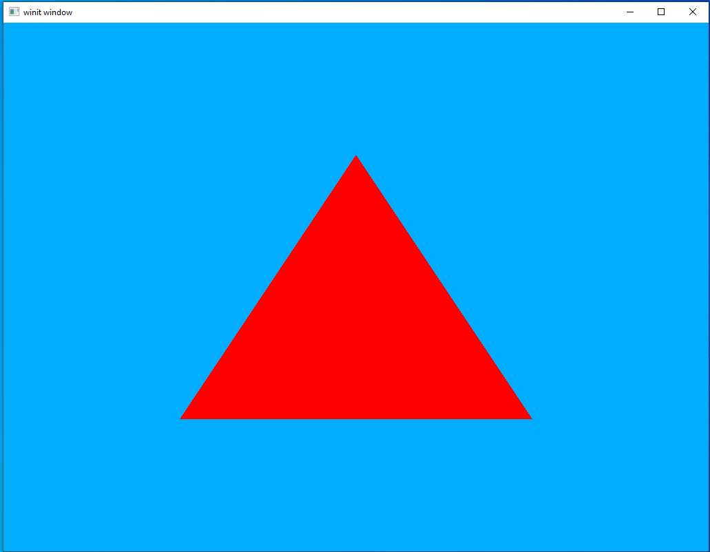
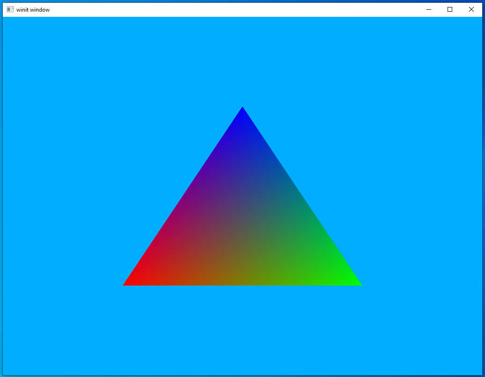

# Adding a Triangle

Now that we've done all the boring work of initializing Vulkan it's time to do something fun: putting an actual shape on screen.

## Walk-through

#### Vertex data

The most important single data type in graphics programming is the `Vertex`. A vertex is actually something borrowed from mathematics and is basically just an array of fixed size (between 2 and 4, usually) representing the location of a point in space. 3 vertices together make up a triangle, the most basic unit that can be rendered on screen. More complicated polygons are created from a number of triangles connected together, usually referred to as a "mesh" in the context of 3D modeling.

In Vulkan `Vertex` has a special meaning on top of the usual meaning, it is the primary way we pass information into the shaders. Because it's so important, Vulkano comes equipped with a helper-method that can take a struct and apply the `Vertex` trait to it. Using this, we can define structs that can have their information passed into the shaders with a minimum of fuss.

Outside the `main` function let's define the following struct which we'll use for this lesson.

```rust
#[derive(Default, Debug, Clone)]
struct Vertex { position: [f32; 3] }
vulkano::impl_vertex!(Vertex, position);
```

note that our helper method takes the name of the struct as well as the data field as arguments. We can pass in multiple fields this way as well as ignore other fields if we want. The following is just an example so don't put it in your code, but it shows what we can do.

```rust
#[derive(Default, Debug, Clone)]
struct MyStruct {
    position: [f32; 3],
    uv: [f32; 2],
    name: String
}
vulkano::impl_vertex!(MyStruct, position, uv);
```

In this example we have applied the `Vertex` trait to `position` and `uv` but *not* to `name`. Note also that it can handle arguments of different data types.

#### Shaders

Now we come to the fun part of the lesson, writing our own shaders. As a reminder, shaders are program which run on our graphics hardware. In Vulkan shaders are written in a source language called *GLSL* and then compiled. This compiled bytecode is then uploaded to the hardware. Once installed, we render by passing input data through the shaders and storing the output. This process can become devilishly complicated in very demanding applications but we'll start small. All we want right now is a shader that can take in simple vertex position data and output a triangle.

```rust
mod vs {
    vulkano_shaders::shader!{
        ty: "vertex",
        src: "
#version 450
layout(location = 0) in vec3 position;

void main() {
    gl_Position = vec4(position, 1.0);
}"
    }
}

mod fs {
    vulkano_shaders::shader!{
        ty: "fragment",
        src: "
#version 450
layout(location = 0) out vec4 f_color;

void main() {
    f_color = vec4(1.0, 0.0, 0.0, 1.0);
}
"
    }
}

let vs = vs::Shader::load(device.clone()).unwrap();
let fs = fs::Shader::load(device.clone()).unwrap();
```

If this looks a bit hacky to you, you would be correct. This is one area where the Vulkano dev team is looking on improving where possible. The reason it looks like this is because shader compilation currently requires an external toolchain. For now, we'll just have to deal with it as it is. Let's walk through some points of interest in our code.

The first thing you've probably noticed is that we have two shaders, but why is that? Basically, it boils down to each shader being run on different data.

The first shader is called a "vertex shader" this is run on each and every vertex we pass in. If you have two triangles the vertex shader will be run six times, once for each of the six vertices in two triangles. Vertex shaders are used primarily for *position* calculations. For instance, say we want to move something 2 units to the right. Rather than changing the values in the base data, we tell the shader we want to do a *transformation* to move the point to the final location. This will make more sense when we discuss `Uniforms` in the next section.

The second shader is called a "fragment shader" and is run on individual *triangles*. Remember what was said earlier about triangles being the most basic renderable shape. In this example, we use our fragment shader to apply colors.

Now lets look at the actual code.

In our vertex shader we have the line `layout(location = 0) in vec3 position;` which tells us a couple of things. It says we expect an *input* value of a vec3 or an instance of `[f32;3]` when translated to Rust. The initial `layout` keyword is a way of telling the shader that, of all inputs given to the shader, the first one will always be our `vec3` position data. This is technically optional but it's good to get in the habit of doing as it can really help with debugging why data isn't behaving as expected.

Also, like in C or Rust, we have a `main` function. Technically we could call our function whatever we wanted as we will have to manually specify the shader *entry point* in a little bit. However, it's idiomatic to name it `main`.

The last thing to notice in the vertex shader is the line `gl_Position = vec4(position, 1.0);`. `gl_position` is how we set the position value. However, it takes a vec4 but we only have a vec3. You can see a neat feature of the shader language in the way we can cast our vec3 into a vec4 by just supplying our vec3 as well as the fourth value we want.

In the fragment shader pay attention to the line `layout(location = 0) out vec4 f_color;`. This is very similar to the line we saw in our vertex shader except this time we use `out` to indicate that this is where the shader should be *outputting* a vec4. What's the significance of `location = 0` in this context? Simple, that's the index of the renderpass attachment we've declared in the last lesson.

Also note in the fragment shader that `f_color = ...` is not an inbuilt function like `gl_position` was. Instead it's the variable we declared in our `layout(location = 0)...` line.

#### Graphics Pipeline

Along with the shader declaration, this is the other major item we skipped talking about in the last lesson. The reason for this is that the two go together. Our `GraphicsPipeline` object describes *what* gets used, *when* it gets used, and what should happen after. The best explanation might just be to show what it looks like. Remember that this goes after our `RenderPass` object is created.

```rust
let pipeline = Arc::new(GraphicsPipeline::start()
    .vertex_input_single_buffer()
    .vertex_shader(vs.main_entry_point(), ())
    .triangle_list()
    .viewports_dynamic_scissors_irrelevant(1)
    .fragment_shader(fs.main_entry_point(), ())
    .render_pass(Subpass::from(render_pass.clone(), 0).unwrap())
    .build(device.clone())
    .unwrap());
```

In understanding how to read this, keep in mind that each function call gets called in order. Reading it line by line lets us see how data will flow through our shaders to produce output.

`.vertex_input_single_buffer()` tells Vulkan to expect the shader to take exactly one buffer (explained in a bit) as input.

`.vertex_shader(vs.main_entry_point(), ())` tells Vulkan what to use as the vertex shader, as well as the main entry-point to use.

`.triangle_list()` tells Vulkan that the data will be in the form of a list of triangles. That is, it can expect a stream of vertex data in which every set of three vertices produces a triangle. There are a *lot* of other data formats we can use, but they won't be covered here. These other formats are mostly used to help save bandwidth by not uploading as much information from the computer to the graphics hardware.

`.viewports_dynamic_scissors_irrelevant(1)` Sets the viewports and scissor boxes to be dynamic and to cover the whole screen. Setting this means we'll need to set our viewports later.

`.fragment_shader(fs.main_entry_point(), ())` tells Vulkan what to use as the fragment shader and where the main entry point is.

`.render_pass(Subpass::from(render_pass.clone(), 0).unwrap())` Tells Vulkan what subpass to use for rendering. Most real applications will have multiple subpasses so this argument is important. However, right now we have a single subpass so we can just take it and be done.

`.build(device.clone())` produces the actual `GraphicsPipeline` object based on the configurations we've set.

#### Buffers

Before we can go about using data to draw anything we need to store that data somewhere our graphics hardware can see it. We do this using buffers.

```rust
let vertex_buffer = CpuAccessibleBuffer::from_iter(device.clone(), BufferUsage::all(), false, [
    Vertex { position: [-0.5, 0.5, 0.0] },
    Vertex { position: [0.5, 0.5, 0.0] },
    Vertex { position: [0.0, -0.5, 0.0] }
].iter().cloned()).unwrap();
```

Here we create a `CpuAccessibleBuffer` and fill it from an iterator we've manually specified. If this seems like an odd amount of work to do for a three-member array just remember that a graphics card is basically an entirely separate computer that just so happens to live in the same case as the rest of your computer. A graphics card can not look into a computer's main memory the way a regular program can which means we need to perform special operations to get our data over to the graphics hardware where we want it.

Buffer management is a complex topic and more advanced buffer usage will be covered in a later lesson. For now, we'll just use the simplest buffer that will get the job done.

#### Call our render code

And that's it, as far as basic data passing goes. We're done with our setup and ready to call the drawing code to show something to the screen.

Go down to where we declared our `command_buffer` variable. In between the lines `.begin_render_pass` and `.end_render_pass` add the following line of code.

```rust
.draw(pipeline.clone(), &dynamic_state, vertex_buffer.clone(), (), ()).unwrap()
```

And that's it. The `draw` command takes in the pipeline we want to use for rendering and the data to render and that's enough for us. We already specified the details of *how* to draw to the screen when we created our pipeline, so here we can just tell Vulkan to go ahead and use it.

In any case, let's run the program and see what we've got.



If you see the same thing, then congratulations! You have officially completed your first "Hello World" application in Vulkan.

## Multiple Inputs

We've drawn our first triangle but isn't it a bit, you know, boring? Let's spice things up a bit by letting it take a vertex color input as well to create a more interesting picture.

#### Vertex Update

Let's go back to our `Vertex` definition and update it to include a "color" field.

```rust
#[derive(Default, Debug, Clone)]
struct Vertex {
    position: [f32; 3],
    color: [f32; 3]
}
vulkano::impl_vertex!(Vertex, position, color);
```

note that this doesn't *have* to all be in a single structure. As long as the shader gets the input it's expecting it couldn't care less how you organize it on your own. However, for the sake of our own sanity it's usually best to keep things together like this.

There is an important "gotcha" to using `vulkano::impl_vertex!` in that the shader inputs **must** have the same names as the parameters passed into the `impl_vertex!` macro.


#### Shaders part 2

Let's update our shaders to take a second input.

```rust
mod vs {
    vulkano_shaders::shader!{
    ty: "vertex",
    src: "
#version 450
layout(location = 0) in vec3 position;
layout(location = 1) in vec3 color;

layout(location = 0) out vec3 out_color;

void main() {
    gl_Position = vec4(position, 1.0);
    out_color = color;
}"
    }
}

mod fs {
    vulkano_shaders::shader!{
    ty: "fragment",
    src: "
#version 450
layout(location = 0) in vec3 in_color;

layout(location = 0) out vec4 f_color;

void main() {
    f_color = vec4(in_color, 1.0);
}
"
    }
}
```

In the vertex shader we have a new line, `layout(location = 1) in vec3 color;`, which is what tells our shader to expect a second vec3 datatype named "color" to be supplied by the calling application. Using `location = 1` is optional but lets us make very clear exactly what order we need our input data to be in.

Another new line in the vertex shader is `layout(location = 0) out vec3 out_color;` which says that the vertex shader has a new (not built-in like `gl_position`) output. For our input we needed to name it `color` because that's what we named the data vertex type but we can name our output variable whatever we want.

Outputting our new color input to the waiting fragment shader is simple and accomplished with the line `out_color = color;`.

In the fragment shader we have added a line to accept our new input, `layout(location = 0) in vec3 in_color;`. This works exactly the same way as similar lines in the vertex shader, but this time the input is coming from the vertex shader rather than a buffer of input data.

#### Expanded buffer

The update to the buffer is very straightforward and I don't think requires any particular explanation.

```rust
let vertex_buffer = CpuAccessibleBuffer::from_iter(device.clone(), BufferUsage::all(), false, [
    Vertex { position: [-0.5, 0.5, 0.0], color: [1.0, 0.0, 0.0] },
    Vertex { position: [0.5, 0.5, 0.0], color: [0.0, 1.0, 0.0] },
    Vertex { position: [0.0, -0.5, 0.0], color: [0.0, 0.0, 1.0] }
].iter().cloned()).unwrap();
```

#### Run it again

And that's it, a new input source defined and hooked up to our shaders. At this point, we can just run the program again and see the results.



Much more striking, I think you'll agree. In the next lesson we'll look at how to start manipulating our output to do things like rotate them or move them around.

[lesson source code](../lessons/2.%20Triangle)