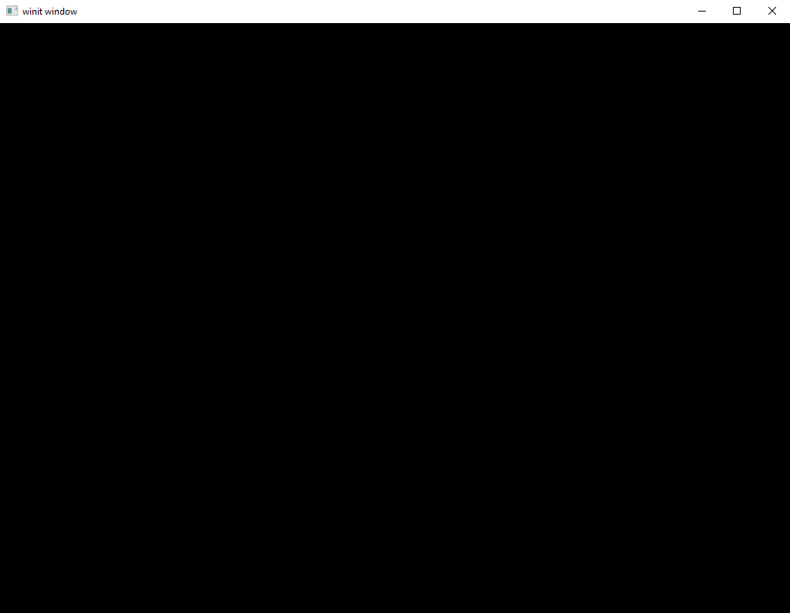
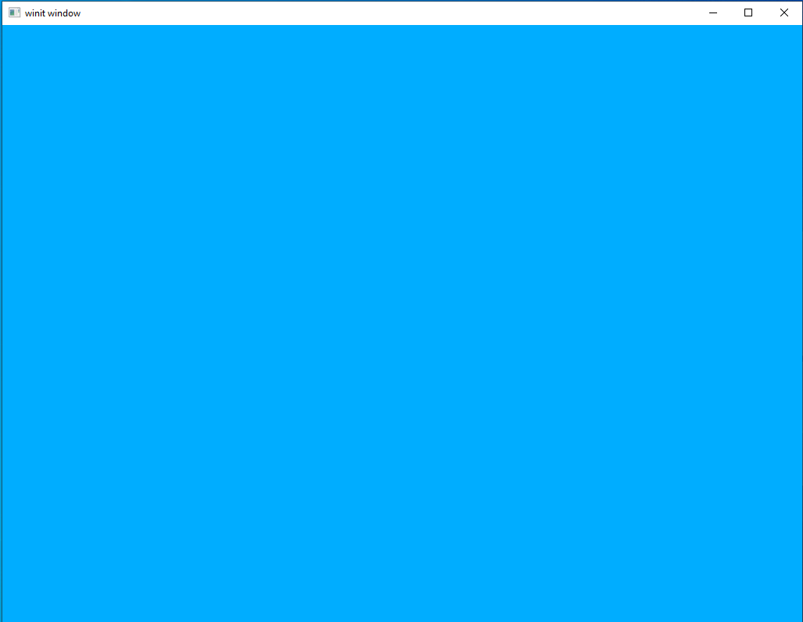

# Our First Window

## Getting started

The first thing we'll do is creating our `Cargo.toml` file. The dependencies listed below will be included in all further examples so they won't be mentioned directly after this.

```toml
[package]
name = "example_project"
version = "0.32.0"
authors = ["your_name"]
edition = "2021"

[dependencies]
vulkano = "0.32.3"
vulkano-shaders = "0.32.0"
vulkano-win = "0.32.0"
winit = "0.27.3"
```

Let's go over the dependencies one by one.
```toml
vulkano = "0.32.3"
```
This is the main library ("crate" in Rust-speak) that we'll be using. This crate wraps the Vulkan API with its own Rust API so that we can call it from our application. We could use the Vulkan API directly if we really wanted to but that would be far more difficult than necessary as well as producing ugly code that doesn't follow Rust idioms. This is because the main Vulkan API is in C and can only be interacted with using Rust's Foreign Function Interface (FFI) mechanism. Although Rust is designed to interface with C when necessary, why would we do that when we have a lovely crate to wrap it all up in a nice Rusty bow for us?

There is a small trade-off here because if you want to go from using Vulkano to using Vulkan directly there will be a learning curve as you get to grips with the native C API. However, learning Vulkano will teach you all the core concepts of Vulkan so it likely won't be that much work to make the change later.

```toml
winit = "0.27.3"
```

This crate solves a problem that surprises a lot of people learning about graphics programming for the first time: our main graphics API (Vulkan in this case) doesn't actually provide a way to show anything on the screen! On first glance this seems a bit crazy. After all, isn't the whole *point* of something like Vulkan or OpenGL to show something on the screen? Well, yes and no.

The key thing to keep in mind is that Vulkan is how we use our *hardware* (usually a graphics card, sometimes integrated rendering hardware) to turn data into graphical output. However, the actual user interface (UI) is a bit of *software* that's provided by the host operating system. Vulkan, like OpenGL before it, is explicitly operating system agnostic which is just a fancy way of saying that it will never contain code that will only work on Windows or Linux or any other single platform. To interact with the operating system itself and do things like open windows or get user input we need to use a second crate.

```toml
vulkano-win = "0.32.0"
```

This is the other part of our "how do we get Vulkan to talk to our UI" problem. The `winit` crate lets us open a window for whatever operating system we're using but there still needs to be a connection between our new window and our graphics API. This crate is a small bit of code that lets us go "hey, you can put your graphics in this window." It would be possible to roll this functionality into the same crate as the window-handling code and this is the strategy used by a number of other libraries you might find out there; however, the `winit` maintainers have kept a tight focus on their project scope.

```toml
vulkano-shaders = "0.32.0"
```

I'm kind of cheating by listing this dependency in this section since we won't be using it for this lesson, but we will be using it in every other one so we might as well talk about it now.

As mentioned elsewhere and covered in more detail in the next lesson "shaders" are what we call programs that run on our graphics hardware. Just like the sorts of programs we run on our computer (like, for instance, the one you're currently reading this tutorial in) Vulkan shaders are written in a programming language (GLSL, inherited from later versions of OpenGL) which are then compiled. This is a change from OpenGL which did not compile the shaders but uploaded them directly as text to the graphics hardware. For reasons too numerous to elaborate on here, this was a massive pain that could easily produce hair-pulling frustration in people first learning OpenGL.

The approach used by Vulkan is far more reliable and less ulcer-inducing but, like the rest of the Vulkan API, comes with a trade-off in the form of more up-front work. Specifically, to compile a Vulkan application you will also need to be able to compile GLSL shaders. This crate handles the shader compilation for us in a transparent manner so writing shaders and using them inside our Vulkano-based apps isn't going to be difficult. However, to get `vulkano-shaders` to compile you need to provide a number of programs in your build environment. To set up your own environment to handle shaders consult the [main Vulkano documentation](https://github.com/vulkano-rs/vulkano).

## Initialization Walk-through

Vulkan is a powerful API but that power comes with a trade-off in the form of a lengthy initialization process. It can be a bit intimidating when starting out to look at such lengthy blocks of inscrutable code full of Vulkan-specific jargon so we'll go through piece by piece. Don't worry if things are still a bit unclear even after reading it. The best way to understand code is to change it and see what happens and this is exactly what we'll be doing in future lessons as we add more features.  

#### Imports
The first section is straight-forward enough as it's just the list of dependencies. You should recognize the root crates from our discussion of our `Cargo.toml` file. The actual data types and functions being imported will be introduced later as they're used. Everything after this block will be inside our `main` method.

```rust
use vulkano::command_buffer::allocator::StandardCommandBufferAllocator;
use vulkano::command_buffer::{
    AutoCommandBufferBuilder, CommandBufferUsage, RenderPassBeginInfo, SubpassContents,
};
use vulkano::device::physical::PhysicalDeviceType;
use vulkano::device::{Device, DeviceCreateInfo, DeviceExtensions, QueueCreateInfo};
use vulkano::image::view::ImageView;
use vulkano::image::{ImageAccess, SwapchainImage};
use vulkano::instance::{Instance, InstanceCreateInfo};
use vulkano::pipeline::graphics::viewport::Viewport;
use vulkano::render_pass::{Framebuffer, FramebufferCreateInfo, RenderPass};
use vulkano::swapchain::{
    self, AcquireError, Swapchain, SwapchainCreateInfo, SwapchainCreationError,
    SwapchainPresentInfo,
};
use vulkano::sync::{self, FlushError, GpuFuture};
use vulkano::{Version, VulkanLibrary};

use vulkano_win::VkSurfaceBuild;

use winit::event::{Event, WindowEvent};
use winit::event_loop::{ControlFlow, EventLoop};
use winit::window::{Window, WindowBuilder};

use std::sync::Arc;
```

#### Instance

The first block of actual Vulkano code we're going to write is where we declare the Vulkan `Instance` object. This is the "root" object for all Vulkan operations and all the objects and variables we'll be creating later. For our purposes we can treat it as nothing more than a large cardboard box with "Vulkan stuff" written in sharpie on the side.

```rust
let instance = {
    let library = VulkanLibrary::new().unwrap();
    let extensions = vulkano_win::required_extensions(&library);

    Instance::new(
        library,
        InstanceCreateInfo {
            enabled_extensions: extensions,
            enumerate_portability: true, // required for MoltenVK on macOS
            max_api_version: Some(Version::V1_1),
            ..Default::default()
        },
    )
    .unwrap()
};
```

A few things to note. On the second line, `let library = ...`. Vulkano supports a few different ways to load the Vulkan API, e.g. by finding an appropriate DLL or .so on your `LD_LIBRARY_PATH`.  The library is the part of Vulkano that either dynamically loads this DLL, or uses a static linker.  If this fails, check your installation of Vulkan.

On the third line, `let extensions = ...`. The Vulkan specification separates core features from those which are considered optional. Rendering to a screen is one of these optional features and we need to specifically request that our created `Instance` contains it. We can get all necessary optional features by asking `vulkano_win` what it requires. A second thing to note is `Version::V1_1`. This is how we declare the *minimum* version of Vulkan we want. We can use Vulkan functions from higher versions but if the software or hardware doesn't meet this minimum requirement the program will refuse to run.

Also, in order to use a Vulkan implementation that doesn't strictly conform to the entire Vulkan Specification, we must pass `enumerate_portability: true` to `InstanceCreateInfo`. Specificially, this allows MoltenVK to be used on macOS, which is an emulation layer that translates the Vulkan API to Apple's own Metal API. It will allow the Vulkan library loader to use the `VK_KHR_portability_enumeration`. See [this document](https://www.lunarg.com/wp-content/uploads/2022/04/Portability-Enumeration-Extension-APR2022.pdf) from the LunarG group for more information.

If it seems strange that actually showing an image is considered "optional" by our graphics API remember the discussion earlier about how showing anything on the UI is considered outside the scope of the main Vulkan specification. In addition, the Vulkan API lets you use your graphics hardware for many things, not all of which require the ability to display it somewhere. We won't be getting into the full range of possibility in these tutorials, but it's a good demonstration of Vulkan's approach of leaving it to the programmer to specify anything that might have more than one option.

Lastly, a note on the use of the `InstanceCreateInfo` struct which is taken as an argument to `Instance::new`. This might strike people with existing Rust experience as odd. When a Rust developer needs to set up a complex struct they typically reach for the [builder pattern](https://rust-unofficial.github.io/patterns/patterns/creational/builder.html) rather than passing in a different struct. However, this is a decision the Vulkano team made to more closely match how the Vulkan API works. In Vulkan each object the program works with is created with a corresponding `info` object that controls all of the various flags to be passed in. By keeping closer to the base Vulkan program structure, the Vulkano team removes some of the barriers to entry that a Vulkan C/C++ developer might have trying to use Vulkano with Rust. We will see this pattern many more times to come.

#### UI Window

Now that we have a Vulkan instance to work with, we can create our basic window. This will be what the user actually sees when they launch the application and will be where all our fancy graphics will (eventually) end up. Anyone who's fiddled with video game graphics settings will know that there are a *lot* of details that need to be considered when deploying a graphical application to end-users. Thankfully, this is a tutorial and we'll be skating by with only the minimum.

```rust
let event_loop = EventLoop::new();
let surface = WindowBuilder::new()
    .build_vk_surface(&event_loop, instance.clone())
    .unwrap();
```

A couple things to note here:

`event_loop` is what we use to listen "window events" like button presses or window resize events. We need to declare this loop if we want to be able to interact with our application at all after launching it. To even close the window requires an `EventLoop`.

`surface` is the only thing that Vulkan actually cares about. A Vulkan "surface" is something that Vulkan can render to. In other words, it's a place that Vulkan can stick the output once it gets done running all the fancy shaders and complicated rendering operations. This is not *quite* the same thing as a UI window. To take our surface and wrap it in a UI window our operating system can actually use we need the `winit` crate.


#### Physical Device and Queue Family

After we've created our `Instance` and a `surface` to render to  we need to find the physical device to use for rendering. What this means is that we need to identify all the pieces of hardware our program can see and decide which one of them we want to use. In practice this usually means finding the user's graphics card. This is also where we first meet one of the things that really sets Vulkan apart from its predecessor, OpenGL, queues and queue families. OpenGL is a *synchronous* API. What this means is that our application sends a request to the graphics card through the API and then waits until it hears back before continuing. This has the advantage of being very simple and intuitive but is also where OpenGL shows its age.

Modern computers are heavily based around the idea of *asynchronous* operations. That is, one application can have many things happening at the same time without needing to wait ("block") for one to finish before starting another. The way Vulkan taps into this newer design philosophy is by using *queues*. Rather than sending commands one at a time to the graphics card and waiting for a reply, in Vulkan we create lists of commands and upload them all at once to the graphics card. The graphics card will then start executing each command in sequence and our main app will continue on immediately without waiting to hear back.

The difference between Vulkan `Queue`s and `QueueFamily`s can be thought of this way: the `QueueFamily` is the *type* of operation we can do whereas a `Queue` is an instance of that type of operation. We will create a `Queue` later in the lesson but it is convenient for us to find the `PhysicalDevice` and the `QueueFamily` at the same time.

```rust
let device_extensions = DeviceExtensions {
    khr_swapchain: true,
    ..DeviceExtensions::empty()
};

let (physical_device, queue_family_index) = instance
    .enumerate_physical_devices()
    .unwrap()
    .filter(|p| p.supported_extensions().contains(&device_extensions))
    .filter_map(|p| {
        p.queue_family_properties()
            .iter()
            .enumerate()
            .position(|(i, q)| {
                // pick first queue_familiy_index that handles graphics and can draw on the surface created by winit
                q.queue_flags.graphics && p.surface_support(i as u32, &surface).unwrap_or(false)
            })
            .map(|i| (p, i as u32))
    })
    .min_by_key(|(p, _)| {
        // lower score for preferred device types
        match p.properties().device_type {
            PhysicalDeviceType::DiscreteGpu => 0,
            PhysicalDeviceType::IntegratedGpu => 1,
            PhysicalDeviceType::VirtualGpu => 2,
            PhysicalDeviceType::Cpu => 3,
            PhysicalDeviceType::Other => 4,
            _ => 5,
        }
    })
    .expect("No suitable physical device found");
```

That seems rather complicated but, luckily, most of that complication comes from the way it uses Rust mapping functions rather than Vulkano itself. We'll go though bit by bit.

```rust
let device_extensions = DeviceExtensions {
    khr_swapchain: true,
    ..DeviceExtensions::empty()
};
```

Just like with our `Instance` earlier, optional features are specified via the relevant _extensions_. In our case, we want to make sure we can use a `Swapchain` with our physical device. We'll see what that means in a bit. 

```rust
let (physical_device, queue_family_index) = instance
    .enumerate_physical_devices()
    .unwrap()
```

If you haven't used a language which features it, Rust allows multiple-assignment where multiple variables can be declared or modified in a single statement. The vulkan-specific code is `instance.enumerate_physical_devices()` which will just list every physical device our `Instance` can see.

```rust
.filter(|p| p.supported_extensions().contains(&device_extensions))
```

This takes the list we got on the first line and filters each item. First it queries which extensions it supports and checks that it supports at least the set of extensions we want. It's totally normal that a physical device will support more extensions than we want or will use, but it absolutely must meet the minimum standards we declared with `device_extensions`. In this case, we would not even be able to render to the target if we picked a physical device that did not support `khr_swapchain`. The output of `.filter` will be all items in the list which evaluated as `true` in the [closure](https://doc.rust-lang.org/rust-by-example/fn/closures.html) (also sometimes called a _lambda function_).

```rust
.filter_map(|p| {
    p.queue_family_properties()
        .iter()
        .enumerate()
        .position(|(i, q)| {
            // pick first queue_familiy_index that handles graphics and can draw on the surface created by winit
            q.queue_flags.graphics && p.surface_support(i as u32, &surface).unwrap_or(false)
        })
        .map(|i| (p, i as u32))
})
```

This is where we bring the `QueueFamily` into the equation. For each of the physical devices we found in the last section we query what queue families it supports. And for each of those queue families we check that it supports graphical output (remember, not every Vulkan target will!) and that it is supported by the actual `Surface` we've created. For each queue family that passes this test we return a tuple that contains the physical device and the queue family index.

```rust
.min_by_key(|(p, _)| {
    // lower score for preferred device types
    match p.properties().device_type {
        PhysicalDeviceType::DiscreteGpu => 0,
        PhysicalDeviceType::IntegratedGpu => 1,
        PhysicalDeviceType::VirtualGpu => 2,
        PhysicalDeviceType::Cpu => 3,
        PhysicalDeviceType::Other => 4,
        _ => 5,
    }
})
```

This section is technically optional but I thought it would be a good idea to have it anyway. At this point we might have multiple physical devices which meet our technical needs. That is, they could run our code without crashing and show the right image on the screen. For anything we're going to be doing that's totally fine as we aren't going to even come close to taxing what modern graphics hardware is capable of. But, like any gamer could tell you, not all graphics hardware is created equal. If we have the choice, we want to prefer a dedicated graphics card to an integrated solution. This is a quick bit of code that will organize all our options into a priority list and choose the one that scores the best.

```rust
.expect("No suitable physical device found");
```

If the result of this entire filter chain returns `None`, then we fail with an error message that no suitable physical device can be found on this computer.  For example, there may be no GPU at all, or none that supports the `Swapchain` feature, e.g. when running on server hardware with no display.

#### Device

Now that we've finished querying information about the physical device we'll be using, we need to create a logical `Device` object. This is the *software* representation of the hardware being referenced by our `physical_device` variable. As part of creating our `Device` we will set up a number of configuration options and, on creation, will receive both an instance of `Device` as well as a list of `Queue`s we can use to submit operations to the `Device`.

```rust
let (device, mut queues) = Device::new(
    physical_device,
    DeviceCreateInfo {
        enabled_extensions: device_extensions,
        queue_create_infos: vec![QueueCreateInfo {
            queue_family_index,
            ..Default::default()
        }],
        ..Default::default()
    },
)
.unwrap();
```

Like we've seen in other places, we need to consider which optional extensions we want to have enabled at any particular time. With `device_extensions` we indicate we want the swapchain extension but will otherwise accept the default. Note also the `Info` struct pattern in use again here.

For the creation of the `Device` itself we need to provide it the `PhysicalDevice` to use, the list of features supported by the `PhysicalDevice`, as well as a list of `QueueCreateInfo` objects. Each `QueueCreateInfo` should use the `queue_family_index` we determined above when enumerating the devices. We will mostly just use the defaults when creating queues, and will revisit this when it comes time to add a second queue for data transfer operations.

#### Queues

As part of creating our `Device` instance, we also have an iterator of available `Queue`s. In this example we just use a single queue so the code is simple. We'll expand this in a later tutorial. We will be using our singular queue to submit rendering operations to the graphics card.

```rust
let queue = queues.next().unwrap();
```

#### Swapchains and Images

An `Image` in Vulkan is basically just a buffer that Vulkan can use to store or retrieve data. In practice this most commonly means 2D graphical information used for storing rendering output; however, Vulkan `Images` can support a number of different data formats and are used for a number of different things.

A `Swapchain` is an object which contains a vector of `Image`s used for rendering as well as information about how they can be shown to the user. The way this works is that Vulkan renders to an `Image` that exists in memory but is not shown to the user. When the render is complete the new `Image` is *swapped* with the `Image` being shown to the user. This means that the user will only ever see a completed render operation. The old `Image` is then moved back into memory, ready for a future render operation.

This can be a bit hard to visualize at first, but it's something any gamer will recognize. When we say a video game runs at 60 frames-per-second (FPS) what's going on behind the scenes is that the game does 60 render operations every second. Each render operation produces a single *frame* that is shown to the user. In Vulkan-speak this frame is actually an *Image* and our *Swapchain* is how we show it to the user.

```rust
let (mut swapchain, images) = {
    let caps = device
        .physical_device()
        .surface_capabilities(&surface, Default::default())
        .unwrap();

    let usage = caps.supported_usage_flags;
    let alpha = caps.supported_composite_alpha.iter().next().unwrap();

    let image_format = Some(
        device
            .physical_device()
            .surface_formats(&surface, Default::default())
            .unwrap()[0]
            .0,
    );

    let window = surface.object().unwrap().downcast_ref::<Window>().unwrap();
    let image_extent: [u32; 2] = window.inner_size().into();

    Swapchain::new(
        device.clone(),
        surface.clone(),
        SwapchainCreateInfo {
            min_image_count: caps.min_image_count,
            image_format,
            image_extent,
            image_usage: usage,
            composite_alpha: alpha,
            ..Default::default()
        },
    )
    .unwrap()
};
```

`caps` and `usage` are just options that let us specify what requirements we want the swapchain to meet. As in other places, here we just accept whatever we find. Remember to revisit this if you want to upgrade your code to be production-quality.

`alpha` lets us set the blending factor for the `Image`s. This can be used for very specific effects if you want, but for most use-cases it's fine to just do what we do here.

`image_format` is the format of the `Image`s. Remember that an `Image` is, in effect, a multi-dimensional array. The format is how we record the number of array dimensions as well as the type of data being stored in the array.

There are too many arguments being passed to `Swapchain::new` to be worth covering here, particularly since we'll be using the code listed above throughout the rest of our tutorial. It's safe to leave it alone until you decide to explore the more complete range of options `Swapchain` gives us.

#### Allocators

Vulkano supports a variety of memory allocators, which it uses to customize how buffers on both the host CPU and on the GPU are created and recycled, as well as command buffers used to transmit a series of instructions from the CPU to the GPU. For now, we just need a `StandardCommandBufferAllocator` to allocate memory to send commands to the given `device`.  In future tutorials, we'll see other allocators, but they'll still mostly use the defaults like this.

```rust
let command_buffer_allocator =
    StandardCommandBufferAllocator::new(device.clone(), Default::default());
```

#### Shaders

Normally, shaders would be declared here. However, since we're not rendering anything in this lesson, we'll leave them out for now. We'll be revisiting this part of the code in the next lesson.

#### Renderpass

Now we come to one of the most important parts of any Vulkan program, the `Renderpass` declaration. This is a structure which lets us define how the rendering process should work. It can be a bit difficult to wrap your head around it the first time you see it if you're just learning graphics programming, but once you get the hang of it you'll be able to leverage its power without too much trouble.

To keep it simple, this is the part of our code where we tell the graphics hardware where it can expect to find input information and where it can store output. Each of these data sources are called "framebuffer attachments" in Vulkan-speak and we can string multiple such attachments together to create complex multi-stage rendering systems. In a multi-stage rendering system the graphics hardware goes through "subpasses" where it executes a shader on a set of data. This will be easier to visualize in the next lesson when we add a `GraphicsPipeline` and start rendering something.

```rust
let render_pass = vulkano::single_pass_renderpass!(
    device.clone(),
    attachments: {
        color: {
            load: Clear,
            store: Store,
            format: swapchain.image_format(),
            samples: 1,
        }
    },
    pass: {
        color: [color],
        depth_stencil: {}
    }
)
.unwrap();
```

You see here that we've declared a single framebuffer attachment and named it `color`. In reality, we could name it pretty much anything we'd like but it's idiomatic to name your attachments after their function. This attachment is a color type attachment so we just name it that.

Going through the options in the attachment now we have `load: Clear` which tells Vulkan that the contents of the framebuffer should be cleared at the start of the render pass, `store: Store` which tells Vulkan that we want to store the results of the render pass in this attachment, `format: swapchain.image_format()` is where we set the image format of the render attachment to be the same as the format of our swapchain, and `samples: 1` indicates that we're not using multi-sampling.

Under `pass:` you see that we only have a single render pass, and that render pass contains a single attachment. If we wanted to have an attachment to, say, store normals data we'd need to remember to add it here.

`depth_stencil` is used to enable depth-testing and will be touched on in a later lesson.

A quirk of the Vulkano crate to take note of is that we used the `single_pass_renderpass!` macro to build our renderpass. Later, when we want to have more than one subpass we will use the `ordered_passes_renderpass!` macro.

#### GraphicsPipeline

A `GraphicsPipeline` is the second half of the process we started with our `RenderPass`. A `RenderPass` tells Vulkan what data sources it has available to it and in what order it should expect to be able to access them. A `GraphicsPipeline` is where we actually tell Vulkan *how* to go from one pass to another and what to do in each one. This is where we'll specify what shaders to use, what format the incoming data will be, and which subpass to use.

However, since we're not rendering anything in this tutorial we'll come back to this in the next lesson. So don't worry right now if you don't understand exactly what the `RenderPass` and `GraphicsPipeline` are supposed to be doing, just remember that this is the point in the process where we need to set it up.

One thing that we do need to declare now is a `viewport` struct. This is used to let us change the size of the viewport (for example, on window-resize) without needing to recreate the entire `GraphicsPipeline`.

```rust
let mut viewport = Viewport {
    origin: [0.0, 0.0],
    dimensions: [0.0, 0.0],
    depth_range: 0.0..1.0,
};
```

#### Framebuffers

When we declared our `Renderpass` object earlier we also declared a single "framebuffer attachment" to go along with it. However, this just tells Vulkan what the framebuffer *will* look like. Before we can render anything, we need to create the actual `Framebuffer` to go along with it.

```rust
let mut framebuffers = window_size_dependent_setup(&images, render_pass.clone(), &mut viewport);
```

The `window_size_dependent_setup` helper function will be listed shortly, but right now take a look at the arguments. The first argument is for `Image`s which, remember, are just Vulkan-speak for data buffers. The second argument is where we give it our render pass for it to be attached to, which is where we connect the actual `Framebuffer`s to their declaration in the `Renderpass`, and the last argument is the viewport struct we created earlier.

```rust
fn window_size_dependent_setup(
    images: &[Arc<SwapchainImage>],
    render_pass: Arc<RenderPass>,
    viewport: &mut Viewport,
) -> Vec<Arc<Framebuffer>> {
    let dimensions = images[0].dimensions().width_height();
    viewport.dimensions = [dimensions[0] as f32, dimensions[1] as f32];

    images
        .iter()
        .map(|image| {
            let view = ImageView::new_default(image.clone()).unwrap();
            Framebuffer::new(
                render_pass.clone(),
                FramebufferCreateInfo {
                    attachments: vec![view],
                    ..Default::default()
                },
            )
            .unwrap()
        })
        .collect::<Vec<_>>()
}
```
This helper function is stolen wholesale from the Vulkano examples page and won't be explored here. For our purposes we can just accept it without changes.

---

And with that we've finally finished the process of initializing our Vulkan code! It's a lot to take in all at once and it can feel quite frustrating since tinkering with obscure settings doesn't really feel like it's getting you closer to the goal of doing actual graphics programming. But take heart, from this point on we have a working instance of Vulkan that we can start doing things with. We'll revisit these settings later as we add more features, but the basic outline will stay the same in all future lessons.

## Running the code

Now we're ready to start actually rendering something. We'll walk through our code piece by piece to show how we can use our rendering system.

#### Some odds and ends

Before getting into the main program loop we need to declare a couple variables we'll be using extensively later on.

```rust
let mut recreate_swapchain = false;
```

Our swapchain can become invalid for a number of reasons, not all of which we have direct control over. The most common reason is the window being resized, leading to a size mismatch between the `Image`s in our swapchain and the actual size of our window. If we try to render to an invalid swapchain we'll get an error, so we need to check that the swapchain is valid each time we want to render.

```rust
let mut previous_frame_end = Some(Box::new(sync::now(device.clone())) as Box<dyn GpuFuture>);
```

Earlier we mentioned how Vulkan is *asynchronous*. This is a very profound change in design philosophy from OpenGL and is necessary if we want to leverage the full power of modern computer hardware. This is a massive topic that we can't really do justice to here so this tutorial will focus on a single aspect of asynchronous development: how to communicate between our main application running on the CPU and our GPU.

Each time we submit a set of commands to the graphics hardware we get an object with the `GpuFuture` trait in return. This indicates that the operation is *still running* on the graphics hardware and will complete at a later point. If we destroy this object our code "blocks" or, to put it another way, our application will wait for the GPU to finish whatever it's doing before continuing. In most cases, this isn't what we want to have happen. Ideally, both our main application and our GPU will be running 100% of the time without sitting idle. Our `previous_frame_end` variable is going to be how we avoid blocking while still keeping track of what the graphics hardware is doing.

#### Program loop

The code for our program loop is simple: it's nothing but an infinite loop that we break out of on certain conditions like window close events. However, this is really the place where all the magic happens. If you're writing a game 99% of your code will take place here.

```rust
event_loop.run(move |event, _, control_flow| match event {
    // exciting stuff goes here
});
```

In all of our examples we're using a very simple loop where each iteration of the loop corresponds to one frame rendered on screen. For more fully-featured applications you'll want to decouple program logic (for instance, simulating a game's economy) from rendering operations. As mentioned before, this topic is far too big to deal with at any length here so we'll only be dealing with asynchronous issues when we absolutely have to.

Rust has very strong support for asynchronous (or, "concurrent" in Rust-speak) programming so if you're looking to take the next steps on this you can research the language-level support. The crates `tokio` and `async-std` are also good places to start.

#### Events

The first thing we need to add to our loop is a `match` statement to parse the different events. Right now, we only need to listen for events that tell us the application needs to close, events which tell us the swapchain needs to be recreated, and events which tell us it's okay to render to the screen.

```rust
event_loop.run(move |event, _, control_flow| {
    match event {
        Event::WindowEvent {
            event: WindowEvent::CloseRequested,
            ..
        } => {
            *control_flow = ControlFlow::Exit;
        }
        Event::WindowEvent {
            event: WindowEvent::Resized(_),
            ..
        } => {
            recreate_swapchain = true;
        }
        Event::RedrawEventsCleared => {
          // do our render operations here
        },
        _ => {}
    }
  });
```

If you're new to Rust you might be a bit confused by the last item `_ => {}`. Rust `match` statements must be *comprehensive*, which just means that they need to account for all possible values. There are, as you could probably guess, way more than 3 possible events so we use a special bit of Rust syntax to say, basically, "if we have anything else that doesn't fit above, do nothing." Rust forces us to be explicit about this as a way of catching errors where programmers update an enum but forget to update where it's used.

This `match` block will be unchanged throughout these tutorials, so for the most part it won't be called out specifically after this point. When we talk about the "program loop" in later tutorials we mean the code that goes where the comment `// do our render operations here` currently lives.

#### Cleanup

At the start of our program loop we call a simple bit of code on our `previous_frame_end` variable.

```rust
previous_frame_end
    .as_mut()
    .take()
    .unwrap()
    .cleanup_finished();
```

This little line of code is actually quite important. It checks if the `GpuFuture` operations stored by `previous_frame_end` have finished and, if so, release any resources held by them. Memory management is not usually something Rust programs have to concern themselves with, but with concurrent operations being split between the CPU and the GPU this is one area where we do need to pay attention to releasing resources once we're done with them.

Note that this function is not blocking, which means that we don't have to worry about our code stopping and waiting if the `GpuFuture` operations have not been finished.

#### Recreating the swapchain

We mentioned at the start of this section that the swapchain can become invalid for a number of reasons. Because of that, we need to check at the start of every rendering loop to see if we need to recreate the swapchain.

```rust
if recreate_swapchain {
    let window = surface.object().unwrap().downcast_ref::<Window>().unwrap();
    let image_extent: [u32; 2] = window.inner_size().into();

    let (new_swapchain, new_images) = match swapchain.recreate(SwapchainCreateInfo {
        image_extent,
        ..swapchain.create_info()
    }) {
        Ok(r) => r,
        Err(SwapchainCreationError::ImageExtentNotSupported { .. }) => return,
        Err(e) => panic!("Failed to recreate swapchain: {:?}", e),
    };

    swapchain = new_swapchain;
    framebuffers =
        window_size_dependent_setup(&new_images, render_pass.clone(), &mut viewport);
    recreate_swapchain = false;
}
```

As you can see, Vulkano supplies a very useful helper method, `swapchain.recreate()`, that lets us produce a new swapchain using all the options and capabilities of an old one. This saves us quite a bit of code compared to where we initially created our swapchain. The return values are, just like when we initially created our swapchain, a `Swapchain` object and a `Vec` of `Image`s. We'll replace the old values with these new values in just a moment. The last thing to take note of is the error handling. We accept the `SwapchainCreationError::ImageExtentNotSupported` error and continue as this is usually a spurious error generated when the user is currently resizing the window. We can just repeat the loop until swapchain creation succeeds in this case.

The last thing to take note of is that we also need to recreate our framebuffers. This is because our framebuffers depends on the `Image`s stored in the swapchain. If one changes the other must follow. There aren't any hidden complications here and we can just use our `window_size_dependent_setup` helper function as before.

#### Getting an image

Now that we've taken care of making sure our rendering environment is valid we can get down to the process of actually rendering something. The first step is acquiring an `Image` to use from our `Swapchain`.

```rust
let (image_index, suboptimal, acquire_future) =
    match swapchain::acquire_next_image(swapchain.clone(), None) {
        Ok(r) => r,
        Err(AcquireError::OutOfDate) => {
            recreate_swapchain = true;
            return;
        }
        Err(e) => panic!("Failed to acquire next image: {:?}", e),
    };

if suboptimal {
    recreate_swapchain = true;
}
```

Remember that the `Swapchain` is actually a vector of `Image`s, only some of which will be available for our use at any given time. The first returned value is the index of the `Image` we can use for rendering. The third returned value is a `GpuFuture` object which we can use to make sure that this function has completed before trying to use it. Notice also that we need to do some error handling to check (once again) if something has happened that requires that we recreate our swapchain.

A note on `acquire_future`. The actual data type for this is `SwapchainAcquireFuture` and represents when the graphics hardware will have access to a specified `Image`. We need to keep track of this so that we don't accidentally try to have our graphics hardware run our rendering commands before the `Image` is ready for use. It's these kinds of scheduling issues that often cause headaches when doing concurrent programming. If, in the future, you get errors related to invalid or unavailable swapchain images, the first thing you should double-check is that you're handling the `SwapchainAcquireFuture` correctly.

Lastly, Vulkano returns a `suboptimal` value that indicates if the current swapchain settings are, well, suboptimal. This is basically Vulkano telling us what we probably want to recreate the swapchain but aren't required to. In our tutorials we'll just go ahead and recreate the swapchain in this case but in your application you might want to take a more nuanced approach.

#### Clear value

A very small bit of code that we need to declare before starting the actual rendering is our clear value. This is a color that we use to clear our images before using them. This serves as a background color for our scene. In the future, setting it to some garish color can be a good way to double-check if there are holes in your models but for now we'll just set it to black.

```rust
let clear_values = vec![Some([0.0, 0.0, 0.0, 1.0].into())];
```

#### Command Buffer

At long last, we reach the point in our program where we actually tell our graphics hardware to do something. We do this by creating a `CommandBuffer` which holds a list of commands for our graphics hardware. We will submit these commands in a single batch operation to the graphics hardware, at which point our graphics hardware will get to work and our program will continue executing.

Recent changes to the Vulkano library have separated this process into two steps:
1: Create a `AutoCommandBufferBuilder` and add your commands to it
2: Finalize the commands and create the final `CommandBuffer`

```rust
let mut cmd_buffer_builder = AutoCommandBufferBuilder::primary(
    &command_buffer_allocator,
    queue.queue_family_index(),
    CommandBufferUsage::OneTimeSubmit,
)
.unwrap();

cmd_buffer_builder
    .begin_render_pass(
        RenderPassBeginInfo {
            clear_values,
            ..RenderPassBeginInfo::framebuffer(
                framebuffers[image_index as usize].clone(),
            )
        },
        SubpassContents::Inline,
    )
    .unwrap()
    .end_render_pass()
    .unwrap();

let command_buffer = cmd_buffer_builder.build().unwrap();
```

A bit underwhelming, I know, but remember that this lesson is only here to produce a minimal Vulkan application and we're not really doing any *actual* rendering right now. This will get a bit more exciting in the next lesson. Let's look over what we do have anyway to learn the structure of a `CommandBuffer`.

Vulkano provides a nice `AutoCommandBufferBuilder` helper to handle buffer creation. Note the `command_buffer_allocator`, which we created earlier, for communication between the CPU and the given `device`. Also note the second argument, `queue.queue_family_index()`. Remember from earlier that Vulkan has a number of `QueueFamily`s, each one supporting different types of operations. Right now we only have a single `Queue` and a single `QueueFamily`, a graphics queue that we use to do drawing operations.

To start our rendering operation we need to call `.begin_render_pass`. This starts the process we initially declared back when we created our `Renderpass` object. We'll see in more detail what this means for us in the next lesson, but for now just remember that everything we set up in our `Renderpass` and `GraphicsPipeline` will be used here between `.begin_render_pass` and `.end_render_pass`.

Lastly, our `CommandBuffer` is actually created when we call `.build`

#### Executing our commands

Now that we have our buffer, we need to schedule it to run. If this looks more complicated than necessary, remember that we might have a number of things going on at the same time and we need to make sure that our command buffer isn't executed before everything is ready for it.

```rust
let future = previous_frame_end
    .take()
    .unwrap()
    .join(acquire_future)
    .then_execute(queue.clone(), command_buffer)
    .unwrap()
    .then_swapchain_present(
        queue.clone(),
        SwapchainPresentInfo::swapchain_image_index(swapchain.clone(), image_index),
    )
    .then_signal_fence_and_flush();
```

A lot to unpack here. First, notice the `.join` command. This is a way of taking two `GpuFuture` objects and turning them into one, being sure that the first `GpuFuture` will complete before trying to run the second `GpuFuture`. Secondly, notice that we provide our `acquire_future` here. What this means is that we're telling Vulkan to wait until `previous_frame_end` is done, then make sure that `acquire_future` is done, and *then* run our other commands.

After we join the two futures, we submit a list of commands. The first command, `then_execute`, is to execute the rendering operations we've put in our `CommandBuffer`. The second command, `then_swapchain_present`, tells our graphics hardware to stop using the current image and present it to the user (this is the command that actually makes the operation visible). The last operation, `then_signal_fence_and_flush`, is how we keep track of whether or not this set of commands has finished.

#### Waiting

We just created a pretty sizable work item but our program won't pause at this point because the work is being done *concurrently* on the graphics hardware. Our variable, `future`, then, doesn't represent the output of that work. Instead, we can use `future` to check if the work is still ongoing or not. The following code won't be explained in detail, just know that it's being used to check up on what our graphics hardware is doing.

```rust
match future {
    Ok(future) => {
        previous_frame_end = Some(Box::new(future) as Box<_>);
    }
    Err(FlushError::OutOfDate) => {
        recreate_swapchain = true;
        previous_frame_end = Some(Box::new(sync::now(device.clone())) as Box<_>);
    }
    Err(e) => {
        println!("Failed to flush future: {:?}", e);
        previous_frame_end = Some(Box::new(sync::now(device.clone())) as Box<_>);
    }
}
```

#### A note

In complicated programs it's likely that one or more of the operations we've just scheduled will block. This happens when the graphics hardware can not accept further commands and the program has to wait until it can. Vulkan provides no easy way to check for this. Because of this, any serious application will probably want to have command submissions done on a dedicated thread so the rest of the application can keep running in the background. We will be completely ignoring this for the sake of these tutorials but just keep this in mind for your own future work.

#### Running it

If everything has gone well, we've finished! Just save your code, run `cargo run`, and bask in the glory of the results.



...

Okay, "glory" might be overselling it a bit. To make it somewhat more interesting, let's change the clear color to a nice light blue and run it again.

```rust
let clear_values = vec![Some([0.0, 0.68, 1.0, 1.0].into())];
```



There, much better. Next time, we'll learn how to put something there.

[lesson source code](https://github.com/taidaesal/vulkano_tutorial/tree/gh-pages/lessons/1.%20Initialization)
