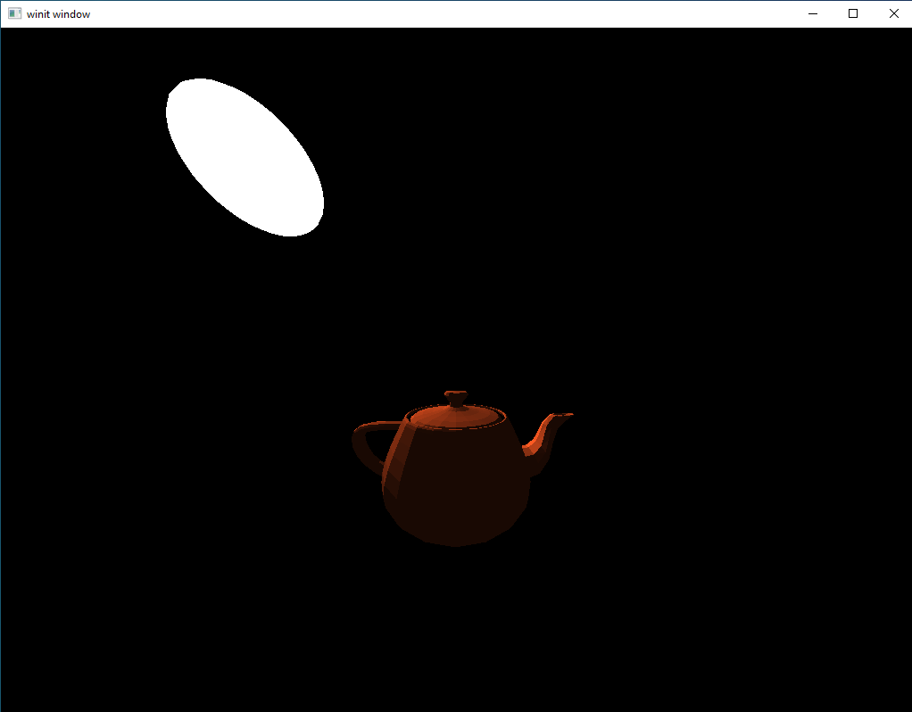
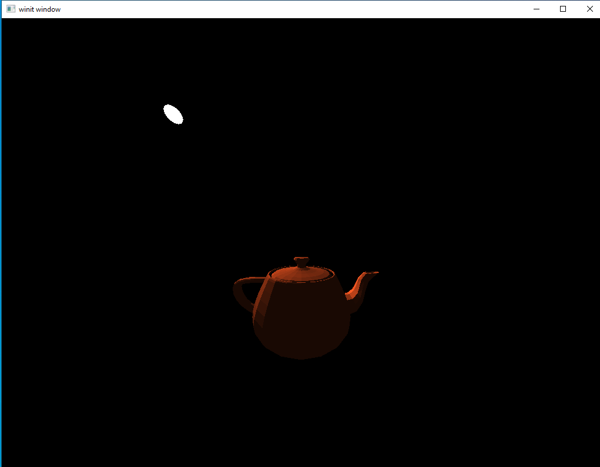
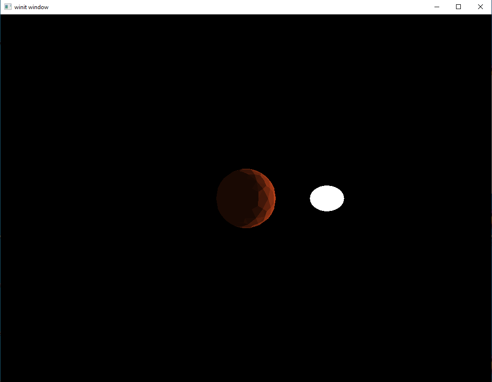
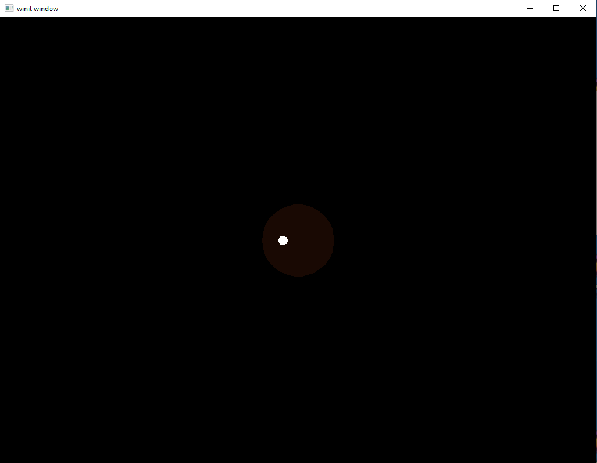

# Light Objects

This will be a simpler lesson which will implement a small feature to make our life easier. Specifically, we'd like to have the option to render something on-screen to represent a light source. Thus far, all our lights have just kind of shone from out of nowhere, leaving the viewer to infer their location from the light they cast on the scene. We'd like to render a small sphere on screen at the starting point of the light and with the same color as the light. This will help us determine if our lighting model is correct or if there are errors that need to be fixed.

#### New Shaders

Our first task is to throw together some shaders. We'll just use a modified version of the existing shaders we're using for the deferred rendering at the start of our pipeline. Both of these steps use flat shading, that is, they just write out whatever color value we give them without correcting for external lighting conditions. The main difference is that when we render our geometry it is at the start of a pipeline that applies these factors to find the final output color. Our new shaders, on the other hand, will be called at the very end of the pipeline and will not have the output colors modified after the fact. In essence we are taking the finished product of our rendering system and hastily scribbling in these light sources on top. 

`system/shaders/light_obj.vert`
```glsl
#version 450

layout(location = 0) in vec3 position;
layout(location = 1) in vec3 color;

layout(location = 0) out vec3 out_color;

layout(set = 0, binding = 0) uniform VP_Data {
    mat4 view;
    mat4 projection;
} vp_uniforms;

layout(set = 1, binding = 0) uniform Model_Data {
    mat4 model;
    mat4 normals;
} model;

void main() {
    gl_Position = vp_uniforms.projection * vp_uniforms.view * model.model * vec4(position, 1.0);
    out_color = color;
}
```

The only major change is that we've cut out the normals input. We have, however, left `Model_Data` the way it was. We'll explain that in a later section.

`system/shaders/light_obj.frag`
```glsl
#version 450
layout(location = 0) in vec3 in_color;

layout(location = 0) out vec4 f_color;

void main() {
    f_color = vec4(in_color, 1.0);
}
```

`system.rs`
```rust
mod light_obj_vert {
    vulkano_shaders::shader! {
        ty: "vertex",
        path: "src/system/shaders/light_obj.vert",
        types_meta: {
            use bytemuck::{Pod, Zeroable};

            #[derive(Clone, Copy, Zeroable, Pod)]
        },
    }
}

mod light_obj_frag {
    vulkano_shaders::shader!{
        ty: "fragment",
        path: "src/system/shaders/light_obj.frag"
    }
}
```

Lastly, we load the new shaders inside `system.rs`.

#### Implement the vertex definition

`system.rs`
```rust
use crate::obj_loader::{ColoredVertex, DummyVertex, NormalVertex};
// ...
vulkano::impl_vertex!(ColoredVertex, position, color);
// ...
```

This is a very minor step but it's easy to forget and will lead to a number of somewhat cryptic errors when trying to use it in a pipeline declaration.

#### New Pipeline

As you hopefully remember from earlier lessons, to use shaders we need to declare a graphics pipeline for them to live in. This tells Vulkan what data formats to expect and how to process them.

```rust
pub struct System {
    // ...
    ambient_pipeline: Arc<GraphicsPipeline>,
    light_obj_pipeline: Arc<GraphicsPipeline>,
    // ...
}

impl System {
    pub fn new(event_loop: &EventLoop<()>) -> System  {
        // ...
        let ambient_vert = ambient_vert::load(device.clone()).unwrap();
        let ambient_frag = ambient_frag::load(device.clone()).unwrap();
        let light_obj_vert = light_obj_vert::load(device.clone()).unwrap();
        let light_obj_frag = light_obj_frag::load(device.clone()).unwrap();
        // ...
        let light_obj_pipeline = GraphicsPipeline::start()
            .vertex_input_state(BuffersDefinition::new().vertex::<ColoredVertex>())
            .vertex_shader(light_obj_vert.entry_point("main").unwrap(), ())
            .input_assembly_state(InputAssemblyState::new())
            .viewport_state(ViewportState::viewport_dynamic_scissor_irrelevant())
            .fragment_shader(light_obj_frag.entry_point("main").unwrap(), ())
            .render_pass(lighting_pass.clone())
            .build(device.clone())
            .unwrap();
        // ...
        System{
            // ...
            ambient_pipeline,
            light_obj_pipeline,
            // ...
        }
    }
}
```

If you compare this new pipeline, to, say, our `directional_pipeline` declaration you'll notice that our new pipeline is missing any call to `blend_collective` or mention of color blending. This is because we won't want to mix in our new model color with the color that's already there. Instead, we want to overwrite any existing color entirely.

Something to keep in mind here is how easily we can mix pipelines that handle the existing buffer differently from inside the same render pass. If we wanted to, we could add a new pipeline that takes place after this one that does something entirely different. Learning to mix different effects like this is the key to unlocking the possibilities of deferred rendering.  

#### Update our RenderStage

We do have a problem with having multiple graphics pipelines that all run inside the same render pass. Specifically, we've set up each pipeline so that it should only be called at a certain point in the process. Unlike with render passes themselves, Vulkan will not enforce these rules for us. If you remember, our solution to this problem is to create our own struct to track which rendering type we're on and prevent things from being called out of order.

`system.rs`
```rust
#[derive(Debug, Clone)]
enum RenderStage {
    Stopped,
    Deferred,
    Ambient,
    Directional,
    LightObject,
    NeedsRedraw,
}

impl System {
    pub fn finish(&mut self, previous_frame_end: &mut Option<Box<dyn GpuFuture>>) {
        match self.render_stage {
            RenderStage::Directional => {},
            RenderStage::LightObject => {},
            RenderStage::NeedsRedraw => {
                self.recreate_swapchain();
                self.commands = None;
                self.render_stage = RenderStage::Stopped;
                return;
            },
            _ => {
                self.commands = None;
                self.render_stage = RenderStage::Stopped;
                return;
            }
        }
        // ...
    }
}
```

Because we want rendering light sources on screen to be optional, we need to make sure that we give `finish` the ability to skip `RenderStage::LightObject` if we haven't used it.

#### Update Model

We'll want to update `Model` so that it can provide a `ColoredVertex`.

`model.rs`
```rust
impl Model {
    pub fn color_data(&self) -> Vec<ColoredVertex> {
        let mut ret: Vec<ColoredVertex> = Vec::new();
        for v in &self.data {
            ret.push(ColoredVertex {
                position: v.position,
                color: v.color,
            });
        }
        ret
    }
}
``` 

#### Updating DirectionalLight

We'll add method to `DirectionalLight` to get the position data as a `vec3`. We don't have to do that, it's just a convenience method to help keep our code clean.

`system/mod.rs`
```rust
impl DirectionalLight {
    pub fn get_position(&self) -> TVec3<f32> {
        vec3(self.position[0], self.position[1], self.position[2])
    }
}
```

## Write our object render method

Our last major function is the method to do the rendering itself. It's very similar to the other methods we're already using, so I'll just post it here and then point out a couple interesting bits.

`system.rs`
```rust
impl System {
    pub fn light_object(&mut self, directional_light: &DirectionalLight) {
        match self.render_stage {
            RenderStage::Directional => {
                self.render_stage = RenderStage::LightObject;
            }
            RenderStage::LightObject => {}
            RenderStage::NeedsRedraw => {
                self.recreate_swapchain();
                self.render_stage = RenderStage::Stopped;
                self.commands = None;
                return;
            }
            _ => {
                self.render_stage = RenderStage::Stopped;
                self.commands = None;
                return;
            }
        }

        let mut model = Model::new("data/models/sphere.obj")
            .color(directional_light.color)
            .build();

        model.translate(directional_light.get_position());

        let model_subbuffer = {
            let (model_mat, normal_mat) = model.model_matrices();

            let uniform_data = deferred_vert::ty::Model_Data {
                model: model_mat.into(),
                normals: normal_mat.into(),
            };

            self.model_uniform_buffer.from_data(uniform_data).unwrap()
        };

        let model_layout = self
            .light_obj_pipeline
            .layout()
            .set_layouts()
            .get(1)
            .unwrap();
        let model_set = PersistentDescriptorSet::new(
            &self.descriptor_set_allocator,
            model_layout.clone(),
            [WriteDescriptorSet::buffer(0, model_subbuffer.clone())],
        )
        .unwrap();

        let vertex_buffer = CpuAccessibleBuffer::from_iter(
            &self.memory_allocator,
            BufferUsage {
                vertex_buffer: true,
                ..BufferUsage::empty()
            },
            false,
            model.color_data().iter().cloned(),
        )
        .unwrap();

        self.commands
            .as_mut()
            .unwrap()
            .bind_pipeline_graphics(self.light_obj_pipeline.clone())
            .bind_descriptor_sets(
                PipelineBindPoint::Graphics,
                self.light_obj_pipeline.layout().clone(),
                0,
                (self.vp_set.clone(), model_set.clone()),
            )
            .bind_vertex_buffers(0, vertex_buffer.clone())
            .draw(vertex_buffer.len() as u32, 1, 0, 0)
            .unwrap();
    }
}
```

Firstly, you might notice that we're loading a new `Model` each time we call this method. While it would be more efficient to load this model a single time and just use it for every call, that adds more complexity to something that, in the end, is just for the convenience for us as developers. Even complex scenes will likely have a couple dozen light sources *at most* and so the performance impact of this inefficiency is trivial. Anything which requires rendering more than that will likely require more power than this little toy rendering system will ever be capable of delivering. As always, feel free to modify your own code however you wish to meet your own requirements.

On the subject of me being kind of lazy, take a look at our declaration of `model_subbuffer`. We take a buffer type intended to be used with one shader and force it to be used on a different shader. Notice in particular that we're declaring data in the format `deferred_vert::ty::Model_Data` instead of the correct `light_obj_vert::ty::Model_Data` type that's actually present in our shader. This is unsafe because our compiler will not save us if we make a mistake here. However, the Vulkan drivers *will* accept it because both data types have the same signature. This is also why we left the `mat4 normals` field in our `light_obj.vert` uniform despite not using it anywhere, to make this hack possible.

If you wish, it would be a good exercise to fix both of these flaws with my implementation, but for now this tutorial will continue with it as it is.

#### Calling The Code

We'll use a highly simplified version of the `main.rs` from the last lesson to illustrate what we're able to accomplish.

`main.rs`
```rust
fn main() {
    let event_loop = EventLoop::new();
    let mut system = System::new(&event_loop);

    system.set_view(&look_at(
        &vec3(0.0, 0.0, 0.1),
        &vec3(0.0, 0.0, 0.0),
        &vec3(0.0, 1.0, 0.0),
    ));

    let mut teapot = Model::new("data/models/teapot.obj").build();
    teapot.translate(vec3(0.0, 2.0, -5.0));

    let directional_light = DirectionalLight::new([-4.0, -4.0, -3.5, 1.0], [1.0, 1.0, 1.0]);

    let mut previous_frame_end = Some(Box::new(sync::now(system.device.clone())) as Box<dyn GpuFuture>);

    event_loop.run(move |event, _, control_flow| match event {
        Event::WindowEvent {
            event: WindowEvent::CloseRequested,
            ..
        } => {
            *control_flow = ControlFlow::Exit;
        }
        Event::WindowEvent {
            event: WindowEvent::Resized(_),
            ..
        } => {
            system.recreate_swapchain();
        }
        Event::RedrawEventsCleared => {
            previous_frame_end
                .as_mut()
                .take()
                .unwrap()
                .cleanup_finished();

            system.start();
            system.geometry(&mut teapot);
            system.ambient();
            system.directional(&directional_light);
            system.light_object(&directional_light);
            system.finish(&mut previous_frame_end);
        }
        _ => (),
    });
}
```

Running the code shows this:



#### Adding Scale

That looks pretty decent and meets our initial requirements for a way to show the physical location of our lights. However, there is one small problem: the size of our light object. It's not a problem with our current scene but the light is so large that it could easily block some of the things we want to see in other scenes. To fix this, we'll add a simple operation: [scale](https://en.wikipedia.org/wiki/Scaling_%28geometry%29) 

`model.rs`
```rust
pub struct Model {
    // ...
    uniform_scale: f32,
    // ...
}

pub struct ModelBuilder {
    // ...
    scale_factor: f32,
}

impl ModelBuilder {
    fn new(file: String) -> ModelBuilder {
        ModelBuilder {
            // ...
            scale_factor: 1.0,
        }
    }

    pub fn build(self) -> Model {
        // ...
        Model {
            // ...
            uniform_scale: self.scale_factor,
            // ...
        }
    }
    
    // ...

    pub fn uniform_scale_factor(mut self, scale: f32) -> ModelBuilder {
        self.scale_factor = scale;
        self
    }
}

impl Model {
    // ...
    pub fn model_matrices(&mut self) -> (TMat4<f32>, TMat4<f32>) {
        if self.requires_update {
            self.model = self.translation * self.rotation;
            self.model = scale(
                &self.model,
                &vec3(self.uniform_scale, self.uniform_scale, self.uniform_scale),
            );
            self.normals = inverse_transpose(self.model);
            self.requires_update = false;
        }
        (self.model, self.normals)
    }
    // ...
}
```

As you can see, we implement a *uniform scale factor*. What this means is that whatever number we give it will be applied equally. So if we pass in `0.5` the model will become half the size. It is perfectly possible to have *non-uniform scaling* but we're trying to keep this as simple as possible.

Now we just need to update our light object rendering code to apply a scale factor to the models it loads.

`system.rs`
```rust
impl System {
    // ...
    pub fn light_object(&mut self, directional_light: &DirectionalLight) {
        // ...
        let mut model = Model::new("data/models/sphere.obj")
            .color(directional_light.color)
            .uniform_scale_factor(0.2)
            .build();
        // ...
    }
    // ...
}
```

Updating our rendering code to use a fixed scale factor of `0.2` is as simple as that. 

Running our code now produces a light object much more reasonable in size.



## Adding Movement

Testing lighting systems with static lights will only get you so far. It's possible to create shaders with subtle errors that are only apparent when the light is in motion. I actually discovered a bug in my own shaders at this point which I will be going through and correcting in earlier lessons after uploading this one.


#### Adding a Rotating Light

Let's update our main method so that there is a sphere in the center of the view with a light orbiting around it. It's pretty simple to do once you dredge the trigonometry for points on a circle out of the depths of memory.

`main.rs`
```rust
fn main() {
    let event_loop = EventLoop::new();
    let mut system = System::new(&event_loop);

    system.set_view(&look_at(
        &vec3(0.0, 0.0, 0.1),
        &vec3(0.0, 0.0, 0.0),
        &vec3(0.0, 1.0, 0.0),
    ));

    let mut sphere = Model::new("./src/models/ico_sphere_1.obj").build();
    sphere.translate(vec3(0.0, 0.0, -3.0));

    let rotation_start = Instant::now();

    let mut previous_frame_end = Some(Box::new(sync::now(system.device.clone())) as Box<dyn GpuFuture>);

    event_loop.run(move |event, _, control_flow| match event {
        Event::WindowEvent {
            event: WindowEvent::CloseRequested,
            ..
        } => {
            *control_flow = ControlFlow::Exit;
        }
        Event::WindowEvent {
            event: WindowEvent::Resized(_),
            ..
        } => {
            system.recreate_swapchain();
        }
        Event::RedrawEventsCleared => {
            previous_frame_end
                .as_mut()
                .take()
                .unwrap()
                .cleanup_finished();

            let elapsed = rotation_start.elapsed().as_secs() as f32
                + rotation_start.elapsed().subsec_nanos() as f32 / 1_000_000_000.0;
            let elapsed_as_radians = elapsed * 30.0 * (pi::<f32>() / 180.0);

            let x: f32 = 2.0 * elapsed_as_radians.cos();
            let z: f32 = -3.0 + (2.0 * elapsed_as_radians.sin());

            let directional_light = DirectionalLight::new([x, 0.0, z, 1.0], [1.0, 1.0, 1.0]);

            system.start();
            system.geometry(&mut sphere);
            system.ambient();
            system.directional(&directional_light);
            system.light_object(&directional_light);
            system.finish(&mut previous_frame_end);
        }
        _ => (),
    });
}
```

Here we have a circle with a radius of 2 set on its side by replacing the y value with the z value. We move the z-value of the origin of the circle back by 3 to match our sphere so that the light orbits the sphere instead of the world origin.

Let's run the code and see what it looks like:



Looks pretty good. If we had this as a stationary scene we could congratulate ourselves on a job well-done and move on. However, let's let the scene keep running until the light moves behind our center sphere.



The front of our model isn't being illuminated, which is good. But what's going on with the light object still showing up? 

The answer is simple, in the code above we forgot to enable depth-testing when we rendered the geometry of our light object. Now, it would probably be fine to leave it as-is since this is only ever supposed to be a debug tool for the developer. But the fix for this is really simple so let's go ahead and add it in.

`system.rs`
```rust
impl System {
    pub fn new(event_loop: &EventLoop<()>) -> System  {
        // ...
        let render_pass = vulkano::ordered_passes_renderpass!(device.clone(),
            // ...
            passes: [
                // ...
                {
                    color: [final_color],
                    depth_stencil: {depth},
                    input: [color, normals]
                }
            ]
        ).unwrap();
        // ...
        let light_obj_pipeline = GraphicsPipeline::start()
            .vertex_input_state(BuffersDefinition::new().vertex::<ColoredVertex>())
            .vertex_shader(light_obj_vert.entry_point("main").unwrap(), ())
            .input_assembly_state(InputAssemblyState::new())
            .viewport_state(ViewportState::viewport_dynamic_scissor_irrelevant())
            .fragment_shader(light_obj_frag.entry_point("main").unwrap(), ())
            .depth_stencil_state(DepthStencilState::simple_depth_test())
            .rasterization_state(RasterizationState::new().cull_mode(CullMode::Back))
            .render_pass(lighting_pass.clone())
            .build(device.clone())
            .unwrap();
        // ...
    }
}
```

We don't have to declare anything new or wrestle with buffer configuration or anything like that. We just needed to tell Vulkan that our second subpass will be using the depth stencil and enable `depth_stencil_state` for our light object pipeline.  We'll also go ahead and add in the `rasterization_state` call as well even though face culling is a trivial performance consideration for this feature.

Run the code and see for yourself. With these few minor tweaks, our light object is being hidden when it goes behind the sphere.

This is a rather small feature but it's one that I, personally, have found pretty useful in my own programs. Little things that make life easier for you as the programmer can go a long way in more complex projects.

[lesson source code](https://github.com/taidaesal/vulkano_tutorial/tree/gh-pages/lessons/11.5.%20Light%20Objects)
