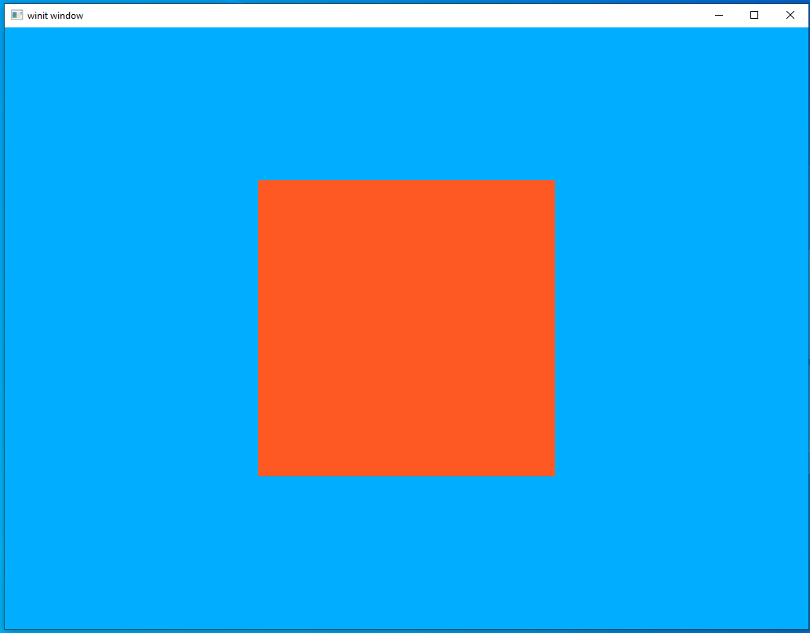
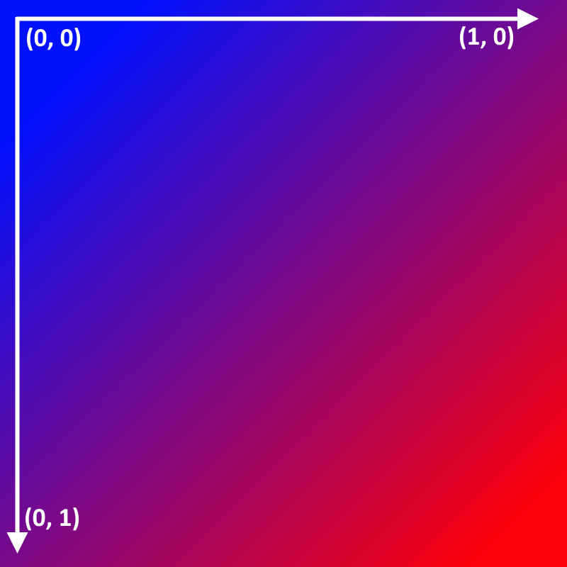
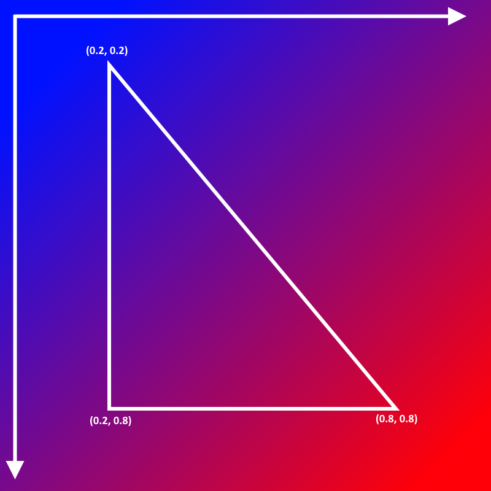
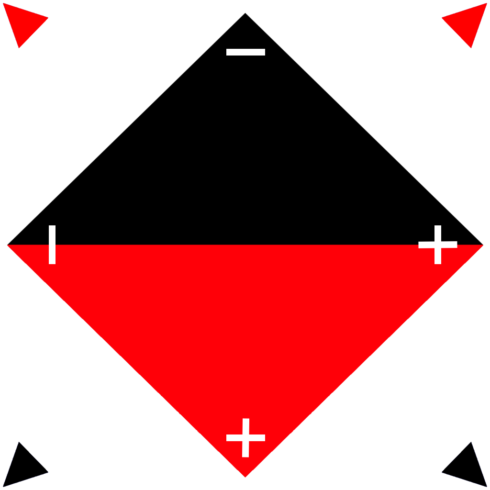
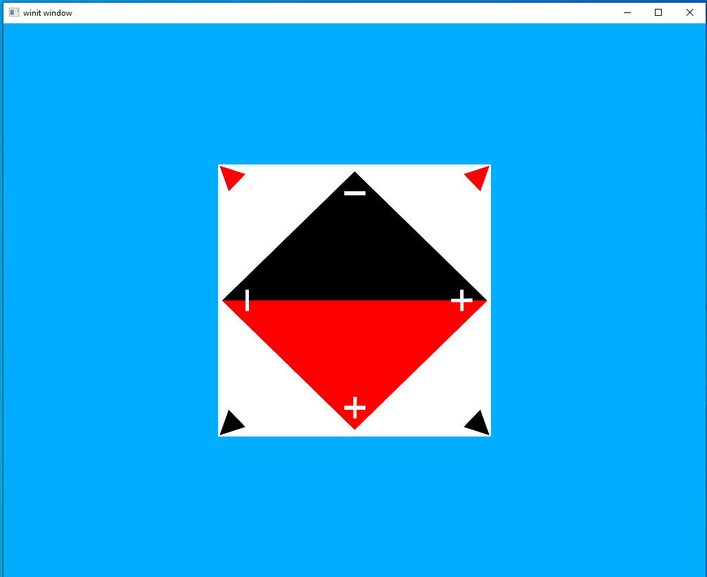
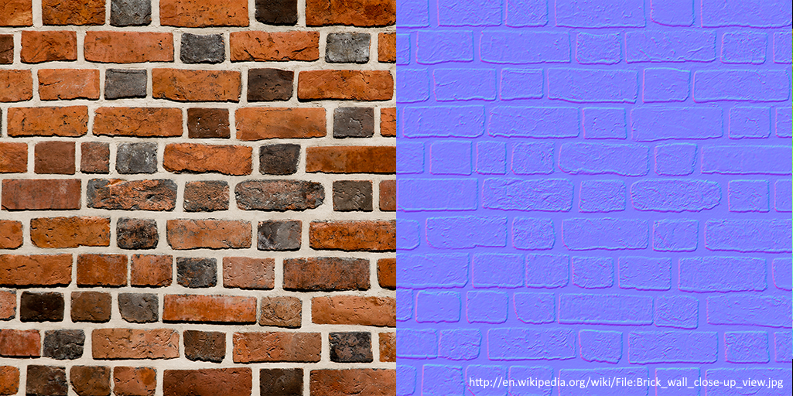
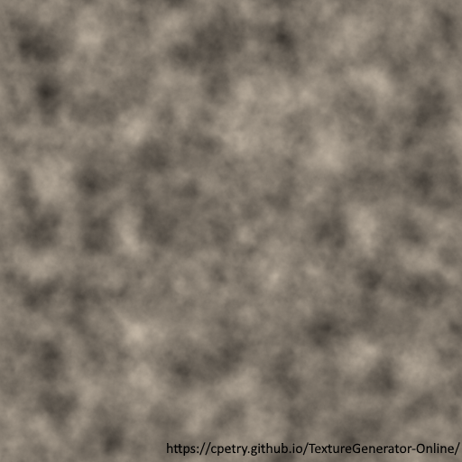

# Textures

We at last come to a topic we've left oddly late compared to most tutorials and one you may have been eager to get to: textures. We've discussed why the tutorials are structured like this in the past. Specifically, textures are simply a specialized type of data buffer we upload to the graphics hardware. As such, I feel that while textures are vital to any graphical application they do not really help you understand more about Vulkan in particular. Now that we've covered most of the basic concepts we can move on to topics like this.

What are textures though? Although there are exceptions we'll be discussing later, textures are images that are meant to be displayed as pictures to the user. Every time so far we've created an `Image` we've used it as a general data buffer to store things like vertices. In this lesson we will be storing actual images and using them instead of manually-passing color values.

#### About texture dimensions

The general rule for the size of textures is that they should have dimensions that is a power of two. So 8, 16, 32, 64, 128, 256, 512, 1024, and 2048 are all common dimension sizes (although AAA games today can have textures even larger than that). The reason for this is down to the physical nature of the hardware itself. Only a certain amount of data can be transmitted at once and that's a hard limited imposed by the silicon itself. To maximize performance we want to "fill up" each transaction, to push as much data as possible through at once. The driver that's handling all this behind the scenes is pretty forgiving in instances where the actual data format is different from what the hardware would like it to be so sending in textures of other sizes is not something that will cause an error or crash. However, to upload a texture of the un-optimal size the hardware will have to spend extra cycles fixing it up. That won't be a problem with anything we'll be doing in these tutorials but when uploading textures of hundreds of megabytes or even a gigabyte or more it can bring the performance to its knees.

Textures are usually square but that's partly just convention. Certain game engines might do things behind the scenes that makes it more of a requirement but the actual hardware and drivers are fine with rectangular textures. so textures of 32x112 or 64x256 are perfectly valid as far as Vulkan is concerned. However, since it is something of an industry preference all textures used in these tutorials will be square. 

## Getting Started

First, copy the source files from lesson 5. We'll use a simple code base so that we don't have to worry about fitting this in to the more complex code of our rendering system. We'll circle back for our next draft of the rendering system to add this in.

After copying the file, we'll update the `Cargo.toml` file to add a new dependency. Since we're loading image files we're going to use a crate for that instead of trying to write our own parser like we did with our `.obj` file loader.

```toml
png = "0.16.8"
```

Lastly, we'll update the `vertex_buffer` variable to create a square instead of a triangle. The reasons for this will be clear in a bit.

```rust
let vertex_buffer = CpuAccessibleBuffer::from_iter(device.clone(), BufferUsage::all(), false, [
    Vertex { position: [-0.5, -0.5, -0.5], color: [1.0, 0.35, 0.137] }, // top left corner
    Vertex { position: [-0.5, 0.5, -0.5], color: [1.0, 0.35, 0.137] }, // bottom left corner
    Vertex { position: [0.5, -0.5, -0.5], color: [1.0, 0.35, 0.137] }, // top right corner

    Vertex { position: [0.5, -0.5, -0.5], color: [1.0, 0.35, 0.137] }, // top right corner
    Vertex { position: [-0.5, 0.5, -0.5], color: [1.0, 0.35, 0.137] }, // bottom left corner
    Vertex { position: [0.5, 0.5, -0.5], color: [1.0, 0.35, 0.137] }, // bottom right corner
].iter().cloned()).unwrap();
```

if you run the program at this point you should see the following image:



This is the blank canvas we will be painting with our texture image.


#### UV coordinates

We access texture images through vector values we call _UV values_ in a process called _UV mapping_. This lets us map pixels from the input pixels onto the rendered pixels on the screen. 



The UV coordinates follow the X,Y axis we're familiar with from elsewhere. Note that UV coordinates follow the same coordinate space as the rest of Vulkan with the origin point in the upper left corner with the positive U-axis moving further to the right and the positive V-axis moving further "down" the image. Another thing to note is that the axis goes from 0.0 to 1.0. Unlike values in model space only values between 0 and 1 are accepted.

Here is an example of a triangle with the UV values for each vertex labeled.




The second image shows what the triangle might look like if we ran it in our program. You can see that the portion of the image sketched out by the UV coordinates in the first image is the value loaded and put on the triangle.

#### Our Texture

We will be using the image below in our lesson. It's designed to be something that we can use to see whether it is oriented correctly. When working with UV mapping it can be easy to mess up the axis and end up with an image that's upside down or otherwise mapped incorrectly. The image below is labeled in such a way that any mistake in mapping will be plainly visible.




## Implementing Textures

Now let's walk through how we add textures to our program. As you'll see, it's pretty similar to things we've seen before.

#### main.rs

Let's modify our `Vertex` data type. We don't need a `color` vertex any more but instead a two-member `uv` vertex. All the previous things about defining a data type to pass to the GPU apply here so keep past lessons in mind when planning your own system.

```rust
#[derive(Default, Debug, Clone)]
struct Vertex {
    position: [f32; 3],
    uv: [f32; 2]
}
vulkano::impl_vertex!(Vertex, position, uv);
```

Next, we update our `vertex_buffer` to use the UV coordinates. This makes it pretty plain to see that the directions of the UV axis are the same as the XY axis in model space. The upper-left corner is `(0.0, 0.0)` and the lower-right corner is `(1.0, 1.0)` just as expected 

```rust
let vertex_buffer = CpuAccessibleBuffer::from_iter(device.clone(), BufferUsage::all(), false, [
    Vertex { position: [-0.5, -0.5, -0.5], uv: [0.0, 0.0] }, // top left corner
    Vertex { position: [-0.5, 0.5, -0.5], uv: [0.0, 1.0] }, // bottom left corner
    Vertex { position: [0.5, -0.5, -0.5], uv: [1.0, 0.0] }, // top right corner

    Vertex { position: [0.5, -0.5, -0.5], uv: [1.0, 0.0] }, // top right corner
    Vertex { position: [-0.5, 0.5, -0.5], uv: [0.0, 1.0] }, // bottom left corner
    Vertex { position: [0.5, 0.5, -0.5], uv: [1.0, 1.0] }, // bottom right corner
].iter().cloned()).unwrap();
```

Lastly, let's create a new `textures` directory and add our texture there. We store texture locally as we will be loading the texture with a macro, same as our shaders.

```
src/
  |
  textures/
     |
     diamond.png
```

#### Loading the texture

The process of loading a texture can be a little verbose since it combines Rust-style file io and Vulkan. Let's look at the block of code and then look through it.

```rust
let (texture, tex_future) = {
    let png_bytes = include_bytes!("./textures/diamond.png").to_vec();
    let cursor = Cursor::new(png_bytes);
    let decoder = png::Decoder::new(cursor);
    let mut reader = decoder.read_info().unwrap();
    let info = reader.info();
    let dimensions = ImageDimensions::Dim2d {
        width: info.width,
        height: info.height,
        array_layers: 1,
    };
    let mut image_data = Vec::new();
    image_data.resize((info.width * info.height * 4) as usize, 0);
    reader.next_frame(&mut image_data).unwrap();
    let (image, future) = ImmutableImage::from_iter(
        image_data.iter().cloned(),
        dimensions,
        MipmapsCount::One,
        Format::R8G8B8A8_SRGB,
        queue.clone(),
    )
    .unwrap();
    (ImageView::new(image).unwrap(), future)
};
```

let's go bit-by-bit

```rust
let png_bytes = include_bytes!("./textures/diamond.png").to_vec();
```

Here we use a macro provided by the Rust standard library, `include_bytes!`, to read in our texture file. We load it as a byte array that has the type `&'static [u8; N]`. This means that the data will be added to our executable. Doing this is fine for our learning app but textures will need to be loaded dynamically in production apps.

```rust
let cursor = Cursor::new(png_bytes);
let decoder = png::Decoder::new(cursor);
```

`Cursor` is another type provided by the Rust standard library. It wraps a byte array to provide an implementation of the `Read` trait. This lets us pass it into the `Decoder` provided by the `png` crate we pulled in earlier.

```rust
let mut reader = decoder.read_info().unwrap();
let info = reader.info();
```

This gives us some information about the png image we've loaded as well as a new `Reader` that we can use to actually load the source bytes into a vector.

```rust
let mut image_data = Vec::new();
let depth: u32 = match info.bit_depth {
    png::BitDepth::One => 1,
    png::BitDepth::Two => 2,
    png::BitDepth::Four => 4,
    png::BitDepth::Eight => 8,
    png::BitDepth::Sixteen => 16
};
image_data.resize((info.width * info.height * depth) as usize, 0);
reader.next_frame(&mut image_data).unwrap();
```

This is how we actually load the image into a Rust vector. First we declare an empty vector, then we resize the vector based on the image dimensions we've found with the `info` variable. The specific call to `reader.next_frame` is because a png file can have multiple "frames". We don't make use of that feature so we can ignore the complications that can come from that.

```rust
let dimensions = ImageDimensions::Dim2d {
    width: info.width,
    height: info.height,
    array_layers: 1,
};
let (image, future) = ImmutableImage::from_iter(
    image_data.iter().cloned(),
    dimensions,
    MipmapsCount::One,
    Format::R8G8B8A8_SRGB,
    queue.clone(),
)
.unwrap();
(ImageView::new(image).unwrap(), future)
```

The last part of this code block is where we bring Vulkan into it. We're seeing `ImmutableImage` for the first time here but I bet you can probably guess what it is. It's the brother type to `AttachmentImage` and `SwapchainImage` and is a data buffer type, it doesn't have to store literal image data but in this case that's exactly what we're doing right here. We can use an `ImmutableImage` here because we won't ever need to change the data we're storing in this `Image`. We don't strictly have to use it but it gives the Vulkan driver a hint about expected use that lets it do optimizations behind the scenes.

This code returns two values `texture` and `tex_future`. `texture` is fairly self-explanatory, it's the `ImmutableImage` we just made. `tex_future` is a `Future` object and is a bit more interesting. Remember that Vulkan is _asynchronous_, so operations that take place on the GPU don't finish before the code on the CPU returns. As part of using `ImmutableImage` the data is going to be uploaded to the GPU and, as such, is going to be an asynchronous operation. We'll need to remember to handle this future before we try to use the data.  

```rust
let mut previous_frame_end = Some(tex_future.boxed());
```
previously we set up an empty future since we had nothing we were waiting for at the start of the program. This is how we make sure that the texture upload process has completed.

#### The Sampler

The following code is the only really new part of the lesson, creating the `Sampler`.

```rust
let sampler = Sampler::new(
    device.clone(),
    Filter::Linear,
    Filter::Linear,
    MipmapMode::Nearest,
    SamplerAddressMode::Repeat,
    SamplerAddressMode::Repeat,
    SamplerAddressMode::Repeat,
    0.0,
    1.0,
    0.0,
    0.0,
).unwrap();
```

This is new but it follows the same pattern for Vulkano data before. Earlier, when we created an `ImmutableImage`, we uploaded the data; however, by itself Vulkan doesn't know how it's supposed to access that data. The `Sampler` is how we tell Vulkan how to access that data. There are a number of arguments but the only one I want to call out here is `SamplerAddressMode::Repeat`. This tells Vulkan what to do if it receives UV values that lie outside the valid range. In this case, we're telling Vulkan to just repeat the image as necessary.

#### Descriptor Set

The descriptor set looks fairly similar to what we've seen before. We treat textures as a form of `uniform` so we use a new method, `add_sampled_image`, to add the texture and its sampler to the descriptor set.

```rust
let layout = pipeline.layout().descriptor_set_layouts().get(0).unwrap();
let mut set_builder = PersistentDescriptorSet::start(layout.clone());
set_builder
    .add_buffer(uniform_buffer_subbuffer)
    .unwrap()
    .add_sampled_image(texture.clone(), sampler.clone())
    .unwrap();
let set = set_builder.build().unwrap();
```

## Shaders

#### Vertex shader

The vertex shader looks much like it did back in lesson 5. The only change we have is to change the `color` input to a `uv` input and pass it to the fragment shader. Note that we don't apply any transformation to the UV coordinates. Texture mapping is generally something that's independent of where a fragment is in the scene or how it's oriented.

```glsl
#version 450
layout(location = 0) in vec3 position;
layout(location = 1) in vec2 uv;

layout(location = 0) out vec2 tex_coords;

layout(set = 0, binding = 0) uniform MVP_Data {
    mat4 model;
    mat4 view;
    mat4 projection;
} uniforms;

void main() {
    mat4 worldview = uniforms.view * uniforms.model;
    gl_Position = uniforms.projection * worldview * vec4(position, 1.0);
    tex_coords = uv;
}
```

#### Fragment shader

The fragment shader is where things get interesting. We accept the `tex_coords` from the vertex shader as well as a `sampler2D`. This is the uniform value we passed in through the descriptor set. There are more kinds of samplers than a 2D version but this is not something that Vulkan can automatically determine. We could, if we wanted, pass in a `sampler3D` and it would successfully compile but the output would be gibberish because the `Sampler` we're creating on the CPU is 2D and not 3D. This sort of pitfall is ever-present while working with GLSL shaders so if you ever find yourself getting weird errors make sure to double-check how you're specifying the data types in GLSL. 

`texture(tex, tex_coords);` is how we retrieve the data from the textures. We "sample" the texture at each vertex and then fill the pixels in between from the corresponding pixels in the texture. 

```glsl
#version 450
layout(location = 0) in vec2 tex_coords;

layout(location = 0) out vec4 f_color;

layout(set = 0, binding = 1) uniform sampler2D tex;

void main() {
    f_color = texture(tex, tex_coords);
}
```

#### Running the code

At this point we should be done with all the changes we need to make. Run the code and, if everything is successful, you should see the below image.



Looks good! Everything seems to be pointing in the right direction and colored correctly.

#### A Note

I had a lot of issues with the texture at first that boiled down to the bit depth of the image I was using. I could only get it working with 32 depth-bit texture images.

## Next Steps

Textures are a huge topic and what we looked at here is just a taste. Textures are often used exactly like we saw here to apply images to fragments; however, that's far from the only thing textures can be used for. Two of the most common such uses are bump mapping and noise mapping.

#### Bump Mapping

Normals are vital to lighting and we've been using them for a while but we've been using a very limited version of them. So far, we have one normal vector for each vertex which means each "triangle" that we render there's only a single normal vector. This is why you can clearly see each face in the model. We can make the lighting look more realistic by adding more vertices to the model. But this approach has limits as it means each model you render needs orders of magnitude more vertices than it would. Ideally, we would like to keep the vertex normals from the high-polygon version of our model and apply it to the lower-polygon version of the model and this is what bump mapping does. 



On the left we see a typical texture image like the one we implemented in this lesson. The image on the right is a *normal map* and is the most common form of bump mapping. If you remember back in lesson 7 we saw a cube with the colors supplied by the vertex normals. This is something similar. Each pixel of the normal map is a vertex stored as a color and it is this vertex that is used when applying lighting. With normal mapping we can apply directional lighting on a per-pixel basis rather than per-vertex.

We won't be implementing bump mapping as part of our tutorials but it's something that's reasonably easy to do with the rendering system we already have. You just need to update the deferred lighting shader to pull normal vertices from a texture instead of from vertex normals passed in from the geometry shader.

#### Noise Mapping

Noise or [gradient noise](https://en.wikipedia.org/wiki/Gradient_noise) is a form of randomness that is often used in computer games. An example of this would be a terrain height-map. We generate a map, say, in the style of Minecraft. However, even "random" shapes generated on the CPU tend to look generic and repetitive thanks to the difficulties with generating true randomness on a computer. We can apply a "noise" function to generate a texture that we can use to modify things on the fly.



In our Minecraft-style example map we could use the above image to modify it. We could map each pixel of the noise texture to a point on the generated terrain and then move the surface of the map up or down based on the value we've found from the noise texture. Real terrain generators often use multiple noise textures, each one applying a different sort of transformation to the underlying map.

[Lesson Source Code](https://github.com/taidaesal/vulkano_tutorial/tree/gh-pages/lessons/13.%20Textures)