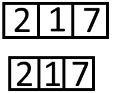
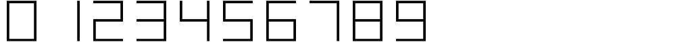
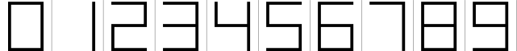
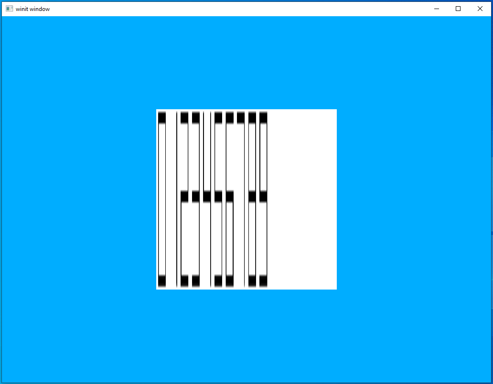
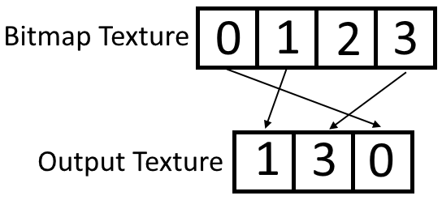
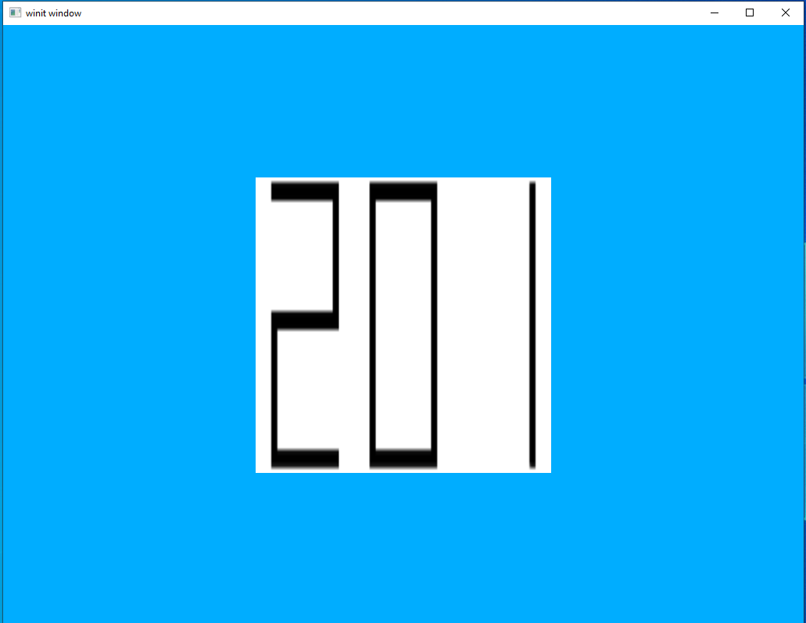
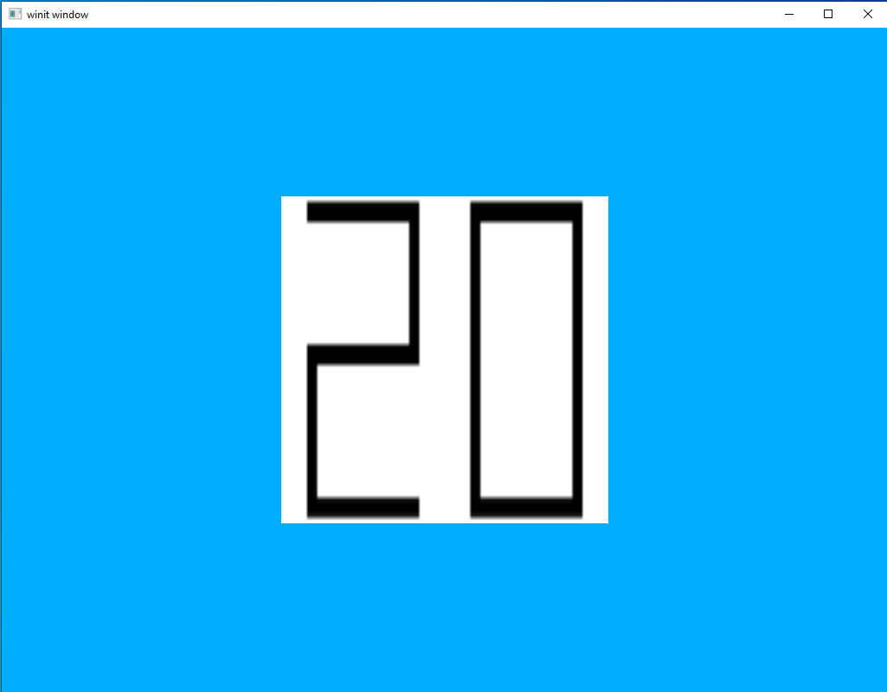

# Text

One of the common application for textures outside of decorating models is to display text. An under-appreciated aspect of video games is the Graphical User Interface (GUI) that goes along with it, and the most fundamental component of the GUI is text. Text lets you directly communicate the critical parts of the interface to the user, provide directions, and clarify potentially confusing items.

The catch is that, like buttons, sliders, and other parts of a GUI, text isn't just provided to us "for free." As a programmer you will need to find some way to add text support to your application, rather than enjoying it by default. In most applications this will be done by integrating a third-party library or framework but this lesson will show how to implement a simple text loading and display system.

## About Text

#### Bitmap vs Vector

Text is, ultimately, just another picture we're drawing on the screen. So the first question is: where do we get that picture? The simplest answer to that question is to store each character in a literal picture file. Just like with textures that we might store in a .png file, bitmap (also calls *raster*) text characters exist in a regular image format that we could view directly if we wanted to. This has the advantage of being easy to create, understand, and to use and is why it was used on the earliest computers as well as remaining a popular choice today.

The main alternative to bitmap fonts is vector fonts. Vector fonts aren't stored as images but rather as a set of instructions that tell the computer how to draw the images itself. The advantage of this is that vector fonts are no longer dependent on resolution. Compared to bitmap fonts which tend to only look good in a narrow range of resolutions, vector fonts can be used at pretty much any resolution and still produce crisp letters. This does come with a small computational overhead compared to bitmap fonts but is generally insignificant on modern hardware.

Between the two, vector fonts are by far the most commonly used in modern applications. Bitmap fonts are now used mostly in embedded systems, legacy computing hardware, for artistic reasons, or for learning about how text rendering works. For the sake of this tutorial, I would like to have code that shows the most basic form of text loading and rendering and only bitmap fonts are simple enough to do that. Writing a vector text rendering engine would be a major undertaking and certainly not something that would help explain Vulkan.

#### Spacing

The second major topic we'll need to look at is *font-spacing*. Basically, how much space does each character get on the screen. The two options are *monospaced* where each character occupies the same amount of horizontal space and *proportional* where each character takes up an amount of horizontal space proportional to the actual width of the individual character. This is probably best seen with an illustration.



In the first line we see an example of *monospaced* text. Each character sits in the middle of an equally-sized "box" of space. The character "1" takes up much less space than "2" or "7" does, but this doesn't lead to less space being assigned to it. 

The bottom line is an example of *proportional* spacing. Since "1" is a very narrow character it is given a much narrower amount of horizontal space while "2" and "7" are given more.

Font spacing is independent of whether the font itself is a bitmap font or a vector font; although, many of the earliest bitmapped fonts were also monospaced for reasons related to limited memory and processing power since monospaced fonts are easier to store and load. This tutorial will make use of a monospaced font for similar reasons, it's just much easier to write a loader when the only information you need to keep track of is the index value of the character in the source texture.

## Our Program

For the sake of simplicity we'll be writing a program that handles only the most basic case: a bitmapped, monospaced font that only contains digits. The input texture we're going to be using is shown below.



A zoomed-in version that marks the amount of space each character is assigned might make things more obvious.



Each character has been given a space 64x64 pixels large, no matter how much of that space the character uses. Compare the "0" to the "1". The "0" takes up most of its 64 pixel-wide space while the "1" takes up hardly any. 

#### What We'll Do

We'll be re-using the code from the last lesson for this one. However, instead of using a fixed texture we'll be creating a new texture every second. This texture will contain the count of how many seconds the program has been running.

#### First Change

I've added our bitmap texture `texture_small.png` to the `src/textures` directory we created in the last lesson. Let's quickly upload the texture and see what it looks like.

`main.rs`
```rust
let (image_data, image_dimensions) = {
    let png_bytes = include_bytes!("./textures/texture_small.png").to_vec();
    let cursor = Cursor::new(png_bytes);
    let decoder = png::Decoder::new(cursor);
    let mut reader = decoder.read_info().unwrap();
    let info = reader.info();
    let image_dimensions = ImageDimensions::Dim2d {
        width: info.width,
        height: info.height,
        array_layers: 1,
    };
    let mut image_data = Vec::new();
    let depth: u32 = match info.bit_depth {
        png::BitDepth::One => 1,
        png::BitDepth::Two => 2,
        png::BitDepth::Four => 4,
        png::BitDepth::Eight => 8,
        png::BitDepth::Sixteen => 16,
    };
    image_data.resize((info.width * info.height * depth) as usize, 0);
    reader.next_frame(&mut image_data).unwrap();
    (image_data, image_dimensions)
};
```

If we run it we see:


This is compressed because we're displaying an image 1024 pixels wide by 64 pixels high in a square. We'll only be looking to display a couple of digits so this won't be an issue with our current program, but it's something we'd need to pay attention to if we wanted to create a GUI of our own.

#### Creating Our Texture

What we'll do is generate a new texture each time we want to update what the user sees on screen. In principle is his pretty straight-forward. We have an input bitmap, and we want to copy sections of that input image to an output image. Effectively just copy/pasting from one to the other. This is where using monospace fonts will come in handy. We can find the starting index of the "chunk" of image data we want by just multiplying the number by 64 pixels as that is the width of each chunk.

First let's create a new file, `monospace.rs`, and add some quick-and-dirty code to load the input bitmap into memory.

`monospace.rs`
```rust
pub struct Monospace {
    input_width: usize,
    texture_data: Vec<u8>,
}

impl Monospace {
    pub fn new() -> Monospace {
        let png_bytes = include_bytes!("./textures/texture_small.png").to_vec();
        let cursor = Cursor::new(png_bytes);
        let decoder = png::Decoder::new(cursor);
        let mut reader = decoder.read_info().unwrap();
        let info = reader.info();
        let width = info.width;
        let height = info.height;
        let mut image_data = Vec::new();
        let depth: u32 = match info.bit_depth {
            png::BitDepth::One => 1,
            png::BitDepth::Two => 2,
            png::BitDepth::Four => 4,
            png::BitDepth::Eight => 8,
            png::BitDepth::Sixteen => 16,
        };
        image_data.resize((width * height * depth) as usize, 0);
        reader.next_frame(&mut image_data).unwrap();

        Monospace {
            input_width: width as usize,
            texture_data: image_data,
        }
    }
}
```

Nothing much to see here, we just move the existing image-loading code from `main.rs` to here. The next method is where the interesting stuff happens.

```rust
impl Monospace {
    
    // ....
    
    pub fn text(&self, value: &str) -> (Vec<u8>, u32, u32) {
        let chars = value.chars();
        let length = value.len();
        let height = 64;
        let width = length * 64;
        let mut ret: Vec<u8> = Vec::new();
        ret.resize(height * width * 4, 0);
        for (i, ch) in chars.enumerate() {
            let val = ch.to_digit(10).unwrap() as usize;
            let source_index = val * 64;
            let target_index = i * 64;
            for row in 0..64 {
                let source_row_offset = row * self.input_width * 4;
                let target_row_offset = row * width * 4;
                for col in 0..64 {
                    let source_col_offset = (source_index + col) * 4;
                    let target_col_offset = (target_index + col) * 4;
                    for ii in 0..4 {
                        ret[target_row_offset + target_col_offset + ii] = self.texture_data[source_row_offset + source_col_offset + ii];
                    }
                }
            }
        }
        (ret, 64, (length * 64) as u32)
    }
}
```

Here we see a method that takes in a numeric string, counts the number of digits, creates an output buffer large enough to hold those digits, and then copies the appropriate sections from the bitmap image to the output image. The main complication here is that in some places we want to know the position of things in pixels and sometimes we need the position of an individual byte in the array. Each pixel has four bytes worth of data so to convert from pixel position to byte position the pixel needs to be multiplied by 4. The picture below shows the same process in a more visual way.




#### Initial Test

Before making our counter, let's update the current texture in `main.rs` to use our `Monospace` struct to prove that it works.

`main.rs`
```rust
let (image_data, image_dimensions) = {
    let (image_data, height, width) = mono.text("201");
    let image_dimensions = ImageDimensions::Dim2d {
        width: width,
        height: height,
        array_layers: 1,
    };
    (image_data, image_dimensions)
};
```

If you run this, you should see the following.



Not pretty, but it is clearly legible so, success!

#### Creating a Timer

Luckily, a basic timer is pretty easy to implement.

`main.rs`
```rust
// ...
use std::time::Instant;
// ...

fn main() {
    // ...

    let mono = Monospace::new();
    let now = Instant::now();
    
    // ...

    let mut previous_frame_end = Some(Box::new(sync::now(device.clone())) as Box<dyn GpuFuture>);

    event_loop.run(move |event, _, control_flow| {
        // ...
        let texture = {
            let (image_data, height, width) = mono.text(&now.elapsed().as_secs().to_string());
            let image_dimensions = ImageDimensions::Dim2d {
                width: width,
                height: height,
                array_layers: 1,
            };

            let image = ImmutableImage::from_iter(
                &memory_allocator,
                image_data.iter().cloned(),
                image_dimensions,
                MipmapsCount::One,
                Format::R8G8B8A8_SRGB,
                &mut cmd_buffer_builder,
            )
            .unwrap();
            ImageView::new_default(image).unwrap()
        };
        // ...
    }
}
```

As you can see, we're re-creating the texture every frame regardless of whether the value we want to display has changed. This is totally fine for this example application and, in fact, will probably be fine for any application we'll be creating as part of these tutorials. In a real application you won't want to recreate textures when you don't have to, so I leave it as homework to the reader to modify our code here to only create new textures as needed.



[Lesson Source Code](https://github.com/taidaesal/vulkano_tutorial/tree/gh-pages/lessons/14.%20Text)
