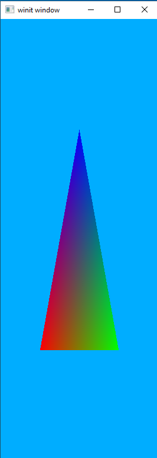
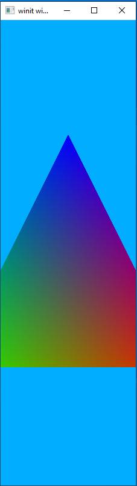
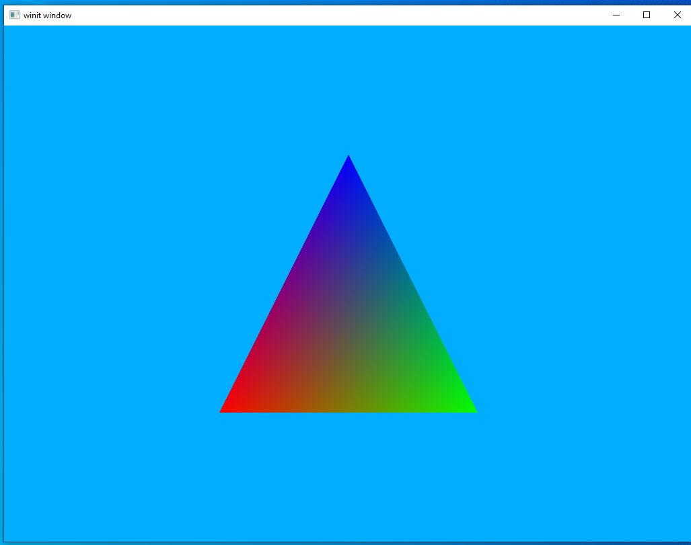
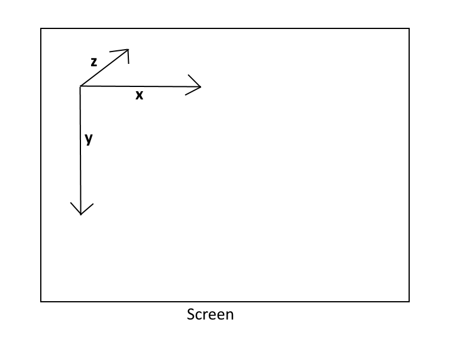
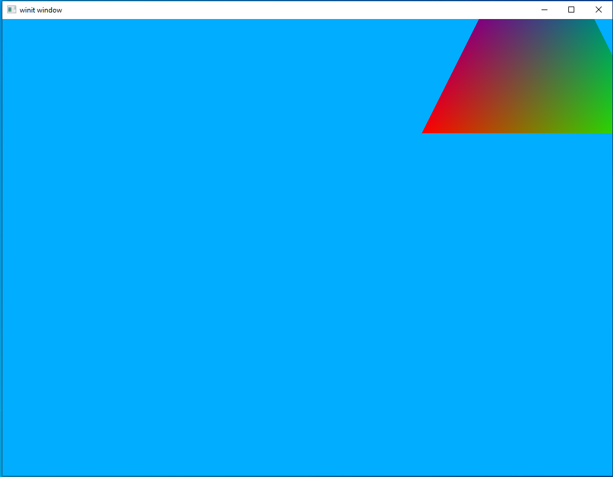
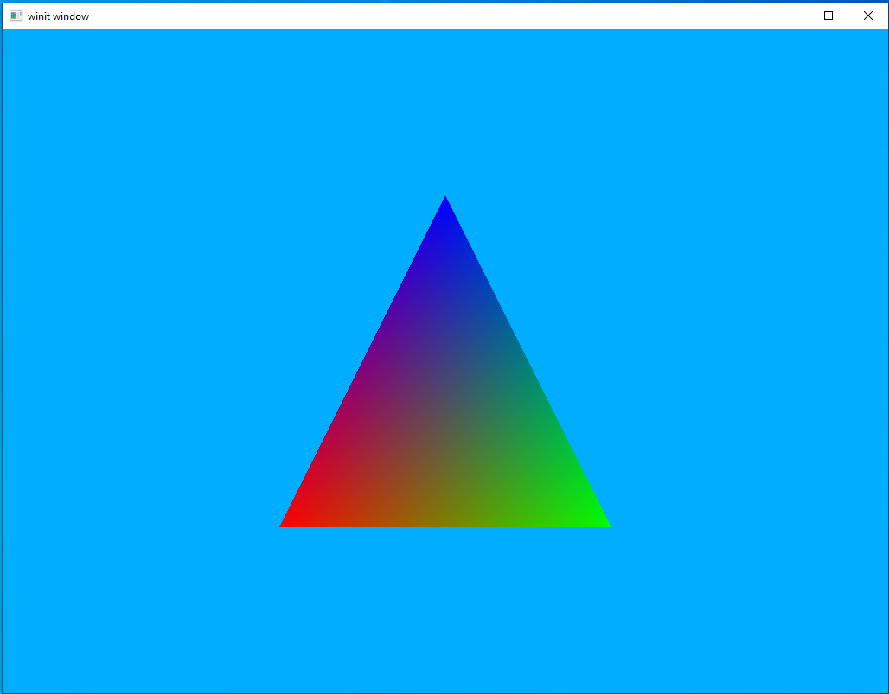

# Moving things around

To learn how to move things around in our scene you need to understand a bit about transformations. Basically, a transformation is any change like scaling, rotating, or moving that we might want to apply on one of our models. It's all a matter of linear algebra where we have a vector representing a location in space and we multiply it by one or more matrices representing the transformation we want. It's okay if you don't know much about linear algebra (god knows I don't) because we'll be using a crate to handle all the heavy math for us. For the most part, we just need to keep in mind that those matrices are how we move things around, not by changing the initial position vector.

For the most part, that's straightforward enough, however, there is one major concept that we need to spend more time thinking about and if we mess this up we'll never get our rendered scenes to look or behave correctly.

#### Model-View-Projection

The Model-View-Projection (MVP) matrix transformation is used on every single model in the scene to put it where it needs to go. Each letter in the MVP name represents a different transformation matrix that, multiplied together, forms our final transformation matrix. To understand what it does you need to understand a simple fact: where something is depends on what perspective you're looking at it from.

Each of our models, whether it be a simple triangle or some complex character in a AAA game initially exists in *Model Space*. That is, by default, every model in every game views itself as the center of the universe. Go back to the last lesson and look at our triangle. It's defined such that the *origin* point `(0.0, 0.0, 0.0)` is in the center of the model. The "Model" part of our MVP is the sum total of transformations applied to a model while in the model space. This means scaling, rotation, and translation. Each of these takes place with the assumption that the model starts more or less at the center of the universe.

The View matrix represents something called *Camera Space*. This is what space looks like when viewed from a certain point. For most applications, the Camera Space is set by the viewport so the "camera" is actually the user themselves. As for what transformations look like for this, I'll steal a Futurama quote used in a tutorial I'll link to at the end of this section: `The engines don’t move the ship at all. The ship stays where it is and the engines move the universe around it.` Or, to put it in our terms, the camera stays in one place and looks in one direction and the rest of the world moves around it.

Lastly we have the Projection matrix. Of all of them, this is the easiest. Going back to our triangle from the last lesson the dimensions are set by the window. Try resizing the window and see what it does to the triangle.



The triangle gets squished and elongated when we make the window narrower. A projection matrix is just a transformation we apply to a view so that everything stays in the appropriate proportions no matter what the relative dimensions of the view happen to be.

I am *at best* woefully underqualified to explain math to anyone. So I encourage anyone reading this to check out these two tutorials. They're both for OpenGL but math is math and the concepts they talk about apply to any rendering system.

[opengl-tutorial](http://www.opengl-tutorial.org/beginners-tutorials/tutorial-3-matrices/)

[open.gl](https://open.gl/transformations)

## Walk-through

#### Cargo.toml

We'll be adding a new dependency to our Cargo file for this lesson. Open it up and copy in the following code under the `[Dependencies]` header:

```toml
nalgebra-glm = "0.16.0"
```

#### Create our MVP data structure

We will create a new type of struct to hold our MVP data for reasons that will be explained in a bit. For now, just go ahead and throw this code in right below where you declare the `Vertex` struct.

```rust
#[derive(Debug, Clone)]
struct MVP {
    model: TMat4<f32>,
    view: TMat4<f32>,
    projection: TMat4<f32>
}

impl MVP {
    fn new() -> MVP {
        MVP {
            model: identity(),
            view: identity(),
            projection: identity()
        }
    }
}
```

`TMat4<f32>` is a nalgebra-glm struct that holds a 4x4 matrix of f32 values. Since we're storing position values as vectors of f32 we need to make sure that the data types match.

We declare a `new()` method for our `MVP` struct as a convenience method for us that initializes all three fields to something called the *Identity Matrix*. The identity matrix can be thought of as a "neutral" matrix. If we multiply our vector by an identity matrix nothing will change. This makes the identity matrix the starting point for most matrix operations.

#### Uniforms

Now we need to pause and discuss something that Vulkan calls *Uniforms*. In our last lesson we saw one way to upload data to our shaders, as vertices. This data doesn't have to be just position data but can be things like color values or, really, anything we want. The catch is that it runs on a *per-vertex* basis. That means that if you have a model with 300 vertices the shader will execute 300 times, each with a different value. This is exactly what we want for, say, rendering triangles (after all, each triangle should have three totally different vertices!) but what do we do for things we want to stay the same no matter how many individual vertices we have?

For that we have the idea of the `Uniform` to help us out. In our above example, the shader is executed 300 times but any Uniform data given to the shader will be the same in each of those 300 shader instances. This is exactly what we're looking for to help us out with our transformation matrices. We could, if we really wanted to, upload our MVP matrix 300 times but that will waste a lot of bandwidth that could be used by other things. Uniforms lets us upload it once and use it "for free" inside each instance of the shader.

#### Shaders

We only need to update our vertex shader for this lesson.

```rust
mod vs {
    vulkano_shaders::shader!{
    ty: "vertex",
    src: "
#version 450
layout(location = 0) in vec3 position;
layout(location = 1) in vec3 color;

layout(location = 0) out vec3 out_color;

layout(set = 0, binding = 0) uniform MVP_Data {
    mat4 world;
    mat4 view;
    mat4 projection;
} uniforms;

void main() {
    mat4 worldview = uniforms.view * uniforms.world;
    gl_Position = uniforms.projection * worldview * vec4(position, 1.0);
    out_color = color;
}"
    }
}
```

As you can see our main change is adding a struct `MVP_Data`. Let's break it down piece by piece.

`layout(set = 0, binding = 0)` serves the same general purpose as `layout(location = 0)` does for our position variable, it tells Vulkan where this data is going to be coming from. As before this information doesn't *have* to be explicitly declared this way, but it saves us the headache from trying to figure out why Vulkan says our data isn't being given in the right order. The exact meaning of `set` and `binding` will be explained when we reach that part of our code.

`uniform` this is equivalent to the `in` and `out` keywords used elsewhere. It tells Vulkan that this is a very particular kind of data, in this case uniform data that will not change from instance to instance of the shader.

`mat4 world...etc` each of these are 4x4 floating-point matrices and describes the content we'll be passing in. We don't have to create structs like this, as we could just as easily upload each `mat4` directly as its own uniform. Putting them together in a single struct is both to help the programmer keep things straight as well as to make it easier to update the uniform as we can do it all at once, rather than having to run through the update process three different times.

`uniforms;` just as in C, GLSL lets us give structs a "friendly" name in addition to the real name. We take advantage of this here to produce more readable code.

Further down, we have the two lines that actually create the full MVP transformation matrix.
```glsl
mat4 worldview = uniforms.view * uniforms.model;
gl_Position = uniforms.projection * worldview * vec4(position, 1.0);
```

We could be more direct by writing it as the following
```glsl
mat4 mvp_matrix = uniforms.projection * uniforms.view * uniforms.model;
gl_Position = mvp_matrix * vec4(position, 1.0);
```

The reason we don't do this is because later lessons will have a use for the `worldview` matrix without the projection data.


#### Uniform Buffer

Just like we did with our vertex data, the first thing we need to do inside our program is to create a buffer to hold the data in a place our graphics hardware can see it. The code for this is pretty simple and should be placed after we declare our shaders.

```rust
let uniform_buffer = CpuBufferPool::<vs::ty::MVP_Data>::uniform_buffer(device.clone());
```

A buffer pool is, in effect, a ring buffer containing "sub buffers" that we can use as our data buffers. This is useful for data that needs to be updated often, such as once a frame in a video game.

The `uniform_buffer()` is a helper method that produces a `CpuBufferPool` configured specifically for holding uniform data. We could just as easily write `CpuBufferPool::<vs::ty::MVP_Data>::new(device.clone(), BufferUsage::all());` to get a generic `CpuBufferPool` suitable for most applications.

Important note: `<vs::ty::MVP_Data>` is not just random gibberish. It **must** be the same name as the struct or variable holding the uniform data in the shader. This might be obvious to you, but it caused me a lot of frustration before I realized what was going on and it's not very well documented elsewhere. So just keep it in mind. That's why I named the struct something distinctive like `MVP_Data` instead of just the generic `Data` that it's named in the examples in the main Vulkano GitHub repository.

#### Using our sub-buffer

In the section above we create a `BufferPool` but that means we need to request and fill a buffer from that pool each time we want to use it. The following code can be added right after we recreate the swapchain in our main program loop.

```rust
let uniform_buffer_subbuffer = {
    let mvp = MVP::new();
    let uniform_data = vs::ty::MVP_Data {
        model: mvp.model.into(),
        view: mvp.view.into(),
        projection: mvp.projection.into(),
    };

    uniform_buffer.next(uniform_data).unwrap()
};
```

Right now we aren't doing anything special with our actual MVP data. Instead, we're just passing the values directly into our `vs::ty::MVP_Data` object. We'll revisit this section in a little bit.

#### Descriptor Sets

When we created our new shaders we had a section of code that looked like `set = 0, binding = 0`. This refers to a `DescriptorSet` and is what we'll declare next. Place the following code right after our `uniform_buffer_subbuffer` declaration.

```rust
let layout = pipeline.layout().descriptor_set_layouts().get(0).unwrap();
let set = PersistentDescriptorSet::new(
    layout.clone(),
    [WriteDescriptorSet::buffer(0, uniform_buffer_subbuffer)],
)
.unwrap();
```

For descriptor sets we need to know two things: the graphics pipeline the set is for and the index of the set. The first line here is how we find that information prior to creating our descriptor set. `pipeline` is, of course, the graphics pipeline we want to use and the `0` in `.descriptor_set_layout().get(0)` is the set index we're requesting. This argument corresponds to the `set = 0` part of our uniform `layout` in the shader. We can have multiple sets and multiple buffers per set. `layout(set = 0, binding = 0)` means that Vulkan wants `MVP_Data` to be the first buffer of the first descriptor set.

#### Update the draw command

The last thing we need to do in order to pass our uniforms to the shader is add our set to the command buffer so that our drawing command knows to use it. Go down to the `cmd_buffer_builder` and add the following below `.bind_pipeline_graphics()`

```rust
.bind_descriptor_sets(
    PipelineBindPoint::Graphics,
    pipeline.layout().clone(),
    0,
    set.clone(),
)
```

`PipelineBindPoint::Graphics` is used to tell Vulkan if we're attaching the value to a graphics pipeline or a compute pipeline. Unless you're using compute pipelines you can just always provide this value into `.bind_descriptor_sets`.

#### What if we want more than one uniform buffer?

We'll pause here to show what the code would look like if we wanted to have two different uniforms. The code shown here won't be in the final project but it will be a good way to review what our code does.

```rust
mod vs {
    vulkano_shaders::shader!{
    ty: "vertex",
    src: "
#version 450
layout(location = 0) in vec3 position;
layout(location = 1) in vec3 color;

layout(location = 0) out vec3 out_color;

layout(set = 0, binding = 0) uniform MVP_Data {
    mat4 world;
    mat4 view;
    mat4 projection;
} uniforms;

layout(set = 0, binding = 1) uniform extra_data_idk {
    mat4 extra_data;
};

void main() {
    // do something with extra_data_idk.extra_data
    mat4 worldview = uniforms.view * uniforms.world;
    gl_Position = uniforms.projection * worldview * vec4(position, 1.0);
    out_color = color;
}"
    }
}
```

```rust
let second_uniform_buffer = CpuBufferPool::<vs::ty::extra_data_idk>::uniform_buffer(device.clone());
```

```rust
let second_uniform_subbuffer = Arc::new({
    let m:TMat4<f32> = identity();
    let uniform_data = vs::ty::extra_data_idk {
        extra_data: m.into(),
    };

    second_uniform_buffer.next(uniform_data).unwrap()
});
```

```rust
let layout = pipeline.layout().descriptor_set_layouts().get(0).unwrap();
let set = PersistentDescriptorSet::new(
    layout.clone(),
    [
        WriteDescriptorSet::buffer(0, uniform_buffer_subbuffer),
        WriteDescriptorSet::buffer(1, second_uniform_subbuffer),
    ],
)
.unwrap();
```

The order we specify our `WriteDescriptorSet` in the array does not matter but the index we pass in each one must be the same as the index expected by our shaders. If it's wrong, we will be able to compile without errors or warnings but our program will not work.

#### Back to our actual project

Going back to our single-uniform-buffer project, try to run it and see what happens. If everything goes well, the same screen we had at the end of the last lesson will show up. With one exception nothing's changed because we're still using the identity matrices for our uniform input. Let's start changing that now.

There is one difference that is probably immediately apparent to you, our triangle is upside-down now! We'll fix this in a little bit once we start setting our proper MVP matrices.

#### Projection

Let's start with the easiest, yet most boring matrix, the projection matrix. First we need to update our source data though.

```rust
let vertex_buffer = CpuAccessibleBuffer::from_iter(device.clone(), BufferUsage::all(), false, [
    Vertex { position: [-0.5, 0.5, -0.5], color: [1.0, 0.0, 0.0] },
    Vertex { position: [0.5, 0.5, -0.5], color: [0.0, 1.0, 0.0] },
    Vertex { position: [0.0, -0.5, -0.5], color: [0.0, 0.0, 1.0] }
].iter().cloned()).unwrap();
```

Doing this moves our triangle away from the viewer "deeper" into the screen. This is important because once we start adding our MVP matrices we can no longer see something located at the same place as the camera.

Once you've done that, update the sub-buffer creation screen to look like this. Don't worry that it looks hacky, we'll clean it up in the end.

```rust
let uniform_buffer_subbuffer = {
    let mvp = MVP::new();
    let dimensions = if let Some(dimensions) = window.get_inner_size() {
        let dimensions: (u32, u32) = dimensions.to_physical(window.get_hidpi_factor()).into();
        [dimensions.0, dimensions.1]
    } else {
        return;
    };
    let projection: TMat4<f32> = perspective(dimensions[0] as f32 / dimensions[1] as f32, 180.0, 0.01, 100.0);
    let uniform_data = vs::ty::MVP_Data {
        model: mvp.model.into(),
        view: mvp.view.into(),
        projection: projection.into(),
    };

    uniform_buffer.next(uniform_data).unwrap()
};
```

This sets the aspect ratio to be the same as our screen as sets the viewable area to be anything from depth 0.01 to 100.0. Run it again and you should see a triangle that looks basically the same, but which will not become distorted when you resize the window.



#### View Matrix

We'll take advantage of a method called `look_at()` to set our view matrix. It takes three vectors, the first representing the location of the eye (our view port), the second representing the direction we're looking, and the their representing which direction is "up" for us. In practice this is pretty simple and you can see this by updating the sub-buffer code as follows.

```rust
let uniform_buffer_subbuffer = {
    let mvp = MVP::new();
    let dimensions = if let Some(dimensions) = window.get_inner_size() {
        let dimensions: (u32, u32) = dimensions.to_physical(window.get_hidpi_factor()).into();
        [dimensions.0, dimensions.1]
    } else {
        return;
    };
    let projection: TMat4<f32> = perspective(dimensions[0] as f32 / dimensions[1] as f32, 180.0, 0.0, -100.0);
    let view: TMat4<f32> = look_at(&vec3(0.0, 0.0, 0.01), &vec3(0.0, 0.0, 0.0), &vec3(0.0, -1.0, 0.0));
    let uniform_data = vs::ty::MVP_Data {
        model: mvp.model.into(),
        view: view.into(),
        projection: projection.into(),
    };

    uniform_buffer.next(uniform_data).unwrap()
};
```

Run the code and you should see the following image.



As you can see, our triangle is now the right way round again. This is because the matrix produced by the `look_at` method will orient the scene along the up vector, which is what we're seeing here.

#### Vulkan Coordinate System

Let's pause here to talk about the coordinate system used by Vulkan. What this means is just what do the different axis values mean? I'll produce a diagram.



Smaller x-values move to the left while larger x-values move to the right.

Smaller y-values move up whereas larger y-values move down.

Larger z-values move forward into the screen while smaller z-values move backwards out of the screen.

On the last point imagine if our eye is sitting at `(0.0, 0.0, 0.0)`. Anything with a positive z-value will be in front of us while anything with a negative z-value will be behind us.

#### Model Matrix

Now that we understand what the coordinate directions in Vulkan look like, it's time to add the last part of the MVP matrix system: the model matrix.

The model matrix holds all the transformations we want to do to a particular model. Let's look at a model matrix that translates (moves) our triangle up and to the right.

```rust
let uniform_buffer_subbuffer = {
    let mvp = MVP::new();
    let dimensions = if let Some(dimensions) = window.get_inner_size() {
        let dimensions: (u32, u32) = dimensions.to_physical(window.get_hidpi_factor()).into();
        [dimensions.0, dimensions.1]
    } else {
        return;
    };
    let projection: TMat4<f32> = perspective(dimensions[0] as f32 / dimensions[1] as f32, 180.0, 0.0, -100.0);
    let view: TMat4<f32> = look_at(&vec3(0.0, 0.0, 0.01), &vec3(0.0, 0.0, 0.0), &vec3(0.0, -1.0, 0.0));
    let model: TMat4<f32> = translate(&identity(), &vec3(1.0, -1.0, 0.0));
    let uniform_data = vs::ty::MVP_Data {
        model: model.into(),
        view: view.into(),
        projection: projection.into(),
    };

    uniform_buffer.next(uniform_data).unwrap()
};
```

run the code and you should see something like this:



Note the translation vector, `&vec3(1.0, -1.0, 0.0)`, and remember that bigger x values move us to the right and smaller y-values move us up.

## Our First Dynamic Scene

Right now we have a scene that correctly displays using an MVP matrix, but it's still static. Let's update our code to add some movement as well as clean up some of the ugly code from the last sections.

Add this line to the top of your `main` method.
```rust
let mut mvp = MVP::new();
```

The view matrix will never change in our code, so we can add the following line right after we declare `mvp`.

```rust
mvp.view = look_at(&vec3(0.0, 0.0, 0.01), &vec3(0.0, 0.0, 0.0), &vec3(0.0, -1.0, 0.0));
```

Now let's deal with the projection matrix. There are two places where we find the screen size, let's add the following code to both:

```rust
let dimensions: [u32; 2] = surface.window().inner_size().into();
mvp.projection = perspective(dimensions[0] as f32 / dimensions[1] as f32, 180.0, 0.01, 100.0);

```

For our model matrix let's first start by recreating the initial scene and moving on from there. First, return the model vertex data to the way it was before, with each vertex being at `0.0` on the z-axis

```rust
let vertex_buffer = CpuAccessibleBuffer::from_iter(device.clone(), BufferUsage::all(), false [
    Vertex { position: [-0.5, 0.5, 0.0], color: [1.0, 0.0, 0.0] },
    Vertex { position: [0.5, 0.5, 0.0], color: [0.0, 1.0, 0.0] },
    Vertex { position: [0.0, -0.5, 0.0], color: [0.0, 0.0, 1.0] }
].iter().cloned()).unwrap();
```

Now lets create an initial model matrix that performs a z-axis translation to move the triangle back where we can see it. You can add the following line right after we declared our view matrix.

```rust
mvp.model = translate(&identity(), &vec3(0.0, 0.0, -0.5));
```

Lastly, we can simplify our sub-buffer creation code to use our new global `mvp` variable.

```rust
let uniform_buffer_subbuffer = {
    let uniform_data = vs::ty::MVP_Data {
        model: mvp.model.into(),
        view: mvp.view.into(),
        projection: mvp.projection.into(),
    };

    uniform_buffer.next(uniform_data).unwrap()
};
```

Run the code and you should see a triangle identical to the last one, just centered on the screen instead of moved up and to the right.



This is good as it means our cleaned-up MVP system is working as expected. However, I promised you something more interesting than a static triangle so let's see if we can't get this thing to rotate as well.

copy the following line right above the start of our render loop.

```rust
let rotation_start = Instant::now();
```

now update our sub-buffer creation screen

```rust
let uniform_buffer_subbuffer = {
    let elapsed = rotation_start.elapsed().as_secs() as f64 + rotation_start.elapsed().subsec_nanos() as f64 / 1_000_000_000.0;
    let elapsed_as_radians = elapsed * pi::<f64>() / 180.0 * 30.0;
    let model = rotate_normalized_axis(&mvp.model, elapsed_as_radians as f32, &vec3(0.0, 0.0, 1.0));

    let uniform_data = vs::ty::MVP_Data {
        model: model.into(),
        view: mvp.view.into(),
        projection: mvp.projection.into(),
    };

    uniform_buffer.next(uniform_data).unwrap()
};
```

It's not something that can really be captured in a still image but if you run this code you should see a rotating triangle.

[lesson source code](https://github.com/taidaesal/vulkano_tutorial/tree/gh-pages/lessons/3.%20Transformations%20and%20Uniforms)