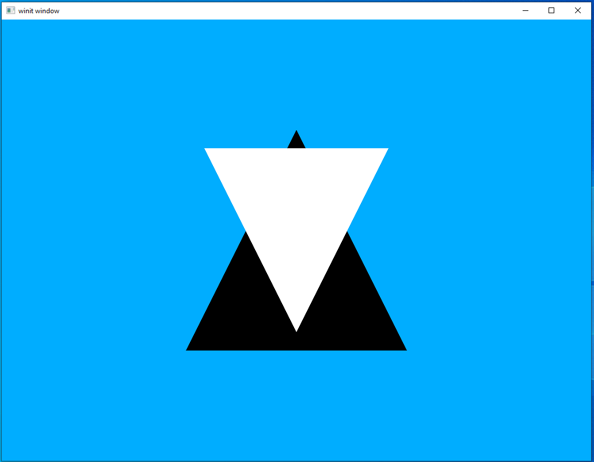
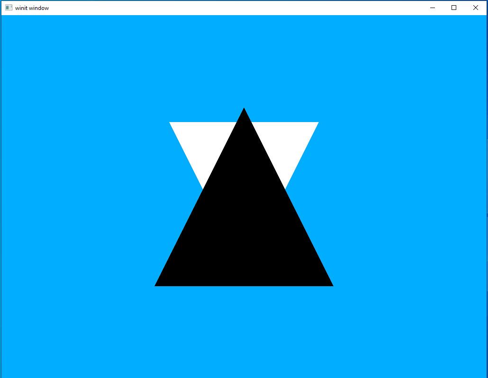

# Depth

We're four lessons into this thing but we've been cheating the whole time. We have been talking about models in 3-dimensional space and how to transform them and such. However, we have actually been silently ignoring the third dimension entirely. What do I mean by that? Let's look at an example.

## Example

Let's change our code so we have two triangles with one being white, and the other black. For the sake of this example we'll get rid of the translation/rotation code from last time and replace the model matrix with the simple identity matrix.

```rust
let vertex_buffer = CpuAccessibleBuffer::from_iter(device.clone(), BufferUsage::all(), false, [
    Vertex { position: [-0.5, 0.5, -0.5], color: [0.0, 0.0, 0.0] },
    Vertex { position: [0.5, 0.5, -0.5], color: [0.0, 0.0, 0.0] },
    Vertex { position: [0.0, -0.5, -0.5], color: [0.0, 0.0, 0.0] },

    Vertex { position: [-0.5, -0.5, -0.6], color: [1.0, 1.0, 1.0] },
    Vertex { position: [0.5, -0.5, -0.6], color: [1.0, 1.0, 1.0] },
    Vertex { position: [0.0, 0.5, -0.6], color: [1.0, 1.0, 1.0] }
].iter().cloned()).unwrap();
```

Pretty simple; we have two triangles, one behind the other. The one in front is black and the one in back is in white. Let's run the code and see what happens.



That...doesn't look right. The white triangle is supposed to be behind the black one but it's the other way around, what's going on? What we're lacking is *depth testing*, the mechanism where vulkan checks what depth each vertex is at. In other words, with depth testing enabled our graphics hardware will be able to draw back-to-front with the furthest away vertices being drawn first. Right now, the vertices are being drawn in the order they are received, which is why we currently have this problem.

Luckily for us, Vulkan makes it very easy to turn on depth testing. Let's take a look at that now.

#### Render Pass

We do depth testing through something called a *depth_stencil*. The way this works is that it's another render attachment (data buffer) that we attach to the render pass we want depth testing for. It might sound like it might be a bit difficult but it's actually pretty simple. Let's look at what our new render pass declaration looks like.

```rust
let render_pass = vulkano::single_pass_renderpass!(
    device.clone(),
    attachments: {
        color: {
            load: Clear,
            store: Store,
            format: swapchain.format(),
            samples: 1,
        },
        depth: {
            load: Clear,
            store: DontCare,
            format: Format::D16_UNORM,
            samples: 1,
        }
    },
    pass: {
        color: [color],
        depth_stencil: {depth}
    }
).unwrap();
```

As you can see, our `depth` attachment looks a lot like our `color` attachment. There are, however, two things to take note of. First, our `store` value is `DontCare`. This means that our graphics driver can do what it wants with the data, including destroying it if it wishes. This is because this attachment is used within the rendering process by the driver and we're not interested in retrieving it later. The second thing is that our `format` is *not* the same format as our swapchain. This is because is serves as a *stencil* rather than a full-on render target. So we only need a format which can store the depth information.

Also, just like `color` we could have called `depth` anything but it's most idiomatic to name our depth attachment after its function. It's not a big problem when you only have two attachments in a single render pass but more complicated workflows will have a lot more to keep track of. Giving everything sensible names will save yourself a lot of annoyance down the line.

#### Graphics pipeline

Our render pass tells Vulkan *what* is available but to tell Vulkan *how to use it* we need to update our pipeline declaration. Thankfully, this is even easier than updating our render pass.

```rust
let pipeline = GraphicsPipeline::start()
    .vertex_input_state(BuffersDefinition::new().vertex::<Vertex>())
    .vertex_shader(vs.entry_point("main").unwrap(), ())
    .input_assembly_state(InputAssemblyState::new())
    .viewport_state(ViewportState::viewport_dynamic_scissor_irrelevant())
    .fragment_shader(fs.entry_point("main").unwrap(), ())
    .depth_stencil_state(DepthStencilState::simple_depth_test())
    .render_pass(Subpass::from(render_pass.clone(), 0).unwrap())
    .build(device.clone())
    .unwrap();
```

our only new line is `.depth_stencil_state(DepthStencilState::simple_depth_test())` and it instructs Vulkan to use our attached depth stencil. Like with `input_assembly_state` there are more complex things we could do but for now the simplest option is all we need.

#### Framebuffer

We have a new framebuffer attachment declared in our renderpass so we need to make sure to add it to our framebuffer declarations as well.

```rust
let depth_buffer = ImageView::new(
    AttachmentImage::transient(device.clone(), dimensions, Format::D16_UNORM).unwrap(),
)
.unwrap();
images
    .iter()
    .map(|image| {
        Framebuffer::start(render_pass.clone())
            .add(view)
            .unwrap()
            .add(depth_buffer.clone())
            .unwrap()
            .build()
            .unwrap()
    })
    .collect::<Vec<_>>()
```

Our call to `AttachmentImage::transient` is how we create the actual buffer that will be used in the framebuffer attachment. Since we don't care what happens to it once we're done, it can be a transient image.

Also, since this is being taken care of in our `window_size_dependent_setup` helper function, we'll need to expand the parameter list to pass in a `Device`.

```rust
fn window_size_dependent_setup(
    device: Arc<Device>,
    images: &[Arc<SwapchainImage<Window>>],
    render_pass: Arc<RenderPass>,
    viewport: &mut Viewport,
) -> Vec<Arc<Framebuffer>> {
    // ....
}
```

#### Clear colors

The last thing we need to do is set the clear colors. This is an easy thing to miss but important. Each framebuffer attachment we use needs to have its own clear color.

```rust
let clear_values = vec![[0.0, 0.68, 1.0, 1.0].into(), 1f32.into()];
```

Two things to notice here:
 - because our depth buffer is in a format that takes a single value per vertex rather than an array we can get away with using `1f32` as the clear value rather than a color vector
 - the clear values **must** be listed in the same order as the buffer attachments. This is an easy thing to get wrong, so just keep it in mind.

#### Running our new code

Re-run our code and you should see that everything is now in the expected order with the black triangle in front of the white one.



Not the most exciting image, I know, but now that we have depth sorted out we are ready to start moving on to more complicated scenes.

In this lesson you also got your first taste of using multiple attachments, something which will be very useful in future lessons.

[lesson source code](https://github.com/taidaesal/vulkano_tutorial/tree/gh-pages/lessons/4.%20Depth)