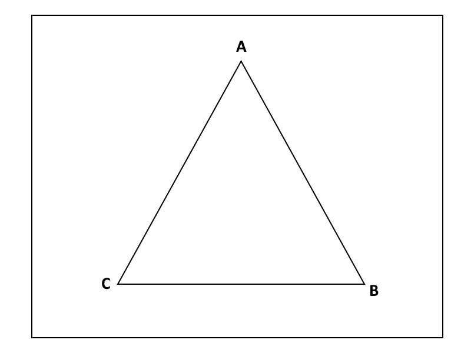
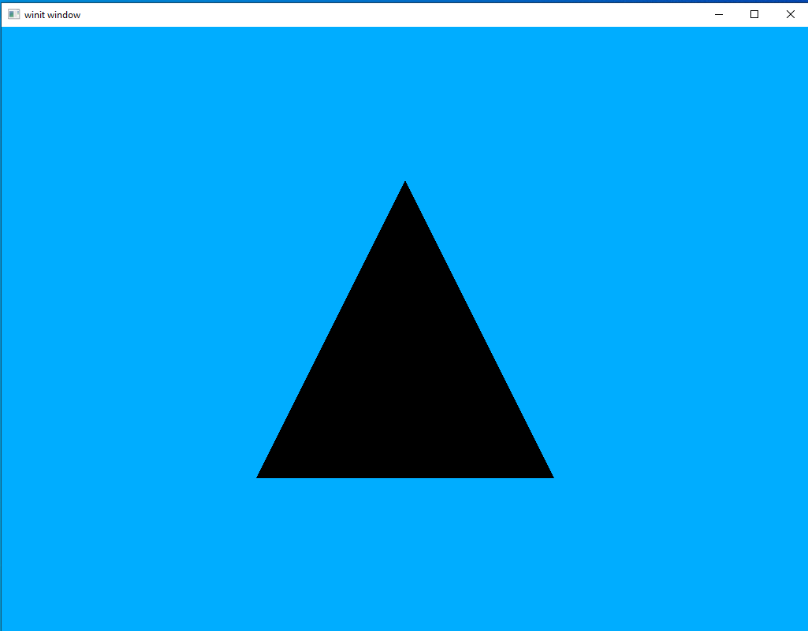

# Winding Order and Face Culling

Much like depth testing, up until now we've been overlooking a concept that's fundamental to getting complicated scenes to work: winding order. What's that you might ask? It's nothing more complicated than the order in which we specify a triangle's vertices. Consider the following diagram:



A triangle is defined by three vertices and, up until now, we've been listing them in whatever order we please; however, Vulkan would very much *like* to care about that order for reasons we'll touch on in a second.

Winding order can be either clockwise or counter-clockwise. A clockwise winding for the triangle above would be `A -> B -> C` whereas a counter-clockwise winding would be `A -> C -> B`. Conceptually it isn't very difficult but it can easily trip you up if you don't pay attention to it.

Okay, that's great and all but why should we care? What winding lets us do is figure out which triangles are facing away from us due to a neat math trick. If a triangle has clockwise winding when it's facing us, if we turn it around it will appear to us to have a counter-clockwise winding instead. This lets Vulkan silently cull (or drop) these vertices which aren't facing us. A complicated scene might have hundreds of thousands or even millions of triangles in its raw data, but around half of those will be facing away from us and invisible to the user at any given time. By using face winding we can halve the amount of rendering our graphics hardware needs to do. It's an inexpensive trick, but one which frees up *a lot* of graphics hardware capability to use for things we care about.

## Example

Okay, a simple example is below. Let's use the same code as we did for our depth testing but modify it a little bit. Let's set it so that the black triangle uses counter-clockwise winding while the white triangle uses clockwise winding.
```rust
let vertex_buffer = CpuAccessibleBuffer::from_iter(device.clone(), BufferUsage::all(), false, [
    Vertex { position: [-0.5, 0.5, -0.5], color: [0.0, 0.0, 0.0] },
    Vertex { position: [0.5, 0.5, -0.5], color: [0.0, 0.0, 0.0] },
    Vertex { position: [0.0, -0.5, -0.5], color: [0.0, 0.0, 0.0] },

    Vertex { position: [-0.5, -0.5, -0.6], color: [1.0, 1.0, 1.0] },
    Vertex { position: [0.5, -0.5, -0.6], color: [1.0, 1.0, 1.0] },
    Vertex { position: [0.0, 0.5, -0.6], color: [1.0, 1.0, 1.0] }
].iter().cloned()).unwrap();
```

If you run your code now you'll see that both triangles show up, exactly as in the last lesson. Let's change that now.

#### Pipeline

To tell Vulkan we want to enable face-culling we need to add some commands to our Pipeline.

```rust
let pipeline = Arc::new(GraphicsPipeline::start()
    .vertex_input_single_buffer()
    .vertex_shader(vs.main_entry_point(), ())
    .triangle_list()
    .viewports_dynamic_scissors_irrelevant(1)
    .fragment_shader(fs.main_entry_point(), ())
    .depth_stencil_simple_depth()
    .front_face_counter_clockwise()
    .cull_mode_back()
    .render_pass(Subpass::from(render_pass.clone(), 0).unwrap())
    .build(device.clone())
    .unwrap());
```

`.front_face_counter_clockwise()` is actually the default so we don't really need to list it here. I just like listing it as a way of making everything explicit in the code.

`.cull_mode_back()` Is the code which actually turns on our culling mode. And, yes, there is an option to call the front face instead.

Run the code and we should see the white triangle has disappeared, exactly as expected.



As with depth testing, we will be leaving this feature on for all future lessons.

[lesson source code](../lessons/5.%20Face%20and%20Winding%20Order)