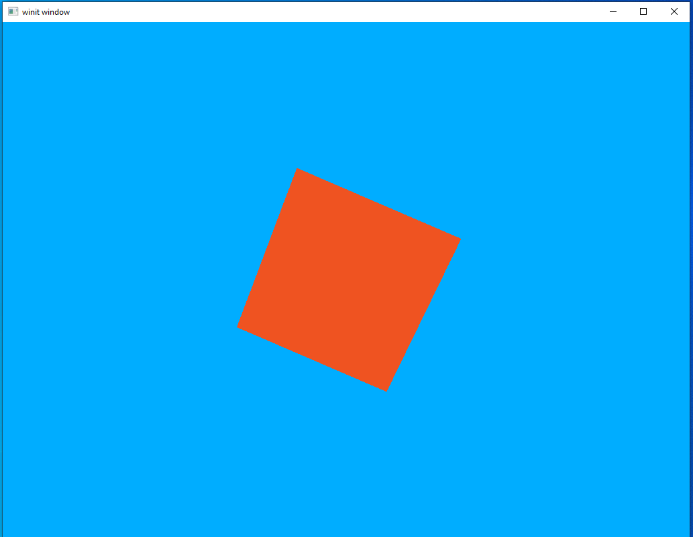

# Light

We've reached a major milestone in our development as a Vulkan programmer. We've played around with triangles and learned the fundamentals and that's all well and good, but so far we've been languishing at the "hello world" level of program complexity. In this lesson we bump up the complexity quite a bit to introduce a lighting system to our scene. That might sound intimidating but don't worry, you already know everything you need to succeed.

Once you have a working lighting example it will be time to stop playing with toys and start working towards a real rendering system.

## Cube

But before we introduce lighting we're going to need to upgrade our model. Up until now we've been using simple triangles. That's a good way to learn the basics and we've gotten pretty far with it; however, to really demonstrate the lighting system we need a more complicated model. For now, that role will be played by a humble cube.

#### Vertex

We need to make an update to our `Vertex` datatype to add a field for `normals`. Normal vectors are vectors that stick straight out from a polygon. The point where the normal and the polygon meet will form a 90 degree angle. It's not important to really understand them right this moment, so just update your `Vertex` to include them.

```rust
#[derive(Default, Debug, Clone)]
struct Vertex {
    position: [f32; 3],
    normal: [f32; 3],
    color: [f32; 3]
}
vulkano::impl_vertex!(Vertex, position, normal, color);
```

Notice the ordering! We're setting it up so normals are in the second slot and color in the third. We'll need to remember to update our shaders in a moment to reflect this.

#### Model data

First, let's add in a direct translation for the Model matrix. This is because our model is centered around the origin and we need to move it back far enough that we can see it. This line can go anywhere before the main program loop.

```rust
mvp.model = translate(&identity(), &vec3(0.0, 0.0, -2.5));
```

Next let's update our vertex buffer to output all the data we need for our cube. This is actually a really, really poor way of handling anything more complicated than a couple triangles but I don't want to get into model handling in this lesson so we'll just do it the hacky way.

```rust
let vertex_buffer = CpuAccessibleBuffer::from_iter(device.clone(), BufferUsage::all(), false, [
    // front face
    Vertex { position: [-1.000000, -1.000000, 1.000000], normal: [0.0000, 0.0000, 1.0000], color: [1.0, 0.35, 0.137]},
    Vertex { position: [-1.000000, 1.000000, 1.000000], normal: [0.0000, 0.0000, 1.0000], color: [1.0, 0.35, 0.137]},
    Vertex { position: [1.000000, 1.000000, 1.000000], normal: [0.0000, 0.0000, 1.0000], color: [1.0, 0.35, 0.137]},
    Vertex { position: [-1.000000, -1.000000, 1.000000], normal: [0.0000, 0.0000, 1.0000], color: [1.0, 0.35, 0.137]},
    Vertex { position: [1.000000, 1.000000, 1.000000], normal: [0.0000, 0.0000, 1.0000], color: [1.0, 0.35, 0.137]},
    Vertex { position: [1.000000, -1.000000, 1.000000], normal: [0.0000, 0.0000, 1.0000], color: [1.0, 0.35, 0.137]},

    // back face
    Vertex { position: [1.000000, -1.000000, -1.000000], normal: [0.0000, 0.0000, -1.0000], color: [1.0, 0.35, 0.137]},
    Vertex { position: [1.000000, 1.000000, -1.000000], normal: [0.0000, 0.0000, -1.0000], color: [1.0, 0.35, 0.137]},
    Vertex { position: [-1.000000, 1.000000, -1.000000], normal: [0.0000, 0.0000, -1.0000], color: [1.0, 0.35, 0.137]},
    Vertex { position: [1.000000, -1.000000, -1.000000], normal: [0.0000, 0.0000, -1.0000], color: [1.0, 0.35, 0.137]},
    Vertex { position: [-1.000000, 1.000000, -1.000000], normal: [0.0000, 0.0000, -1.0000], color: [1.0, 0.35, 0.137]},
    Vertex { position: [-1.000000, -1.000000, -1.000000], normal: [0.0000, 0.0000, -1.0000], color: [1.0, 0.35, 0.137]},

    // top face
    Vertex { position: [-1.000000, -1.000000, 1.000000], normal: [0.0000, -1.0000, 0.0000], color: [1.0, 0.35, 0.137]},
    Vertex { position: [1.000000, -1.000000, 1.000000], normal: [0.0000, -1.0000, 0.0000], color: [1.0, 0.35, 0.137]},
    Vertex { position: [1.000000, -1.000000, -1.000000], normal: [0.0000, -1.0000, 0.0000], color: [1.0, 0.35, 0.137]},
    Vertex { position: [-1.000000, -1.000000, 1.000000], normal: [0.0000, -1.0000, 0.0000], color: [1.0, 0.35, 0.137]},
    Vertex { position: [1.000000, -1.000000, -1.000000], normal: [0.0000, -1.0000, 0.0000], color: [1.0, 0.35, 0.137]},
    Vertex { position: [-1.000000, -1.000000, -1.000000], normal: [0.0000, -1.0000, 0.0000], color: [1.0, 0.35, 0.137]},

    // bottom face
    Vertex { position: [1.000000, 1.000000, 1.000000], normal: [0.0000, 1.0000, 0.0000], color: [1.0, 0.35, 0.137]},
    Vertex { position: [-1.000000, 1.000000, 1.000000], normal: [0.0000, 1.0000, 0.0000], color: [1.0, 0.35, 0.137]},
    Vertex { position: [-1.000000, 1.000000, -1.000000], normal: [0.0000, 1.0000, 0.0000], color: [1.0, 0.35, 0.137]},
    Vertex { position: [1.000000, 1.000000, 1.000000], normal: [0.0000, 1.0000, 0.0000], color: [1.0, 0.35, 0.137]},
    Vertex { position: [-1.000000, 1.000000, -1.000000], normal: [0.0000, 1.0000, 0.0000], color: [1.0, 0.35, 0.137]},
    Vertex { position: [1.000000, 1.000000, -1.000000], normal: [0.0000, 1.0000, 0.0000], color: [1.0, 0.35, 0.137]},

    // left face
    Vertex { position: [-1.000000, -1.000000, -1.000000], normal: [-1.0000, 0.0000, 0.0000], color: [1.0, 0.35, 0.137]},
    Vertex { position: [-1.000000, 1.000000, -1.000000], normal: [-1.0000, 0.0000, 0.0000], color: [1.0, 0.35, 0.137]},
    Vertex { position: [-1.000000, 1.000000, 1.000000], normal: [-1.0000, 0.0000, 0.0000], color: [1.0, 0.35, 0.137]},
    Vertex { position: [-1.000000, -1.000000, -1.000000], normal: [-1.0000, 0.0000, 0.0000], color: [1.0, 0.35, 0.137]},
    Vertex { position: [-1.000000, 1.000000, 1.000000], normal: [-1.0000, 0.0000, 0.0000], color: [1.0, 0.35, 0.137]},
    Vertex { position: [-1.000000, -1.000000, 1.000000], normal: [-1.0000, 0.0000, 0.0000], color: [1.0, 0.35, 0.137]},

    // right face
    Vertex { position: [1.000000, -1.000000, 1.000000], normal: [1.0000, 0.0000, 0.0000], color: [1.0, 0.35, 0.137]},
    Vertex { position: [1.000000, 1.000000, 1.000000], normal: [1.0000, 0.0000, 0.0000], color: [1.0, 0.35, 0.137]},
    Vertex { position: [1.000000, 1.000000, -1.000000], normal: [1.0000, 0.0000, 0.0000], color: [1.0, 0.35, 0.137]},
    Vertex { position: [1.000000, -1.000000, 1.000000], normal: [1.0000, 0.0000, 0.0000], color: [1.0, 0.35, 0.137]},
    Vertex { position: [1.000000, 1.000000, -1.000000], normal: [1.0000, 0.0000, 0.0000], color: [1.0, 0.35, 0.137]},
    Vertex { position: [1.000000, -1.000000, -1.000000], normal: [1.0000, 0.0000, 0.0000], color: [1.0, 0.35, 0.137]},
].iter().cloned()).unwrap();
```

See? Pretty hideous. But it works so for now we can just ignore the model data for the rest of the lesson. We'll revisit the topic of models in a later lesson.

#### Shaders

We'll only need to update our vertex shader right now, and the changes are minor. We just need to add an input for our normals and make sure that `normal` and `color` use the right location index. We won't do anything with the normals until later in the lesson.

```glsl
#version 450
layout(location = 0) in vec3 position;
layout(location = 1) in vec3 normal;
layout(location = 2) in vec3 color;

layout(location = 0) out vec3 out_color;

layout(set = 0, binding = 0) uniform MVP_Data {
    mat4 model;
    mat4 view;
    mat4 projection;
} uniforms;

void main() {
    mat4 worldview = uniforms.view * uniforms.model;
    gl_Position = uniforms.projection * worldview * vec4(position, 1.0);
    out_color = color;
}
```

#### Adding rotation

Let's stop right now and run our code to see what it looks like.


Looks pretty good and shows that our new cube vertex information is being fed in correctly. It's hard to really appreciate the 3D nature of the cube when seen head-on like this and it also won't really show off the lighting effects we're going to add later. Let's add some rotation to the cube to rectify this.

```rust
let rotation_start = Instant::now();
```

```rust
let uniform_buffer_subbuffer = {
    let elapsed = rotation_start.elapsed().as_secs() as f64 + rotation_start.elapsed().subsec_nanos() as f64 / 1_000_000_000.0;
    let elapsed_as_radians = elapsed * pi::<f64>() / 180.0;
    let mut model:TMat4<f32> = rotate_normalized_axis(&identity(), elapsed_as_radians as f32 * 50.0, &vec3(0.0, 0.0, 1.0));
    model = rotate_normalized_axis(&model, elapsed_as_radians as f32 * 30.0, &vec3(0.0, 1.0, 0.0));
    model = rotate_normalized_axis(&model, elapsed_as_radians as f32 * 20.0, &vec3(1.0, 0.0, 0.0));
    model = mvp.model * model;

    let uniform_data = vs::ty::MVP_Data {
        model: model.into(),
        view: mvp.view.into(),
        projection: mvp.projection.into(),
    };

    uniform_buffer.next(uniform_data).unwrap()
};
```

This should be familiar from our lesson on uniforms which is why I'm not pausing to go through it in detail. The only real change is that we're doing rotations around all three axis, so that the cube moves in a more interesting way.


It's not really possible to capture the full effect of a moving scene in a still image but I think this demonstrates the key problem: our cube just looks *wrong*. Why is this though? After all, our model is indeed a 3D cube and our rotation is showing off multiple sides and angles that should demonstrate that. But it still looks...off.

This is because our brain uses differences in lighting to determine the shape of three-dimensional objects. With a uniform color our model doesn't look like a rotating 3D shape so much as it looks like a 2D polygon unpredictably changing shape.

It would be remiss of me if I didn't stop to note that lighting isn't the *only* way our brain can interpret visual data like this. Careful artistic design decisions and scene composition are other ways a designer can communicate visual information to the user. There are many examples of games that use unconventional lighting as part of an overall art style to produce very striking results. Sadly for anyone who wants to learn about how to do that, I'm even less qualified to talk about art than I am programming so you'll have to research that topic elsewhere.

## Light Pt 1: Ambient Lighting

To introduce lighting systems let's talk about the most "basic" form of dynamic lighting: ambient lights. To understand ambient lighting let's stop and look at our current code. Thus far we use "flat lighting." When we define our shapes we say what color they should be and that's it. No matter how near or far the shape is to us and no matter if it's angled towards or away from us, the shape will have exactly the color we said it should have.

This is fine but it's not how lighting works in the real world, is it? The mug I have next to me while I write this is a nice shade of blue but if I turned off all the lights it would be just a featureless black shape. This is because the intensity of the colors we can see depend on the intensity of the light that's shining on them. Figuring out this intensity is the core of any dynamic lighting system.

An ambient lighting system is, in effect, just an upgrade to our current way of doing things. We'll specify a color and an intensity and apply that uniformly to everything in our scene. This can be thought of as the "background" light in our scene. In games it's often a way of keeping things at least somewhat visible when the user loses their light source or something of that nature.

#### A new uniform structure

Since we want this light to be the same everywhere, it makes sense to store it as a uniform data type. Remember what we need from an ambient light uniform: the ability to specify the color of the light as well as its intensity.

Add this code in the same part of the file where we define our other structs
```rust
#[derive(Default, Debug, Clone)]
struct AmbientLight {
    color: [f32; 3],
    intensity: f32
}
```

And we'll define it below the MVP definitions at the start of our `main` function.

```rust
let ambient_light = AmbientLight { color: [1.0, 1.0, 1.0], intensity: 1.0 };
```

#### Shader updates

We need to update our shaders to accept a new uniform input as well as use it. As part of this we will only need to make changes to our fragment shader.
```rust
#version 450
layout(location = 0) in vec3 in_color;

layout(location = 0) out vec4 f_color;

layout(set = 0, binding = 1) uniform Ambient_Data {
    vec3 color;
    float intensity;
} ambient;

void main() {
    vec3 ambient_color = ambient.intensity * ambient.color;
    vec3 combined_color = ambient_color * in_color;
    f_color = vec4(combined_color, 1.0);
}
```

Wait, a uniform declared in a fragment shader? Can we do that? Yes! Doing it this way makes things much easier since, if we were to take this in to the vertex shader, we would need to have the vertex shader pass it to the fragment shader. Doing it this way lets us declare the struct where we intend to use it.

Important note: uniforms share the same "index space" so to speak. So even though `Ambient_Data` is our only uniform in our fragment shader it is still our second uniform overall. So we need to give `Ambient_Data` a binding index of 1.

As for what the shader is actually *doing*, it's going one step beyond just using the intensity to modify the model's color. The color of a light impacts the color we perceive the illuminated object to be. So in our shader we're change the model color by both the color and the intensity of the ambient light. We'll look at some examples in a little bit.

#### Updating the code

To use our uniform we need to create a buffer for it, fill it, and make sure it gets attached to the same set as our MVP uniform data.

The following line can go right under our declaration of `uniform_buffer`.

```rust
let ambient_buffer = CpuBufferPool::<fs::ty::Ambient_Data>::uniform_buffer(device.clone());
```

Note the new datatype in the call we make to `CpuBufferPool`. Our `Ambient_Data` struct lives in our fragment shader, so we need to use `fs::ty` to access its data. Until now, all our custom data types have been added to our vertex shader so we only ever needed to use `vs::ty`.

Next we can add our sub-buffer creation right under the sub-buffer creation for our MVP data in our main program loop.

```rust
let ambient_uniform_subbuffer = {
    let uniform_data = fs::ty::Ambient_Data {
        color: ambient_light.color.into(),
        intensity: ambient_light.intensity.into()
    };

    ambient_buffer.next(uniform_data).unwrap()
};
```

Nothing dramatic here. We're just creating an instance of `fs::ty::Ambient_Data` and giving it a white light at 100% intensity. We'll play around with these values in a little bit.

The last thing we need to do is update our set descriptor. Make sure our new descriptor set has the correct index

```rust
let layout = pipeline.layout().descriptor_set_layouts().get(0).unwrap();
let set = PersistentDescriptorSet::new(
    layout.clone(),
    [
        WriteDescriptorSet::buffer(0, uniform_buffer_subbuffer),
        WriteDescriptorSet::buffer(1, ambient_uniform_subbuffer),
    ],
)
.unwrap();
```

#### Experimenting

That's it for the new code we have to write for our ambient lighting system. Now let's fire it up and see what it looks like.



It looks...exactly the same. But that's good! It shows that our ambient lighting system is working and this is, indeed, the result we expected. A white light at 100% intensity is actually the same thing as not having a lighting system at all. Let's turn that intensity down to 30% and run it again.


That looks good. We dimmed the light and now the object isn't as bright. But what about the blue background? That looks as bright as ever.

The reason for that is because that blue is our *clear color*. Everything that's blue is a place we haven't drawn anything. Because we're not rendering in those areas, the shaders aren't being run on them. Let's set the clear color to back and give it another look.

```rust
let clear_values = vec![[0.0, 0.0, 0.0, 1.0].into(), 1f32.into()];
```


Much better, I think.

For the last experiment before we move on let's try changing the ambient color to green and turning the intensity back up to 100%


A bright green light...makes things look green! Not surprising, maybe, but a good sign for our code anyway.

We're about ready to move on to the next form of lighting. For now, let's set the ambient light color back to white and give it an ambient intensity of 20%.

## Light Pt 2: Directional Lighting

In the last section we looked at ambient lighting, the core feature of which is that the light intensity is the same everywhere. Directional lighting works on the same principle of `more light intensity = brighter colors` but that intensity *changes* depending on where in the scene you're looking.

The way we find this changing intensity is by finding the *angle* formed between a vertex normal and the vector from the light source. The lower the angle, the higher the light's intensity.

This can be hard to picture when talking about random meshes that only exist as mathematical constructs so let's move to the real world for a moment. Picture yourself standing up in a flat park field. You represent the "normal vertex" of the ground, since you're standing straight up. During the day, when is the light the brightest? That's right, at noon when the sun is directly over head. If you drew a line from the sun to the ground you'd end up with a line running exactly parallel to yourself. The angle *between* the rays of sunlight and the line of your body is 0, because both are hitting the ground at 90 degrees. As the sun moves through the day the light dims and the angle between you and the sun increases. Eventually, that angle reaches 180 degrees and night comes.

It's a bit funny to think about night as being when the angle between the ground and the sun is too large and not because, you know, there's a planet in the way, but that's exactly the strategy we'll take in our code to figure out which parts of the model shouldn't be illuminated at all.

#### Yet another new uniform

A uniform? But isn't the point of our dynamic lighting that it changes from place to place? That's true. However, the most important thing about a directional light is where it's located. That light location will never change in our scene, nor will the light color. So we can use another uniform rather than per-vertex data.

The uniform struct is going to look a lot like our ambient struct and will be declared in the same place.

```rust
#[derive(Default, Debug, Clone)]
struct DirectionalLight {
    position: [f32; 3],
    color: [f32; 3]
}
```

Let's put our declaration for this right next to our ambient light.
```rust
let directional_light = DirectionalLight {position: [-4.0, -4.0, 0.0], color: [1.0, 1.0, 1.0]};
```

This position will put a white light over our head and to our left.

#### Shaders

Our shaders are a bit more complex now. Rather than trying to explain them in detail I'll just link to [the tutorial](https://learnopengl.com/Lighting/Basic-Lighting) I was following to get it working. If you read the tutorial we only implement the diffuse lighting part here. We'll get into other kinds of lighting in a later lesson.

```rust
mod vs {
    vulkano_shaders::shader!{
    ty: "vertex",
    src: "
#version 450
layout(location = 0) in vec3 position;
layout(location = 1) in vec3 normal;
layout(location = 2) in vec3 color;

layout(location = 0) out vec3 out_color;
layout(location = 1) out vec3 out_normal;
layout(location = 2) out vec3 frag_pos;

layout(set = 0, binding = 0) uniform MVP_Data {
mat4 model;
mat4 view;
mat4 projection;
} uniforms;

void main() {
mat4 worldview = uniforms.view * uniforms.model;
gl_Position = uniforms.projection * worldview * vec4(position, 1.0);
out_color = color;
out_normal = mat3(uniforms.model) * normal;
frag_pos = vec3(uniforms.model * vec4(position, 1.0));
}"
    }
}

mod fs {
    vulkano_shaders::shader!{
    ty: "fragment",
    src: "
#version 450
layout(location = 0) in vec3 in_color;
layout(location = 1) in vec3 in_normal;
layout(location = 2) in vec3 frag_pos;

layout(location = 0) out vec4 f_color;

layout(set = 0, binding = 1) uniform Ambient_Data {
    vec3 color;
    float intensity;
} ambient;

layout(set = 0, binding = 2) uniform Directional_Light_Data {
    vec3 position;
    vec3 color;
} directional;

void main() {
    vec3 ambient_color = ambient.intensity * ambient.color;
    vec3 light_direction = normalize(directional.position - frag_pos);
    float directional_intensity = max(dot(in_normal, light_direction), 0.0);
    vec3 directional_color = directional_intensity * directional.color;
    vec3 combined_color = (ambient_color + directional_color) * in_color;
    f_color = vec4(combined_color, 1.0);
}
"
    }
}
```

It's a lot to take in, but we aren't introducing any concepts you haven't seen before. Just another uniform input and some extra data being passed between the two shaders

#### Buffer and sub-buffer

You probably know the drill by now. First we declare our uniform buffer pool and then we create our sub-buffer.

```rust
let directional_buffer = CpuBufferPool::<fs::ty::Directional_Light_Data>::uniform_buffer(device.clone());
```

```rust
let directional_uniform_subbuffer = {
    let uniform_data = fs::ty::Directional_Light_Data {
        position: directional_light.position.into(),
        color: directional_light.color.into()
    };

    directional_buffer.next(uniform_data).unwrap()
};
```

```rust
let layout = pipeline.layout().descriptor_set_layouts().get(0).unwrap();
let set = PersistentDescriptorSet::new(
    layout.clone(),
    [
        WriteDescriptorSet::buffer(0, uniform_buffer_subbuffer),
        WriteDescriptorSet::buffer(1, ambient_uniform_subbuffer),
        WriteDescriptorSet::buffer(2, directional_uniform_subbuffer),
    ],
)
.unwrap();
```

#### Running the code

Okay, we're all ready now for our fancy new lighting system. Just fire it up and...


...what?

If you scrolled up just now to double-check that you didn't define a field named `_dummy0` and just forgot about it, you're not alone. I was stumped for a while. However, the good news is that there are two simple solutions.

#### Solution 1

The first solution is to just give it what it wants: a value for the new field which has just magically shown up. If you play around with it you'll find out that it thinks it should be a `[u8; 4]` data type so we can just change our sub-buffer declaration to this.

```rust
let directional_uniform_subbuffer = {
    let uniform_data = fs::ty::Directional_Light_Data {
        _dummy0: [0, 0, 0, 0],
        position: directional_light.position.into(),
        color: directional_light.color.into()
    };

    directional_buffer.next(uniform_data).unwrap()
};
```

This will work, but doesn't really help us understand what's going on. For that, we're going to have to move to a new solution.

#### Solution 2

Some have probably already guessed where our problem lies: the `shader!` macro. In programming languages a *macro* is "code that writes code." We give it our input (the shader text in our case) and it writes Rust code as output to interface with all of the necessary crates and external tools to compile it. Since we have a piece of code that we didn't write ourselves, a macro is a likely reason for its addition.

How do we check our macro, though? The macros will not be run until the middle of the compile process (called the *macro expansion* phase) and we can not see the output in any IDE or inspect it at runtime. This brings us to one of the things I love the most about Rust: its fantastic support for tooling. You are, of course, already familiar with `cargo` if you've been running these examples on your own machine, but it's useful for more than just the basic `check` and `run` operations it's most commonly used for. The Rust ecosystem has a number of tools that can be integrated with `cargo`. This means that you don't need to run external programs or build systems, you can just run `cargo {command}`.

The tool we'll be using is [cargo-expand](https://github.com/dtolnay/cargo-expand). Once installed we can run `cargo expand` and see the expanded output of our macros. It can be a bit fiddly to get this working correctly and it puts out a lot of information so here I'll just be skipping to the bits we care about.

As a reminder, this is what our uniform looks like in our shader.

```glsl
layout(set = 0, binding = 2) uniform Directional_Light_Data {
    vec3 position;
    vec3 color;
} directional;
```

And this is the Rust code that's generated by the `shader!` macro.

```rust
#[repr(C)]
#[allow(non_snake_case)]
pub struct Directional_Light_Data {
    pub position: [f32; 3usize],
    pub _dummy0: [u8; 4usize],
    pub color: [f32; 3usize],
}
```

Just as we suspected, this is where the unexpected struct field is being inserted. What is it doing, though? Surely `_dummy0` isn't actually doing anything we need?

Well, sort of. It's true that `_dummy0` isn't doing anything that we, as the programmer, care about; however, it's doing something very important to the *hardware* by managing [memory alignment](https://en.wikipedia.org/wiki/Data_structure_alignment). Without getting too far into the technical details, this just means that the compiler wants to make sure `color` lives in a certain position in memory compared to the start of the `position` array. Specifically, it wants there to be four *words*, each one of 32-bits, in between. The reasons for this are technical but the only thing that's important to us is: our compiler wants there to be four words between `position` and `color` but `position` only covers three words. Our new data field, `_dummy0` takes up the space of that fourth word (8-bits * 4 = 32 bits) to keep the compiler happy.

This shows us what a possible solution could be. If `position` is one word too short we can just lengthen it to fill that space. That means that `color` can start at the memory location the compiler wants it at without needing a dummy variable in between.

We'll need to make a couple changes to our code but nothing too dramatic.

```rust
#[derive(Default, Debug, Clone)]
struct DirectionalLight {
    position: [f32; 4],
    color: [f32; 3]
}
```

```rust
let directional_light = DirectionalLight {position: [-4.0, -4.0, 0.0, 1.0], color: [1.0, 1.0, 1.0]};
```

```glsl
#version 450
layout(location = 0) in vec3 in_color;
layout(location = 1) in vec3 in_normal;
layout(location = 2) in vec3 frag_pos;

layout(location = 0) out vec4 f_color;

layout(set = 0, binding = 1) uniform Ambient_Data {
    vec3 color;
    float intensity;
} ambient;

layout(set = 0, binding = 2) uniform Directional_Light_Data {
    vec4 position;
    vec3 color;
} directional;

void main() {
    vec3 ambient_color = ambient.intensity * ambient.color;
    vec3 light_direction = normalize(directional.position.xyz - frag_pos);
    float directional_intensity = max(dot(in_normal, light_direction), 0.0);
    vec3 directional_color = directional_intensity * directional.color;
    vec3 combined_color = (ambient_color + directional_color) * in_color;
    f_color = vec4(combined_color, 1.0);
}
```

```rust
let directional_uniform_subbuffer = {
    let uniform_data = fs::ty::Directional_Light_Data {
        position: directional_light.position.into(),
        color: directional_light.color.into()
    };

    directional_buffer.next(uniform_data).unwrap()
};
```

#### Running the code again

I prefer solution 2 but it's up to you what you'd like to do. Either one will work. Once you've made the changes you want, run the code and take a look at what we have now.


Looks pretty good. It's a single, relatively simple, graphical effect yet our scene looks miles better now than it did at the start of the lesson. Creating your first 3D lighting system is a big milestone for a novice graphics developer, so just take a moment to appreciate how far you've come in just six lessons.

#### A hidden catch

Not to discourage you from enjoying your success, but there is a problem buried deep in our code. Yes, we have a lighting system and, sure, we could keep expanding it by adding specular lighting, bloom, or any number of things. But consider this: how would we add a *second* light to our scene?

As it is now the only way we could add a second directional light to our scene would be to add a second directional light uniform into our shader. That's not very elegant, but it *would* work. The problem is, we don't want to stop at *just* two light sources. A real scene, or even just an example scene using a toy rendering system, might have dozens of light sources. To make things worse, the number of light sources might change while the scene is still running. If we have to hard-code each and every light source into our shader we'd quickly run into insurmountable problems.

Luckily, we have a solution in the form of a feature we've hinted at multiple times before: multi-stage rendering. This is what we're looking at in the next lesson.

[lesson source code](https://github.com/taidaesal/vulkano_tutorial/tree/gh-pages/lessons/6.%20Light%20I)