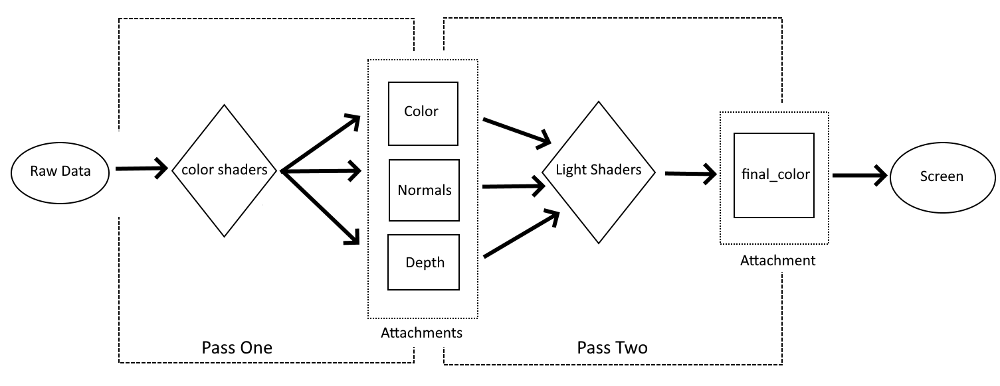
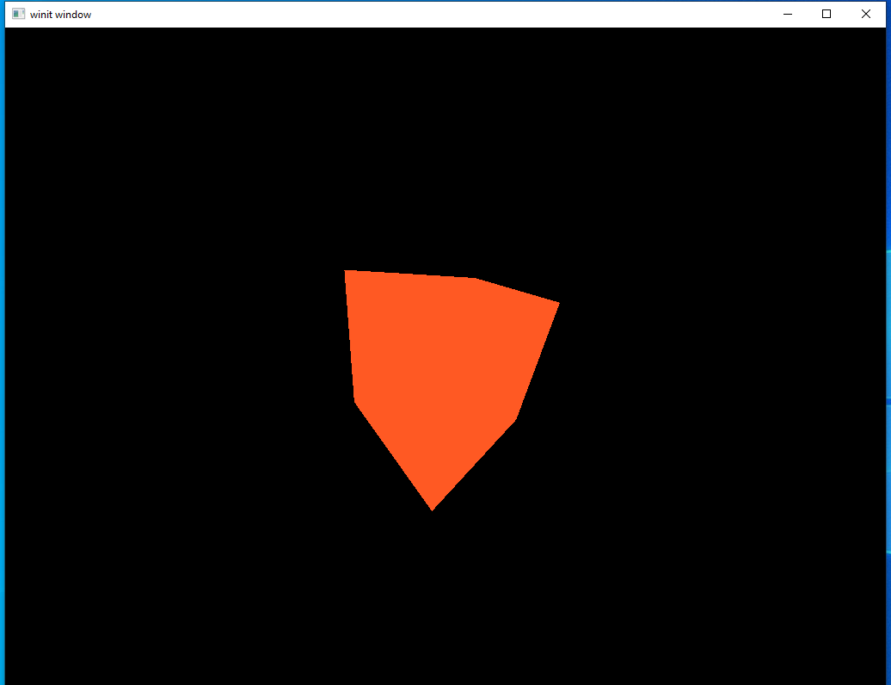
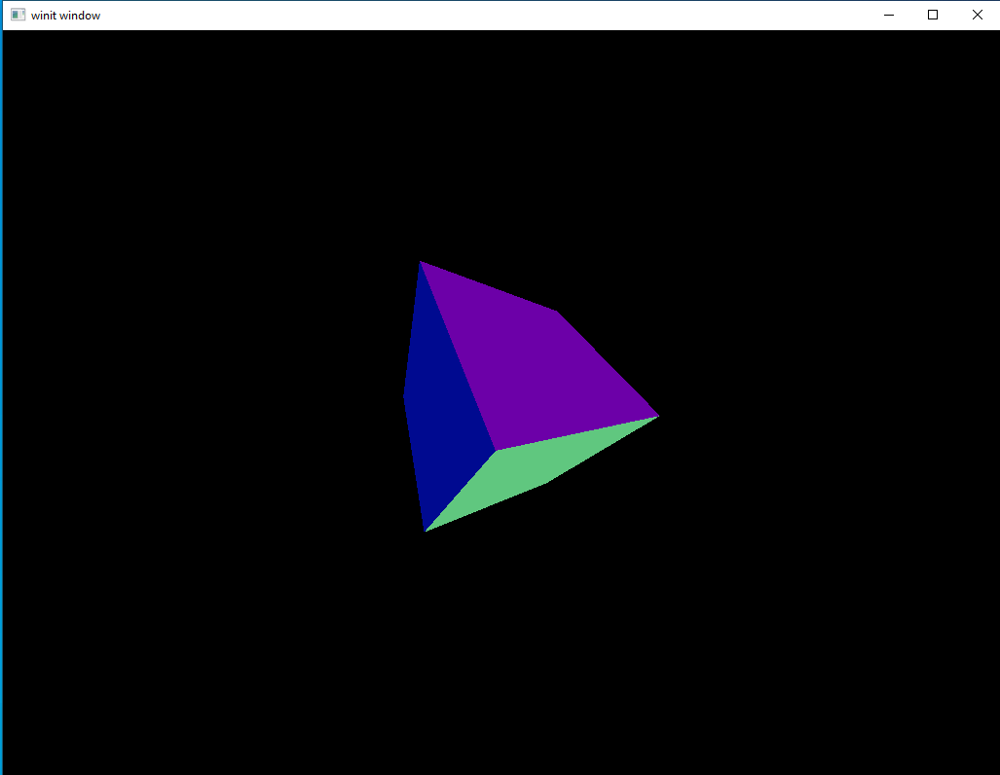
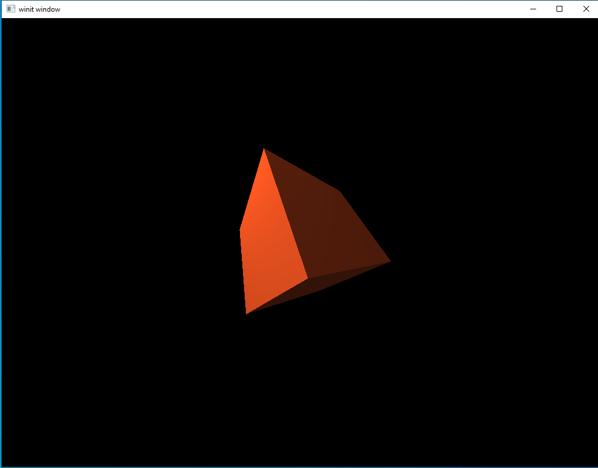
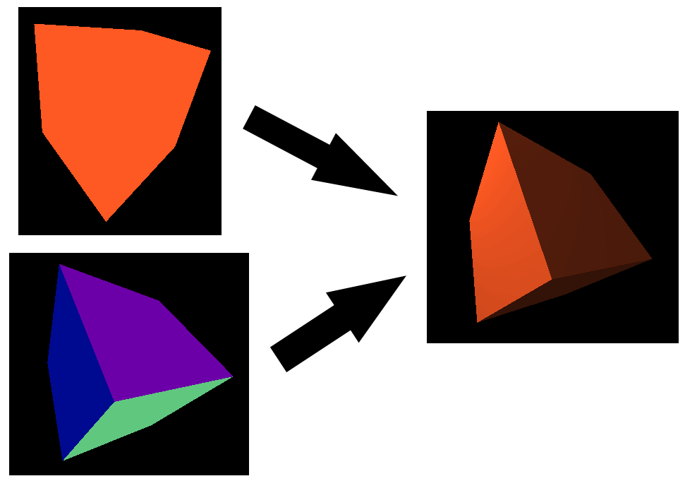

# Multi-pass Rendering

So far we've been rendering our scene in a single pass. We added a second attachment buffer a couple lessons ago but everything still takes place in one go. To continue adding more advanced features, however, we are going to need to expand our horizons a bit to learn how to render with more than one pass, also called _deferred rendering_.

For this lesson we'll focus on implementing the lighting system introduced in the last lesson. At the end of this lesson we will still be rendering one cube with one directional light but the code we write here will form the foundation of later lessons were we introduce advanced lighting and the ability to add an arbitrary number of objects and light sources. Ultimately, this will evolve into a limited, but real and usable, rendering system like the sorts that live in game engines.

## Why More Than One Pass?

It can be a somewhat obscure-sounding concept when you first hear about it, particularly because so many older OpenGL tutorials avoid the topic completely. However, it's necessary if we want to move beyond making simple toys.

In principle it's fairly simple. Up until now we've been doing a single pass. Our render code calls our shaders, the shaders output data into a framebuffer attachment, and then we show that framebuffer attachment to the user. Deferred rendering takes it one step further. Instead of showing the framebuffer to the user, we run a second round of shader calls. These shaders take the framebuffer attachment created by the first round as their input (rather than vertices supplied by the user) and output to other framebuffers. We can keep running like this as long as we want, but today we'll be sticking to a two-round render cycle.

It might be best to use a diagram to explain the program flow we're going for.



The first part of the process is pretty much the same as in the last lesson: we gather up all the geometry, color, and MVP matrix data and feed it into a shader. The difference is where the data produced by our first set of shaders goes. In our last example, our shaders transformed the input into a format ready for display and saved it to an attachment which was immediately shown to the user. However, here, we output data that's only partly processed into temporary *intermediary buffers*. As far as I know, that's not a technical term but it's what I call them to help underscore the fact that they store data that is *in progress* and not a final result. The second pass is where we take the incomplete data stored in our `color` and `normal` attachments and turn it into data that can be presented to the user. In a sense it can be thought of as cutting our shaders from last time in half.

It's reasonable to ask why we're doing this since, after all, we just got done writing shaders that can do lighting for our scene and it was a lot simpler and easier to understand than this is shaping up to be. The key to understanding why we need to do this is the problem brought up at the end of the last lesson: by breaking our rendering into multiple steps we introduce flexibility that just can't exist in a single-pass render system.

Since we're just replicating the functionality of the last lesson, it might not be apparent that one of the new features of this approach is that we can run the same sub-pass more than once. Our lighting sub-pass is only run once and outputs directly to the final attachment image. However, we could easily change it to write to another intermediary buffer. Each time you wanted to add a directional light, you would run the sub-pass again with new inputs. Each time the sub-pass is run, it will update the intermediary buffer with the new lighting information. Finally, we would run a finishing stage that would collect all the data for final output. This is exactly the approach we'll be taking when it's time to start working on our first real general rendering system in a few lessons.

## Getting Started

Since there are a number of things that we'll have to discuss when it comes to adding new passes and attachments, I thought I'd break them off into their own section. We won't talk about shaders here, just how to set up our new rendering system.

#### Renderpass

I've hinted before that you can define more than one pass in a `Renderpass` declaration and now it's time to make good on that promise. It is fair, in my opinion, to call the `Renderpass` code the most important part of this lesson, as this is where we will define our new structures as well as how they relate to each other.

```rust
let render_pass = Arc::new(
    vulkano::ordered_passes_renderpass!(device.clone(),
        attachments: {
            final_color: {
                load: Clear,
                store: Store,
                format: swapchain.format(),
                samples: 1,
            },
            color: {
                load: Clear,
                store: DontCare,
                format: Format::A2B10G10R10_UNORM_PACK32,
                samples: 1,
            },
            normals: {
                load: Clear,
                store: DontCare,
                format: Format::R16G16B16A16_SFLOAT,
                samples: 1,
            },
            depth: {
                load: Clear,
                store: DontCare,
                format: Format::D16_UNORM,
                samples: 1,
            }
        },
        passes: [
            {
                color: [color, normals],
                depth_stencil: {depth},
                input: []
            },
            {
                color: [final_color],
                depth_stencil: {},
                input: [color, normals]
            }
        ]
    )
    .unwrap(),
);
```

Lot to take in here but luckily there isn't much new syntax so we can move through it bit by bit.

First, take note of the new way we're declaring this. Instead of `single_pass_renderpass!` as in the past, we are now using a macro named `ordered_passes_renderpass!`. The difference is about what you might expect, with `single_pass_renderpass!` actually just being a shortcut helper for using `ordered_passes_renderpass!` with only one sub-pass. We could just as easily have been using `ordered_passes_renderpass!` from the beginning. The reason we didn't is because I feel that the helper macro lowers some of the initial complexity a new learner has to deal with until they're ready for the more complicated version. You're ready now, so here we are.

The attachments themselves are declared just like we've seen before. There are a couple of things I want to point out. First, we use different image formats. This is because our intermediary buffers have more limited requirements so we can pick data formats that are more compact than the one used by our final image. For a complete list of format options check the [official documentation](https://docs.rs/vulkano/0.16.0/vulkano/format/enum.Format.html). The second thing about the attachment section is just a reminder to pay attention to the order. I harp on this a lot, but it's a really easy mistake to make.

The `passes` section is where most of our fun new options come in so we'll look at each of the two passes in sequence.

```rust
{
    color: [color, normals],
    depth_stencil: {depth},
    input: []
}
```

This is the first pass and is more or less equivalent to the single sub-pass we've used in our past lessons. There's our friend `depth_stencil` looking the same as always, and `input` which we'll leave for the next sub-pass, but `color` has something interesting going on. In the past, we've always attached a single buffer to `color` and it was the same buffer we'd ask Vulkan to show to the user. Now, however, we're able to output to two *different* buffers and neither of them are the final image. Look back at the diagram from earlier. This is where we tell Vulkan that the first pass' shaders will output to these intermediary buffers. And, yes, if you had any doubt at all at this point, the order we list these two attachments is important.

```rust
{
    color: [final_color],
    depth_stencil: {},
    input: [color, normals]
}
```

Our second sub-pass does something familiar to start with: `color` is back to listing a single attachment as an output source and it will be the one we ask Vulkan to show to the user. We don't have anything to put in `depth_stencil` but that's okay because our earlier shaders did all the work we needed depth tracking for. The real interesting part is what we're doing with `input`. Just like our first pass could use attachments as *outputs* we can use attachments as *inputs*. Our first pass didn't have any buffers as input because it takes the raw data from our program. By the time we reach the second sub-pass, however, we don't need more data from the application. Instead, what we want to do is take the data stored from the first pass and transform it into our final output.

On the subject of using renderpass attachments it should be noted that not every sub-pass has to consume every possible attachment. If we had a three-pass render system (for example) it's possible that our second pass might only use `color` with `normals` left for the third sub-pass. As you might expect, the ordering is important; however, that order only matters inside our shaders. You do not need to list attachments in `input` in the same order they are listed in an earlier sub-pass' `color` field.

Lastly, let's store our sub-passes in named variables to help keep the code readable.

```rust
let deferred_pass = Subpass::from(render_pass.clone(), 0).unwrap();
let lighting_pass = Subpass::from(render_pass.clone(), 1).unwrap();
```

#### Creating our Attachments

Remember the catch with our `Renderpass` object: it tells Vulkan what to *expect* but it's up to us to create these attachments. We'll do this in the `window_size_dependent_setup` helper method.

We'll add our new attachment near the top of the method
```rust
let color_buffer = ImageView::new(
    AttachmentImage::transient_input_attachment(
        device.clone(),
        dimensions,
        Format::A2B10G10R10_UNORM_PACK32,
    )
    .unwrap(),
)
.unwrap();
let normal_buffer = ImageView::new(
    AttachmentImage::transient_input_attachment(
        device.clone(),
        dimensions,
        Format::R16G16B16A16_SFLOAT,
    )
    .unwrap(),
)
.unwrap();
```

Two things about this:
 - We need to make sure the `Format` for each attachment is the same
 - We need to use a different helper method. Earlier we were using `transient_attachment` but now we need `transient_input_attachment`. This is, as you've probably guessed, because we need to use these attachment images as input to a sub-pass. If we didn't give `depth_buffer` as an input to the second sub-pass we could have continued using the first method to create it.

Now we need to attach our new buffers to the actual `Framebuffer`
```rust
Framebuffer::start(render_pass.clone())
    .add(view)
    .unwrap()
    .add(color_buffer.clone())
    .unwrap()
    .add(normal_buffer.clone())
    .unwrap()
    .add(depth_buffer.clone())
    .unwrap()
    .build()
    .unwrap(),
```

Nothing new here, just mind the order you declare them in. Remember that `image` here corresponds to our `final_color` attachment.

We're almost done, however, there is one thing that we need to handle before leaving this method. Our main code needs to know about `color_buffer` and `normal_buffer` so let's adapt the function to return them.
```rust
fn window_size_dependent_setup(
    device: Arc<Device>,
    images: &[Arc<SwapchainImage<Window>>],
    render_pass: Arc<RenderPass>,
    viewport: &mut Viewport,
) -> (
    Vec<Arc<dyn FramebufferAbstract>>,
    Arc<ImageView<Arc<AttachmentImage>>>,
    Arc<ImageView<Arc<AttachmentImage>>>,
) {
  // ...
    (
        images
            .iter()
            .map(|image| {
                let view = ImageView::new(image.clone()).unwrap();
                let depth_buffer = ImageView::new(
                    AttachmentImage::transient(device.clone(), dimensions, Format::D16_UNORM)
                        .unwrap(),
                )
                .unwrap();
                Arc::new(
                    Framebuffer::start(render_pass.clone())
                        .add(view)
                        .unwrap()
                        .add(color_buffer.clone())
                        .unwrap()
                        .add(normal_buffer.clone())
                        .unwrap()
                        .add(depth_buffer.clone())
                        .unwrap()
                        .build()
                        .unwrap(),
                ) as Arc<dyn FramebufferAbstract>
            })
            .collect::<Vec<_>>(),
        color_buffer.clone(),
        normal_buffer.clone(),
    )
}
```

Now we need to update the two places we call this method.
```rust
let (mut framebuffers, mut color_buffer, mut normal_buffer) =
    window_size_dependent_setup(device.clone(), &images, render_pass.clone(), &mut viewport);
```

```rust
if recreate_swapchain {
    let dimensions: [u32; 2] = surface.window().inner_size().into();
    let (new_swapchain, new_images) = match swapchain.recreate_with_dimensions(dimensions) {
        Ok(r) => r,
        Err(SwapchainCreationError::UnsupportedDimensions) => return,
        Err(e) => panic!("Failed to recreate swapchain: {:?}", e)
    };
    mvp.projection = perspective(dimensions[0] as f32 / dimensions[1] as f32, 180.0, 0.01, 100.0);

    swapchain = new_swapchain;
    let (new_framebuffers, new_color_buffer, new_normal_buffer) =
        window_size_dependent_setup(
            device.clone(),
            &new_images,
            render_pass.clone(),
            &mut viewport,
        );
    framebuffers = new_framebuffers;
    color_buffer = new_color_buffer;
    normal_buffer = new_normal_buffer;
    recreate_swapchain = false;
}
```

#### New Pipelines

Okay, I lied, we're going to talk about shaders after all. Just a bit though.

```rust
mod deferred_vert {
    vulkano_shaders::shader!{
        ty: "vertex",
        path: "src/shaders/deferred.vert"
    }
}

mod deferred_frag {
    vulkano_shaders::shader!{
        ty: "fragment",
        path: "src/shaders/deferred.frag"
    }
}

mod lighting_vert {
    vulkano_shaders::shader!{
        ty: "vertex",
        path: lighting.vert
    }
}

mod lighting_frag {
    vulkano_shaders::shader!{
        ty: "fragment",
        path: lighting.frag
    }
}

let deferred_vert = deferred_vert::Shader::load(device.clone()).unwrap();
let deferred_frag = deferred_frag::Shader::load(device.clone()).unwrap();
let lighting_vert = lighting_vert::Shader::load(device.clone()).unwrap();
let lighting_frag = lighting_frag::Shader::load(device.clone()).unwrap();
```

We won't talk about the contents of our shaders until a later section, but we need to know what our new shaders are called. We also take advantage of the `path` argument to load external shader files rather than writing them all in our source. We could have continued in the old way and it would have worked just fine, but now that we're introducing multiple sets of shaders this helps keep everything understandable.

But now let's look at the pipeline for the first sub-pass.
```rust
let deferred_pipeline = Arc::new(GraphicsPipeline::start()
    .vertex_input_single_buffer::<Vertex>()
    .vertex_shader(deferred_vert.main_entry_point(), ())
    .triangle_list()
    .viewports_dynamic_scissors_irrelevant(1)
    .fragment_shader(deferred_frag.main_entry_point(), ())
    .depth_stencil_simple_depth()
    .front_face_counter_clockwise()
    .cull_mode_back()
    .render_pass(deferred_pass.clone())
    .build(device.clone())
    .unwrap());
```
Outside of renaming a couple of the variables it's the same. Our pipelines actually won't end up changing that much. The main change is just that we need two pipelines, one for each sub-pass.

```rust
let lighting_pipeline = Arc::new(GraphicsPipeline::start()
    .vertex_input_single_buffer::<Vertex>()
    .vertex_shader(lighting_vert.main_entry_point(), ())
    .triangle_list()
    .viewports_dynamic_scissors_irrelevant(1)
    .fragment_shader(lighting_frag.main_entry_point(), ())
    .front_face_counter_clockwise()
    .cull_mode_back()
    .render_pass(lighting_pass.clone())
    .build(device.clone())
    .unwrap());
```
Our second pipeline is almost identical to the first. The only real change is the use of different variables for the shaders and subpass as well as the lack of a call to `.depth_stencil_simple_depth()`. Since our second pass doesn't save to a depth attachment, Vulkan will crash if we tell it to expect one. That's really the only pitfall for this part of the code.

#### Uniform Sets

First, for the sake of our initial example, let's comment out our `ambient_uniform_subbuffer` and `directional_uniform_subbuffer` variables and only use our main `uniform_buffer_subbuffer`.
```rust
let deferred_layout = deferred_pipeline
    .layout()
    .descriptor_set_layouts()
    .get(0)
    .unwrap();
let mut deferred_set_builder = PersistentDescriptorSet::start(deferred_layout.clone());
deferred_set_builder
    .add_buffer(uniform_buffer_subbuffer.clone())
    .unwrap();
let deferred_set = Arc::new(deferred_set_builder.build().unwrap());
```
Nothing too notable here since we've seen this exact code in earlier lessons. However, notice that we specify the pipeline we're using. Uniform sets need to be attached to the correct pipeline to work.

The second set is also simple but it does show off another important new wrinkle in how Vulkan works.
```rust
let lighting_layout = lighting_pipeline
    .layout()
    .descriptor_set_layouts()
    .get(0)
    .unwrap();
let mut lighting_set_builder = PersistentDescriptorSet::start(lighting_layout.clone());
lighting_set_builder
    .add_image(color_buffer.clone())
    .unwrap();
lighting_set_builder
    .add_image(normal_buffer.clone())
    .unwrap();
lighting_set_builder
    .add_buffer(uniform_buffer_subbuffer)
    .unwrap();
let lighting_set = Arc::new(lighting_set_builder.build().unwrap());
```
As you can see, renderpass attachments which are used as inputs to a sub-pass are given to that sub-pass as a uniform set. The order we add these attachment images to our descriptor set *does* matter, but not in the way you might expect. In the section on shaders we'll see how this looks on the consumer's side and revisit the topic of order.

#### Rendering

Before we can show our new rendering command buffer we need to update our clear color arrays. Remember: *every* attachment needs to have a clear color supplied.
```rust
let clear_values = vec![[0.0, 0.0, 0.0, 1.0].into(), [0.0, 0.0, 0.0, 1.0].into(), [0.0, 0.0, 0.0, 1.0].into(), 1f32.into()];
```
In this case we just use black for our new attachments.

The new set of render commands we want to look at are these:
```rust
.begin_render_pass(
    framebuffers[image_num].clone(),
    SubpassContents::Inline,
    clear_values,
)
.unwrap()
.set_viewport(0, [viewport.clone()])
.bind_pipeline_graphics(deferred_pipeline.clone())
.bind_descriptor_sets(
    PipelineBindPoint::Graphics,
    deferred_pipeline.layout().clone(),
    0,
    deferred_set.clone(),
)
.bind_vertex_buffers(0, vertex_buffer.clone())
.draw(vertex_buffer.len() as u32, 1, 0, 0)
.unwrap()
.next_subpass(SubpassContents::Inline)
.unwrap()
.bind_pipeline_graphics(lighting_pipeline.clone())
.bind_descriptor_sets(
    PipelineBindPoint::Graphics,
    lighting_pipeline.layout().clone(),
    0,
    lighting_set.clone(),
)
.draw(vertex_buffer.len() as u32, 1, 0, 0)
.unwrap()
.end_render_pass()
.unwrap();
```

Our first `.draw()` call is pretty much the same as our last lesson aside from the change to the variable names.

The first important thing to notice is the `.next_subpass()` call. As mentioned earlier, we can actually draw using the same sub-pass multiple times. Because of that, we need to tell Vulkan directly when we want to move from one sub-pass to another.

Next you'll see we have a repeat of the `bind_` calls, only in this case we're now passing the bindings for the lighting sub-pass. This makes sense, but note that we *also* give it the same vertex information as the first sub-pass. This is odd because our second sub-pass doesn't have anything to do with the geometry of the scene or the MVP matrix, so why do we have it? That's down to an oddity of the current Vulkano crate. We can't call `.draw()` without some vertex information. The reason for that boils down to how shaders work. We want our lighting fragment shader to draw on our cube, but the fragment shader is only run on pixels covered by something rendered in the vertex shader. This is something we'll look into in a later lesson. For now, we'll just re-use the cube's vertex buffer for the sake of simplicity.

## Shaders Pt. 1: A Step Back

For this section we're going to focus mostly on the first pass shaders. Why? It's because we're going to be introducing a number of new concepts and I prefer to tackle things one at a time. By the end of this section we'll have our first pass shaders done and they will do all the transformations on our geometry to put the vertices in their final places. We will create shaders for the second pass but they won't transform the data in any way. Instead, our second pass will just take the output from the first pass and give it directly to our final image.

#### External Shaders

As you saw in the previous section we've changed how we declare our shaders. Instead of putting the shader source code inside our Rust code we store it in external files. The rules are pretty simple: the shaders need to be somewhere they can be located at compile time and there can only be one shader per file.

You can put your shaders wherever you want, but I put them in their own directory inside of `src` like so:
```
src
 |
 |---- shaders
         |
         shader.vert
         |
         shader.frag  
```

You can use whatever file extension you'd like for the shaders. Using `.vert` or `.frag` won't help Vulkan automatically figure out what kind of shader they are so we still need to tell it explicitly when we load them. As far as I know, there's no officially-recommended file extension. The extensions I use are pretty common choices but I've also seen people use `.glsl` as the file extension as well.

For what it's worth, IntelliJ is the IDE I use for Rust development and it associates `.vert` and `.frag` files with GLSL code as long as you have the GLSL language extension plugin installed.

#### External Shaders Problem

There is one catch to external shaders that is important enough that I wanted to give it it's own mini-section. Specifically, because `cargo` does not recognize shader source files as part of our Rust project, changing an external shader will **not** trigger a recompile. While you're actively developing both the Rust application and the shaders you might not even notice, but it can be both surprising and frustrating the first time you make a change to the shader code but don't see that reflected when you run the program again.

The solution is simple, just make a change to the Rust code. I just type in a single space. It's automatically removed by the IDE but is enough to get `cargo` to do a recompile.   

#### Deferred Shaders

Let's talk about our first-pass shaders. They're called "deferred" here but that's just a way to highlight their function in this example, you can call your shaders whatever you want. In any case, they aren't very different from our shaders in our last lesson so let's dive in.

`deferred.vert`
```glsl
#version 450

layout(location = 0) in vec3 position;
layout(location = 1) in vec3 normal;
layout(location = 2) in vec3 color;

layout(location = 0) out vec3 out_color;
layout(location = 1) out vec3 out_normal;

layout(set = 0, binding = 0) uniform MVP_Data {
    mat4 model;
    mat4 view;
    mat4 projection;
} uniforms;

void main() {
    mat4 worldview = uniforms.view * uniforms.model;
    gl_Position = uniforms.projection * worldview * vec4(position, 1.0);
    out_color = color;
    out_normal = mat3(uniforms.model) * normal;
}
```
As you can see, our vertex shader takes in raw geometry data as well as our MVP matrix and applies the MVP transformations. It outputs the base color as well as the transformed normal vectors to the fragment shader.

`deferred.frag`
```glsl
#version 450
layout(location = 0) in vec3 in_color;
layout(location = 1) in vec3 in_normal;

layout(location = 0) out vec4 f_color;
layout(location = 1) out vec3 f_normal;

void main() {
    f_color = vec4(in_color, 1.0);
    f_normal = in_normal;
}
```

Our first pass fragment shader is much simpler than it was in the last lesson but it's still doing something interesting. Remember that our first pass wants to output data to two attachments in addition to the depth stencil and this is where we do that. Our two `out` variables are actually pointing to the different renderpass attachments. Technically, they've always been doing this but before now we've only ever had a single attachment so it wasn't very clear what was going on. Now, however, with two outputs we can see that the first output goes to the first attachment and the second output to the second attachment.

This is something you *really* need to pay attention to. There are plenty of places in Vulkan where you can get into trouble if you list things out of order but this is a particularly dangerous location. Depending on the exact circumstances, it is possible to successfully write to the wrong attachments. In this case the program will seem to run fine, but the output will be gibberish because later sub-passes are being given the wrong data to use. Since no errors are being thrown, it can be hard to track it back to messing up the `location` data in your shaders.  

#### Lighting Shaders

For this section our lighting shaders are going to be very simple. All we want to have them do is take the basic color output from the first pass and render it to the screen. This will still introduce an important new concept: how to handle input attachments.

`lighting.vert`
```glsl
#version 450

layout(location = 0) in vec3 position;

layout(set = 0, binding = 2) uniform MVP_Data {
    mat4 model;
    mat4 view;
    mat4 projection;
} uniforms;

void main() {
    mat4 worldview = uniforms.view * uniforms.model;
    gl_Position = uniforms.projection * worldview * vec4(position, 1.0);
}
```
This is more or less the same as the first pass but there's a good reason for that: We need to tell the fragment shader where, exactly, to render the color pixels. There are better ways to do this and we'll talk about them later.

`lighting.frag`
```glsl
#version 450

layout(input_attachment_index = 0, set = 0, binding = 0) uniform subpassInput u_color;
layout(input_attachment_index = 1, set = 0, binding = 1) uniform subpassInput u_normals;

layout(location = 0) out vec4 f_color;

void main() {
    f_color = vec4(subpassLoad(u_color).rgb, 1.0);
}
```
This shader is shorter than the one from the first pass but it's still doing something we haven't seen before now.

Let's break down `layout(input_attachment_index = 0, set = 0, binding = 0) uniform subpassInput u_diffuse;` bit by bit.

Starting in the middle with `uniform` and it tells us that, well, this is a uniform data source just like our MVP matrix we use in our first pass.

The `subpassInput` keyword is actually our data type. Remember that there are dozens of different formats our render attachments can have, so we can't really figure that out from inside the shaders. With `subpassInput` we are basically committing to accepting a raw data stream and knowing how to handle it ourselves.

The `layout` section looks mostly similar to other uniform inputs we've seen before but it does have a new argument, `input_attachment_index`. Unlike `binding` the value of `input_attachment_index` depends on the order the attachments are given in the *renderpass*, not in the descriptor set. This means that we don't have to have the `binding` values match the `input_atachment_index` values.

For an example of this, let's say we created our descriptor set in the other order.
```rust
let lighting_layout = lighting_pipeline.descriptor_set_layout(0).unwrap();
let lighting_set = Arc::new(PersistentDescriptorSet::start(lighting_layout.clone())
    .add_image(normal_buffer.clone()).unwrap()    
    .add_image(color_buffer.clone()).unwrap()
    .add_buffer(uniform_buffer_subbuffer.clone()).unwrap()
    .build().unwrap());
```  

We would use this in our shader as:
```glsl
layout(input_attachment_index = 1, set = 0, binding = 0) uniform subpassInput u_normals;
layout(input_attachment_index = 0, set = 0, binding = 1) uniform subpassInput u_color;
```

This would work, but I find it ugly and confusing, so I try to list the attachments in the same order in both the renderpass and the descriptor sets. That said, you should pick a style that works best for you and not worry about the approval of a random stranger on the Internet.

Lastly, let's look at `f_color = vec4(subpassLoad(u_color).rgb, 1.0);`

Since we can't just use our input uniforms as a regular variable, we need to use the special `subpassLoad` function to get data from them. The `.rgb` at the end is just a way of destructuring the vector and is the same as calling `.xyz`. The reason we use `.rgb` is that it helps underscore the fact that this is color data.

Let's add back in the sub-buffers we commented out earlier in the lesson.
```rust
let mut lighting_set_builder = PersistentDescriptorSet::start(lighting_layout.clone());
lighting_set_builder
    .add_image(color_buffer.clone())
    .unwrap();
lighting_set_builder
    .add_image(normal_buffer.clone())
    .unwrap();
lighting_set_builder
    .add_buffer(uniform_buffer_subbuffer)
    .unwrap();
lighting_set_builder
    .add_buffer(ambient_uniform_subbuffer)
    .unwrap();
lighting_set_builder
    .add_buffer(directional_uniform_subbuffer)
    .unwrap();
let lighting_set = Arc::new(lighting_set_builder.build().unwrap());
```

#### Running the Code

We're now ready to run our new multi-pass rendering system for the first time.



This is a major step backwards visually as it basically puts us back where we were at the start of the last lesson. But this is actually a pretty big step for us: it shows that our multi-pass rendering pipeline is actually working. If we had messed something up in how we set up the new rendering passes we wouldn't see anything at all.

Let's stop now to do something that we don't really need to, but looks cool. Instead of passing in the color data we can use the *normals* data instead.
```glsl
f_color = vec4(subpassLoad(u_normals).rgb, 1.0);
```



Pretty neat, right? Normals aren't usually used as color input this way but this lets us visualize the data as more than just random numbers in a buffer.

The above two images show the contents of our intermediary buffers. In our next section we'll take this data and produce a final image.

## Shaders Pt. 2: Completing the Shaders

Now that we've seen how to write shaders that interact with input buffers as well as played around with the output for a bit, let's focus back on getting our directional and ambient lights working again.

#### Shaders

`lighting.vert`
```glsl
#version 450

layout(location = 0) in vec3 position;

layout(set = 0, binding = 2) uniform MVP_Data {
    mat4 model;
    mat4 view;
    mat4 projection;
} uniforms;

layout(location = 0) out vec3 frag_pos;

void main() {
    mat4 worldview = uniforms.view * uniforms.model;
    gl_Position = uniforms.projection * worldview * vec4(position, 1.0);
    frag_pos = vec3(uniforms.model * vec4(position, 1.0));
}
```
The only thing we're updating here is that now we're passing `frag_pos` to the fragment shader. This will be removed later but for now we'll keep it in since it's part of our first lighting implementation.

`lighting.frag`
```glsl
#version 450

layout(location = 0) in vec3 frag_pos;

layout(input_attachment_index = 0, set = 0, binding = 0) uniform subpassInput u_color;
layout(input_attachment_index = 1, set = 0, binding = 1) uniform subpassInput u_normals;

layout(set = 0, binding = 3) uniform Ambient_Data {
    vec3 color;
    float intensity;
} ambient;

layout(set = 0, binding = 4) uniform Directional_Light_Data {
    vec4 position;
    vec3 color;
} directional;

layout(location = 0) out vec4 f_color;

void main() {
    vec3 ambient_color = ambient.intensity * ambient.color;
    vec3 light_direction = normalize(directional.position.xyz - frag_pos);
    float directional_intensity = max(dot(normalize(subpassLoad(u_normals).rgb), light_direction), 0.0);
    vec3 directional_color = directional_intensity * directional.color;
    vec3 combined_color = (ambient_color + directional_color) * subpassLoad(u_color).rgb;
    f_color = vec4(combined_color, 1.0);
}
```

This is *nearly* identical to the fragment shader we had at the end of the last lesson. The main difference is that, instead of getting our color or normal data from the vertex shader, we're getting it from a buffer filled by a previous sub-pass. The code itself follows exactly the same logic as before.

Let's run the code and see what we have.



And now we're back to where we were at this time in the last lesson. It's been a long journey to end up in the same place but don't get discouraged, we'll start showing what we can do in the next lesson.

#### Quick Review

We've covered a lot of ground in this lesson so I want to provide one more diagram to review the core concept of what we did today.



On the left we have two *intermediary attachments*. There are named `color` and `normals` inside our Renderpass declaration. The shaders we ran on the first sub-pass output their data to these two attachments.

When we ran our second pass we took the two attachments on the left as an input. We combined the data contained inside them, the base color and the surface normals, to produce a shaded version of the cube input. This final version is output to another attachment which is shown on the right. This final attachment is then shown to the user. All together this process produces a single frame.

This is a trivial example compared to what's possible, but this basic process will be the key to everything we do from now on.

[lesson source code](https://github.com/taidaesal/vulkano_tutorial/tree/gh-pages/lessons/7.%20Deferred%20Rendering)