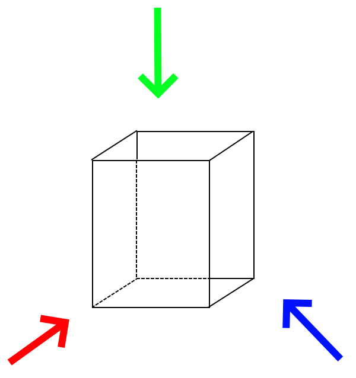
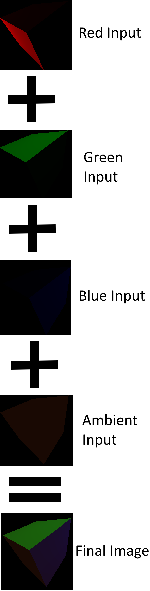
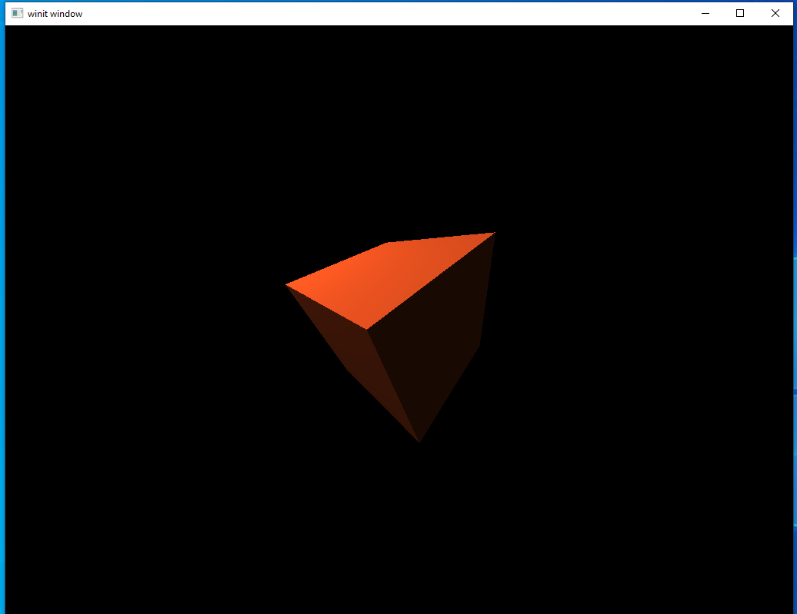
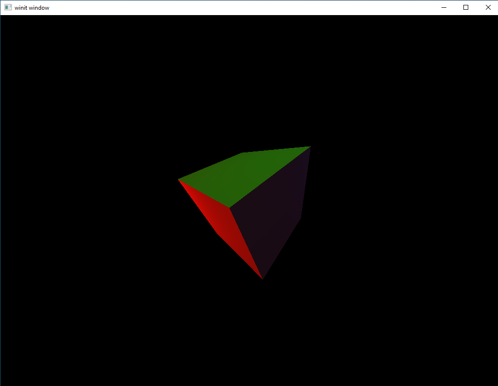

# Multiple Lights

This lesson won't really introduce any new concepts we haven't seen before. Instead, this lesson will be how to use what we already know to apply as many directional lights to our scene as we want. The theory behind the process is simple: instead of having our second render pass overwrite anything in the final image each time it's run, we instead _blend_ the two together. This means that we can run our directional shader once per light source, each time adding its output to the final image.



This shows the position of the lights we'll be adding, as well as their colors. We'll be setting up the lights so they form a rough triangle around our cube. Each light will only strongly illuminate a single face, with some dim illumination of at most one other face. Additionally, there will be a low-intensity white ambient light.




## Single-light Source

Let's walk through what we need to do to turn our existing code into something that renders by calling the second render pass more than once.

#### New Shaders

For our shaders the main change is going to be breaking the ambient light out into its own shader.

`ambient.vert`
```glsl
#version 450

layout(location = 0) in vec3 position;

layout(set = 0, binding = 2) uniform MVP_Data {
    mat4 model;
    mat4 view;
    mat4 projection;
} uniforms;

layout(location = 0) out vec3 frag_pos;

void main() {
    mat4 worldview = uniforms.view * uniforms.model;
    gl_Position = uniforms.projection * worldview * vec4(position, 1.0);
    frag_pos = vec3(uniforms.model * vec4(position, 1.0));
}
```

`ambient.frag`
```glsl
#version 450

layout(location = 0) in vec3 frag_pos;

layout(input_attachment_index = 0, set = 0, binding = 0) uniform subpassInput u_color;
layout(input_attachment_index = 1, set = 0, binding = 1) uniform subpassInput u_normals;

layout(set = 0, binding = 3) uniform Ambient_Data {
    vec3 color;
    float intensity;
} ambient;

layout(location = 0) out vec4 f_color;

void main() {
    vec3 ambient_color = ambient.intensity * ambient.color;
    vec3 combined_color = ambient_color * subpassLoad(u_color).rgb;
    f_color = vec4(combined_color, 1.0);
}
```

As you can see, it looks more or less exactly like our directional light shader, except it only contains our ambient color logic.

Our existing shaders will be modified to remove the ambient logic as well as to rename them as `directional.{foo}` to make it clear that they're doing a single function.

`directional.vert`
```glsl
#version 450

layout(location = 0) in vec3 position;

layout(set = 0, binding = 2) uniform MVP_Data {
    mat4 model;
    mat4 view;
    mat4 projection;
} uniforms;

layout(location = 0) out vec3 frag_pos;

void main() {
    mat4 worldview = uniforms.view * uniforms.model;
    gl_Position = uniforms.projection * worldview * vec4(position, 1.0);
    frag_pos = vec3(uniforms.model * vec4(position, 1.0));
}
```

`directional.frag`
```glsl
#version 450

layout(location = 0) in vec3 frag_pos;

layout(input_attachment_index = 0, set = 0, binding = 0) uniform subpassInput u_color;
layout(input_attachment_index = 1, set = 0, binding = 1) uniform subpassInput u_normals;

layout(set = 0, binding = 3) uniform Directional_Light_Data {
    vec4 position;
    vec3 color;
} directional;

layout(location = 0) out vec4 f_color;

void main() {
    vec3 light_direction = normalize(directional.position.xyz + frag_pos);
    float directional_intensity = max(dot(normalize(subpassLoad(u_normals).rgb), light_direction), 0.0);
    vec3 directional_color = directional_intensity * directional.color;
    vec3 combined_color = directional_color * subpassLoad(u_color).rgb;
    f_color = vec4(combined_color, 1.0);
}
```

Likewise, we rename all our existing `lighting_{foo}` variables in our source code to read `directional_foo` except for `lighting_pass`.

#### Moved Shader Modules

Our next change is to move our shader module declarations outside our `main` method so that they are globally-visible. We will need this in a later section.

```rust
mod deferred_vert {
    vulkano_shaders::shader! {
        ty: "vertex",
        path: "src/shaders/deferred.vert",
        types_meta: {
            use bytemuck::{Pod, Zeroable};

            #[derive(Clone, Copy, Zeroable, Pod)]
        },
    }
}

mod deferred_frag {
    vulkano_shaders::shader! {
        ty: "fragment",
        path: "src/shaders/deferred.frag"
    }
}

mod directional_vert {
    vulkano_shaders::shader! {
        ty: "vertex",
        path: "src/shaders/directional.vert",
        types_meta: {
            use bytemuck::{Pod, Zeroable};

            #[derive(Clone, Copy, Zeroable, Pod)]
        },
    }
}

mod directional_frag {
    vulkano_shaders::shader! {
        ty: "fragment",
        path: "src/shaders/directional.frag",
        types_meta: {
            use bytemuck::{Pod, Zeroable};

            #[derive(Clone, Copy, Zeroable, Pod)]
        },
    }
}

mod ambient_vert {
    vulkano_shaders::shader! {
        ty: "vertex",
        path: "src/shaders/ambient.vert",
        types_meta: {
            use bytemuck::{Pod, Zeroable};

            #[derive(Clone, Copy, Zeroable, Pod)]
        },
    }
}

mod ambient_frag {
    vulkano_shaders::shader! {
        ty: "fragment",
        path: "src/shaders/ambient.frag",
        types_meta: {
            use bytemuck::{Pod, Zeroable};

            #[derive(Clone, Copy, Zeroable, Pod)]
        },
    }
}
```

As part of creating a new ambient shader, we will have to update our ambient buffer pool and sub-buffer creation.

```rust
let ambient_buffer = CpuBufferPool::<ambient_frag::ty::Ambient_Data>::uniform_buffer(device.clone());
```

```rust
let ambient_uniform_subbuffer = {
    let uniform_data = ambient_frag::ty::Ambient_Data {
        color: ambient_light.color.into(),
        intensity: ambient_light.intensity.into()
    };

    ambient_buffer.next(uniform_data).unwrap()
};
```

#### Changes to our Pipeline

We'll be making two changes to our graphics pipeline: updating the options for our second graphics pipeline and creating a pipeline for our new ambient shaders.

```rust
let directional_pipeline = GraphicsPipeline::start()
    .vertex_input_state(BuffersDefinition::new().vertex::<Vertex>())
    .vertex_shader(directional_vert.entry_point("main").unwrap(), ())
    .input_assembly_state(InputAssemblyState::new())
    .viewport_state(ViewportState::viewport_dynamic_scissor_irrelevant())
    .fragment_shader(directional_frag.entry_point("main").unwrap(), ())
    .color_blend_state(ColorBlendState::new(lighting_pass.num_color_attachments()).blend(
        AttachmentBlend {
            color_op: BlendOp::Add,
            color_source: BlendFactor::One,
            color_destination: BlendFactor::One,
            alpha_op: BlendOp::Max,
            alpha_source: BlendFactor::One,
            alpha_destination: BlendFactor::One,
        },
    ))
    .depth_stencil_state(DepthStencilState::simple_depth_test())
    .rasterization_state(RasterizationState::new().cull_mode(CullMode::Back))
    .render_pass(lighting_pass.clone())
    .build(device.clone())
    .unwrap();
```

The new option we added here is `.color_blend_state()`. Without a blending function enabled, each pass will overwrite the output of the last pass. With this, the output of each pass is blended together with the output of the previous passes to create the combined output.

```rust
let ambient_pipeline = GraphicsPipeline::start()
    .vertex_input_state(BuffersDefinition::new().vertex::<Vertex>())
    .vertex_shader(ambient_vert.entry_point("main").unwrap(), ())
    .input_assembly_state(InputAssemblyState::new())
    .viewport_state(ViewportState::viewport_dynamic_scissor_irrelevant())
    .fragment_shader(ambient_frag.entry_point("main").unwrap(), ())
    .color_blend_state(
        ColorBlendState::new(lighting_pass.num_color_attachments()).blend(AttachmentBlend {
            color_op: BlendOp::Add,
            color_source: BlendFactor::One,
            color_destination: BlendFactor::One,
            alpha_op: BlendOp::Max,
            alpha_source: BlendFactor::One,
            alpha_destination: BlendFactor::One,
        }),
    )
    .depth_stencil_state(DepthStencilState::simple_depth_test())
    .rasterization_state(RasterizationState::new().cull_mode(CullMode::Back))
    .render_pass(lighting_pass.clone())
    .build(device.clone())
    .unwrap();
```

This uses the same blending options from our directional pipeline for the same reasons. The only thing I want to highlight here is that we see that both these graphics pipelines use the same sub-pass. This demonstrates the way that not only can we run shaders more than once, we can also have multiple shaders that operate on the same sub-pass.

updated pool declaration
```rust
let uniform_buffer = CpuBufferPool::<deferred_vert::ty::MVP_Data>::uniform_buffer(device.clone());
let ambient_buffer = CpuBufferPool::<ambient_frag::ty::Ambient_Data>::uniform_buffer(device.clone());
let directional_buffer = CpuBufferPool::<directional_frag::ty::Directional_Light_Data>::uniform_buffer(device.clone());
```

#### Updated Descriptor Sets

```rust
let deferred_layout = deferred_pipeline
    .layout()
    .descriptor_set_layouts()
    .get(0)
    .unwrap();
let deferred_set = PersistentDescriptorSet::new(
    deferred_layout.clone(),
    [WriteDescriptorSet::buffer(0, uniform_buffer_subbuffer.clone())],
)
.unwrap();

let ambient_layout = ambient_pipeline
    .layout()
    .descriptor_set_layouts()
    .get(0)
    .unwrap();
let ambient_set = PersistentDescriptorSet::new(
    ambient_layout.clone(),
    [
        WriteDescriptorSet::image_view(0, color_buffer.clone()), 
        WriteDescriptorSet::buffer(1, uniform_buffer_subbuffer.clone()),
        WriteDescriptorSet::buffer(2, ambient_uniform_subbuffer.clone())
    ],
)
.unwrap();
```
Our sets have been updated as well. We no longer need to provide the ambient sub-buffer to `directional_set`. Instead, we create a third descriptor set to store the inputs we need for our ambient shaders.

Side Note: Earlier versions of this tutorial had the ambient shaders taking in the normals buffer as input despite not actually using it. This passed without issue in earlier versions of the Vulkano api but as of version 0.28.0 only bindings that are actually used will be generated. This leads to an `InvalidBinding` error. So if you see the same error make sure that you're actually using all your inputs. 

#### Updated Render Call

```rust
let mut command_buffer_builder = AutoCommandBufferBuilder::primary(
    device.clone(),
    queue.family(),
    CommandBufferUsage::OneTimeSubmit,
)
.unwrap();
let command_buffer = command_buffer_builder
    .begin_render_pass(
        framebuffers[image_num].clone(),
        SubpassContents::Inline,
        clear_values,
    )
    .unwrap()
    .set_viewport(0, [viewport.clone()])
    .bind_pipeline_graphics(deferred_pipeline.clone())
    .bind_descriptor_sets(
        PipelineBindPoint::Graphics,
        deferred_pipeline.layout().clone(),
        0,
        deferred_set.clone(),
    )
    .bind_vertex_buffers(0, vertex_buffer.clone())
    .draw(vertex_buffer.len() as u32, 1, 0, 0)
    .unwrap()
    .next_subpass(SubpassContents::Inline)
    .unwrap()
    .bind_pipeline_graphics(directional_pipeline.clone())
    .bind_descriptor_sets(
        PipelineBindPoint::Graphics,
        directional_pipeline.layout().clone(),
        0,
        directional_set.clone(),
    )
    .bind_vertex_buffers(0, vertex_buffer.clone())
    .draw(vertex_buffer.len() as u32, 1, 0, 0)
    .unwrap()
    .bind_pipeline_graphics(ambient_pipeline.clone())
    .bind_descriptor_sets(
        PipelineBindPoint::Graphics,
        ambient_pipeline.layout().clone(),
        0,
        ambient_set.clone(),
    )
    .bind_vertex_buffers(0, vertex_buffer.clone())
    .draw(vertex_buffer.len() as u32, 1, 0, 0)
    .unwrap()
    .end_render_pass()
    .unwrap()
    .build().unwrap();
```

The only change here is that we've added a second `.draw()` command for our ambient shaders. Notice that, since there isn't a `.next_subpass()` call between our directional draw command and our ambient draw command, they will both execute on the same sub-pass, which is exactly what we want.

#### Running the Code



This cube is very familiar to us by now, as the pattern of these lessons is to use what we already knew how to do when we introduce a new topic. Now let's get to the real meat of the lesson and show how to add as many lights as we want.

## Multiple Lights

The good news is that we've already done most of the work to get what we want. From now on, the code we'll be looking at is mostly just small changes.

#### Helper Function

We'll need to create directional uniform sub-buffers several times so let's create a helper method to do that for us. This is the reason we wanted to make our shader modules global.

```rust
fn generate_directional_buffer(
    pool: &vulkano::buffer::cpu_pool::CpuBufferPool<directional_frag::ty::Directional_Light_Data>,
    light: &DirectionalLight,
) -> Arc<
    vulkano::buffer::cpu_pool::CpuBufferPoolSubbuffer<
        directional_frag::ty::Directional_Light_Data,
        Arc<StdMemoryPool>,
    >,
> {
    let uniform_data = directional_frag::ty::Directional_Light_Data {
        position: light.position.into(),
        color: light.color.into(),
    };

    pool.next(uniform_data).unwrap()
}
```

For the most part this just moves the sub-buffer logic that used to exist in our main program loop into its own function. This takes a buffer pool to use as well as a directional light source.

#### New Light Sources

Let's create our new light sources. Remember we're making three such sources and positioning them around our cube.

```rust
let directional_light_r = DirectionalLight {position: [-4.0, 0.0, -2.0, 1.0], color: [1.0, 0.0, 0.0]};
let directional_light_g = DirectionalLight {position: [0.0, -4.0, 1.0, 1.0], color: [0.0, 1.0, 0.0]};
let directional_light_b = DirectionalLight {position: [4.0, -2.0, -1.0, 1.0], color: [0.0, 0.0, 1.0]};
```

#### Changes to the Rendering System

Now we need to change our rendering system to call our directional shader three times with three different values. The way we do this is fairly simple.

First we change our command buffer declaration.
```rust
let mut commands = AutoCommandBufferBuilder::primary(
    device.clone(),
    queue.family(),
    CommandBufferUsage::OneTimeSubmit,
)
.unwrap();
commands
    .begin_render_pass(
        framebuffers[image_num].clone(),
        SubpassContents::Inline,
        clear_values,
    )
    .unwrap()
    .set_viewport(0, [viewport.clone()])
    .bind_pipeline_graphics(deferred_pipeline.clone())
    .bind_descriptor_sets(
        PipelineBindPoint::Graphics,
        deferred_pipeline.layout().clone(),
        0,
        deferred_set.clone(),
    )
    .bind_vertex_buffers(0, vertex_buffer.clone())
    .draw(vertex_buffer.len() as u32, 1, 0, 0)
    .unwrap()
    .next_subpass(SubpassContents::Inline)
    .unwrap();
```

The type of `commands` is `AutoCommandBufferBuilder` so we can keep chaining rendering commands to it before we call `.build()` to get our final command buffer.

Next, we declare our directional data sub-buffer for our first directional input.
```rust
let mut directional_uniform_subbuffer =
    generate_directional_buffer(&directional_buffer, &directional_light_r);
    
let directional_layout = directional_pipeline
    .layout()
    .descriptor_set_layouts()
    .get(0)
    .unwrap();
let directional_set = PersistentDescriptorSet::new(
    directional_layout.clone(),
    [
        WriteDescriptorSet::image_view(0, color_buffer.clone()), 
        WriteDescriptorSet::image_view(1, normal_buffer.clone()),
        WriteDescriptorSet::buffer(2, uniform_buffer_subbuffer.clone()),
        WriteDescriptorSet::buffer(3, directional_uniform_subbuffer.clone())
    ],
)
.unwrap();
```
We use our helper function for the first time here to declare our usual `directional_uniform_subbuffer` variable.

Next we append the rendering commands to our command buffer building.
```rust
commands
    .bind_pipeline_graphics(directional_pipeline.clone())
    .bind_descriptor_sets(
        PipelineBindPoint::Graphics,
        directional_pipeline.layout().clone(),
        0,
        directional_set.clone(),
    )
    .bind_vertex_buffers(0, vertex_buffer.clone())
    .draw(vertex_buffer.len() as u32, 1, 0, 0)
    .unwrap();
```

That will do for the first directional light and now we can just do the same thing for the other two lights.
```rust
directional_uniform_subbuffer =
    generate_directional_buffer(&directional_buffer, &directional_light_g);

let directional_set = PersistentDescriptorSet::new(
    directional_layout.clone(),
    [
        WriteDescriptorSet::image_view(0, color_buffer.clone()), 
        WriteDescriptorSet::image_view(1, normal_buffer.clone()),
        WriteDescriptorSet::buffer(2, uniform_buffer_subbuffer.clone()),
        WriteDescriptorSet::buffer(3, directional_uniform_subbuffer.clone())
    ],
)
.unwrap();

commands
    .bind_pipeline_graphics(directional_pipeline.clone())
    .bind_descriptor_sets(
        PipelineBindPoint::Graphics,
        directional_pipeline.layout().clone(),
        0,
        directional_set.clone(),
    )
    .bind_vertex_buffers(0, vertex_buffer.clone())
    .draw(vertex_buffer.len() as u32, 1, 0, 0)
    .unwrap();

directional_uniform_subbuffer =
    generate_directional_buffer(&directional_buffer, &directional_light_b);
let directional_set = PersistentDescriptorSet::new(
    directional_layout.clone(),
    [
        WriteDescriptorSet::image_view(0, color_buffer.clone()), 
        WriteDescriptorSet::image_view(1, normal_buffer.clone()),
        WriteDescriptorSet::buffer(2, uniform_buffer_subbuffer.clone()),
        WriteDescriptorSet::buffer(3, directional_uniform_subbuffer.clone())
    ],
)
.unwrap();

commands
    .bind_pipeline_graphics(directional_pipeline.clone())
    .bind_descriptor_sets(
        PipelineBindPoint::Graphics,
        directional_pipeline.layout().clone(),
        0,
        directional_set.clone(),
    )
    .bind_vertex_buffers(0, vertex_buffer.clone())
    .draw(vertex_buffer.len() as u32, 1, 0, 0)
    .unwrap();
```

Lastly, let's draw our ambient buffer and finish our command buffer.
```rust
commands
    .bind_pipeline_graphics(ambient_pipeline.clone())
    .bind_descriptor_sets(
        PipelineBindPoint::Graphics,
        ambient_pipeline.layout().clone(),
        0,
        ambient_set.clone(),
    )
    .bind_vertex_buffers(0, vertex_buffer.clone())
    .draw(vertex_buffer.len() as u32, 1, 0, 0)
    .unwrap()
    .end_render_pass()
    .unwrap();

let command_buffer = commands.build().unwrap();
```

#### Running the Code

That should be the last thing we need to do. Let's compile and run the code and see.



Excellent, it looks just like it should. It's been two long lessons, but we've finally seen how to do something we couldn't have done back in lesson 6. You can also see the emerging outline of the general rendering engine that we'll be working on in a few lessons. This process of building up the final scene by running sets of shaders over and over again will be the core of any engine.

[lesson source code](https://github.com/taidaesal/vulkano_tutorial/tree/gh-pages/lessons/8.%20Light%20II)