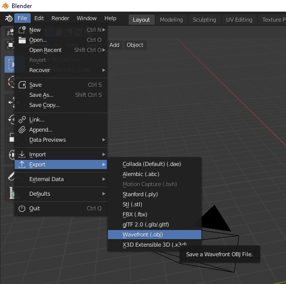
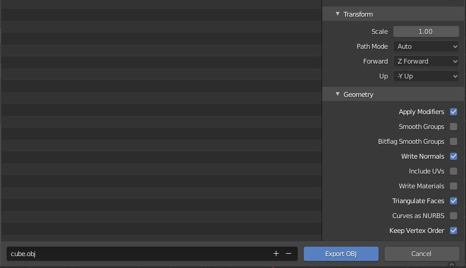
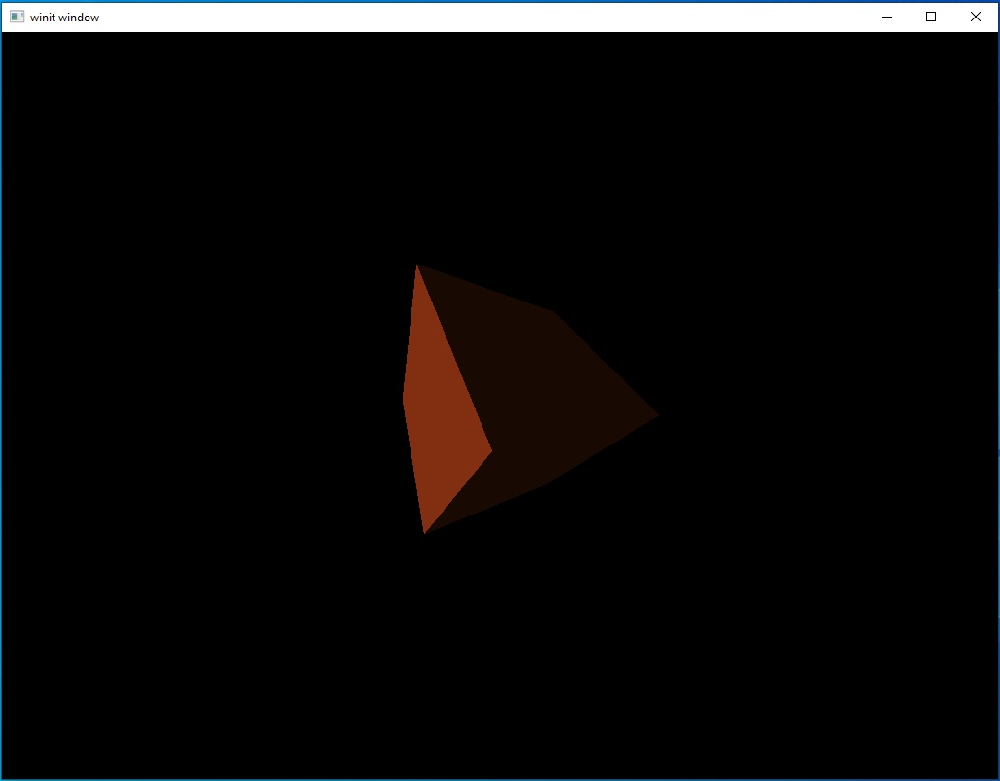
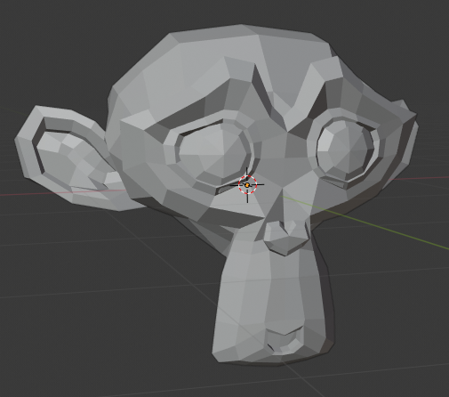
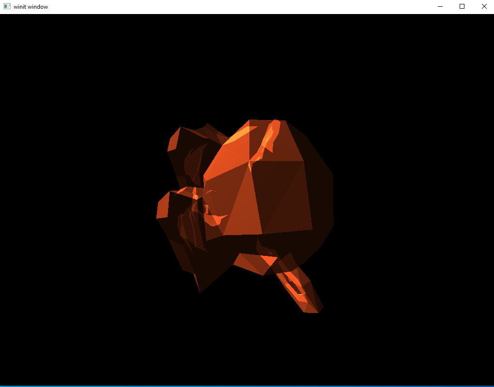
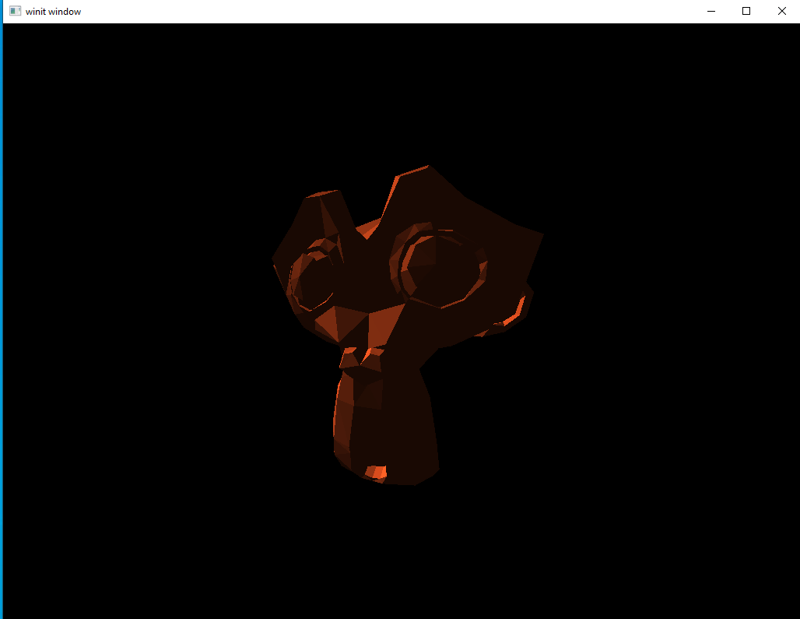

# Model Loading

Until now, we've gotten by with models that we've programmed in by hand. This worked for a triangle and, later, a cube, but we can't keep doing that forever. So let's look at a topic we've been avoiding until now: how to load a model from a file.

## .obj Files

We'll be adding some `.obj` formatted files to our project.

Briefly, this is the format:
```
v x-val y-val z-val
...
vt u-val v-val
...
vn x-val y-val z-val
```
The above is the data section of the file. It lists the model vertices first, each one prefaced with `v`. Then it lists the texture coordinates in the `vt` section. Lastly, it lists the normal vertices in the `vn` section. The order that these are in is important because of the way they are used in the next section
```
f v/vt/vn v/vt/vn v/vt/vn
```
The `face` section lists the index of the three items which make up the face. Each value actually contains information on the vertex, texture vertex, and normal vertex. The second two elements are optional. An example of a face that has no texture or normal data would be:
```
f 3 1 5
```
A face which has normals but no textures would be
```
f 3//1 1//2 5//4
```

A face which has textures but no normals would be
```
f 3/6 1/1 5/7
```

This is only a small sub-set of the total functionality offered by the obj file format. For a more complete understanding, the [Wikipedia page](https://en.wikipedia.org/wiki/Wavefront_.obj_file) is a good place to start.

#### Blender Exporter

I've generated a number of model files and stored them in the folder at `data/models` in the tutorial's root directory. I used Blender to export the shapes and a number of them were provided by default or easily available. The following two images show how I exported the files. I stuck to "simple" models but you should be able to use the same process to produce something more complicated.





In the second picture, notice that "Include UVs" is unchecked. This is entirely optional and, in fact, most of the models here do actually export their UV values. However, these values are used for texturing which is not a subject we will be getting into for a few more lessons now. The two most important options are "triangulate faces" and "keep vertex order." Without these two settings it may produce a file that can't be rendered correctly in a Vulkan application.

Just a short note on Blender itself: it seems to export models with clockwise vertex winding order. The loader discussed in the next section fixes this. However, if you need to read in a file that is already in counter-clockwise order there is an option to turn the "order inversion" off. Read the `impl` section for `ModelBuilder` to find it.

#### File Loader

I created a new module named `obj_loader` where I added code related to loading obj files. I also moved our different vertex type declarations there since they can be used by the loading logic. To be perfectly honest, it's just a toy that does what we need for these lessons and no more. I wrote it as an exercise so you're welcome to use it if you want or not.

## Updating the Code

#### Vertices

Like I mentioned in the other section, I've created new vertex types and moved them to `obj_vector`.

For the purpose of this lesson, we'll be using a type named `NormalVertex`. This is the same as the `Vertex` type we used in the last lesson, just with a more descriptive name. So go through your code and rename instances of `Vertex` with `NormalVertex`.

Another task to do is making sure you use the `impl_vertex!` macro correctly. I wanted to keep all non-standard crates out of `obj_loader` so there is no Vulkano specific code there. That just means we need to have the following somewhere near the start of our `main.rs` file.
```rust
mod obj_loader;
use obj_loader::NormalVertex;

vulkano::impl_vertex!(NormalVertex, position, normal, color);
```

From this point on we can use `NormalVertex` with our Vulkano code as usual.

#### Using Model

I added a `Model` data type to handle loading the obj file as well as keeping track of the model transformation matrix. This is part of the process of moving towards having more than one model on screen, just like we did with lights. That's for another time though, so let's just look at how we use `Model`.

 ```rust
let mut cube = Model::new("data/models/cube.obj").build();
cube.translate(vec3(0.0, 0.0, -2.5));
```

Our first line is how we build a `Model`. We pass it a file name and that gives us a builder in response. The main option we have right now is that we could call `.color([f32; 3])` to change the color of the model. Left unspecified, the default is the same shade of orange we have been using.

The second line replaces our call to setting the `mvp.model` value like we have been in the previous lessons.

```rust
let vertex_buffer = CpuAccessibleBuffer::from_iter(
    device.clone(),
    BufferUsage::all(),
    false,
    cube.data().iter().cloned()).unwrap();
```

This is how we declare our vertex buffer. Instead of using a hard-coded array to hold the vertex data we ask our `Model` instance to give us the array of the data it's loaded. As you can see, it's much nicer-looking than what we had before. This sort of generality means that the same code can handle new model data without needing to be rewritten.

```rust
let uniform_buffer_subbuffer = {
    let elapsed = rotation_start.elapsed().as_secs() as f64 + rotation_start.elapsed().subsec_nanos() as f64 / 1_000_000_000.0;
    let elapsed_as_radians = elapsed * pi::<f64>() / 180.0;
    cube.zero_rotation();
    cube.rotate(elapsed_as_radians as f32 * 50.0, vec3(0.0, 0.0, 1.0));
    cube.rotate(elapsed_as_radians as f32 * 30.0, vec3(0.0, 1.0, 0.0));
    cube.rotate(elapsed_as_radians as f32 * 20.0, vec3(1.0, 0.0, 0.0));

    let uniform_data = deferred_vert::ty::MVP_Data {
        model: cube.model_matrix().into(),
        view: mvp.view.into(),
        projection: mvp.projection.into(),
    };

    uniform_buffer.next(uniform_data).unwrap()
};
```

This is the other major change we're making. You can see that we have moved the rotation logic to the `Model` the same way we did with the translation logic. We call `cube.zero_rotation();` to bring our `Model`'s rotation matrix back to zero. Without zeroing the rotation will accelerate without bounds

#### Running the Code

And that's it! There's a lot of new code on our backend but actually using it is simple. Let's run it and take a look.



At this point, this cube should seem like an old friend. As you can see, I reverted back to using a single white light source but if you left your lighting untouched from the last lesson it should look the same as it did back then.

#### A Side Note on Files

Earlier, I mentioned that our models live in the root directory of the tutorials project space at `vulkano_tutorial/data/models`. This may seem a bit odd if you remember that we load our shaders with code like this:

```rust
mod ambient_vert {
    vulkano_shaders::shader! {
        ty: "vertex",
        path: "src/shaders/ambient.vert"
    }
}
```

Why do we get to store our shaders in the local project directory while our models live in a "global" place? 

The main reason for this is that what files Rust can find depends on *where it's being run from*. Macros like `shader!` aren't "run" in the traditional sense, but they are expanded and resolved at compile time. From the perspective of the Rust compiler working on resolving this macro, the "working directory" is the one the source file is located in. Meanwhile, our models are loaded at *runtime* which means their working directory is whatever directory `cargo` is being run from. Since these tutorials are intended to be run from within the base `vulkano_tutorial` folder, that means all file paths have to be expressed relative to that.

## A More Complicated Example

Let's move on to a more complicated model. Included in our `models` directory is a file for [Suzanne](https://en.wikipedia.org/wiki/Blender_(software)#Suzanne,_the_%22monkey%22_mascot). This is a common [standard reference object](https://en.wikipedia.org/wiki/List_of_common_3D_test_models) used in 3D rendering similar to the famous [Utah teapot](https://en.wikipedia.org/wiki/Utah_teapot). It is also the mascot for the open-source [Blender](https://www.blender.org/) 3D modeling and animation program. The image blow is what Suzanne looks like inside Blender.



Still a pretty simple model, if we go by the number of vertices, but still light-years away from the simple shapes we've been using until this point. Let's add the following changes to our code and then run it.

```rust
let mut cube = Model::new("./src/models/suzanne.obj").build();
cube.translate(vec3(0.0, 0.0, -1.5));
```



Well that's kind of horrifying. What's gone wrong?

#### The Root of the Problem

It looks transparent, doesn't it? You might wonder if the vertex winding might be messed up, so some vertices aren't being shown. Or, possibly, you wonder about our graphics pipeline. Maybe some option there is misconfigured?

The second guess is closer to the answer. Remember that our graphics pipeline is set to render things *additively*. We have multiple vertices facing front and all of them are being drawn. Each face increases the brightness of the area, giving the impression of a transparent model.

Despite what you might think, this problem isn't new. In fact, it's been buried in our code since we first implemented our deferred rendering system. By passing in the full set of geometry data we lead to this case of overlapping drawing. The reason we haven't seen it so far is because, up until now, we've been using shapes in which all faces which were overlapped by other faces were facing away from us. This is the first complex shape we've tried to render.

## Fixing our Rendering System

Remember the core problem with deferred rendering stages: we need to provide *something* to the vertex shaders because the fragment shaders will only execute on pixels that lie in the area covered by faces defined in the vertex shader.

The solution we've been using so far is to just pass it the full set of model vertex data and let it work things out from there. However, what we need is a way to trigger the fragment shaders to run on every pixel on screen. The fix we will be applying here is to pass these deferred stages vertices that form a square that takes up the whole screen. Even though this square isn't actually *rendered* in any way the user will see, the fragment shaders will still run.

#### New Vertex Type

We could continue to use `NormalVertex` for this purpose if we wanted; however, this struct contains a lot of extra data we don't need. For our purposes we actually only need a 2D position vertex. For this, we'll define a new vertex type.

```rust
#[derive(Default, Debug, Clone)]
pub struct DummyVertex {
    pub position: [f32; 2]
}

impl DummyVertex {
    pub fn list() -> [DummyVertex; 6] {
        [
            DummyVertex { position: [-1.0, -1.0] },
            DummyVertex { position: [-1.0, 1.0] },
            DummyVertex { position: [1.0, 1.0] },
            DummyVertex { position: [-1.0, -1.0] },
            DummyVertex { position: [1.0, 1.0] },
            DummyVertex { position: [1.0, -1.0] }
        ]
    }
}
```

Calling `DummyVertex::list()` will return the array of vertices we need to cover the whole screen. We can get away with using these values because the *screen space* only runs from `(-1,-1)` in the top left to `(1,1)` in the bottom left. The transformations we apply to our model move everything to be inside this box. Without applying transformations to our `DummyVertex` square here we will be able to take up the whole screen.

Remember to run the `impl_vertex!` macro for `DummyVertex`.
```rust
vulkano::impl_vertex!(DummyVertex, position);
```

#### Update shaders

We can remove all the position data from our lighting shaders, making everything much simpler.

`ambient.vert`
```glsl
#version 450

layout(location = 0) in vec2 position;

void main() {
    gl_Position = vec4(position, 0,0, 1.0);
}
```

`ambient.frag`
```glsl
#version 450

layout(input_attachment_index = 0, set = 0, binding = 0) uniform subpassInput u_color;
layout(input_attachment_index = 1, set = 0, binding = 1) uniform subpassInput u_normals;

layout(set = 0, binding = 2) uniform Ambient_Data {
    vec3 color;
    float intensity;
} ambient;

layout(location = 0) out vec4 f_color;

void main() {
    vec3 ambient_color = ambient.intensity * ambient.color;
    vec3 combined_color = ambient_color * subpassLoad(u_color).rgb;
    f_color = vec4(combined_color, 1.0);
}
```

Note `Ambient_Data`. Because we removed the MVP uniform we needed to change the `binding` value for `Ambient_Data` to 2 instead of 3

`directional.vert`
```glsl
#version 450

layout(location = 0) in vec2 position;

void main() {
    gl_Position = vec4(position, 0.0, 1.0);
}
```

`directional.frag`
```glsl
#version 450

layout(input_attachment_index = 0, set = 0, binding = 0) uniform subpassInput u_color;
layout(input_attachment_index = 1, set = 0, binding = 1) uniform subpassInput u_normals;

layout(set = 0, binding = 2) uniform Directional_Light_Data {
    vec4 position;
    vec3 color;
} directional;

layout(location = 0) out vec4 f_color;

void main() {
    vec3 light_direction = normalize(directional.position.xyz - subpassLoad(u_normals).xyz);
    float directional_intensity = max(dot(normalize(subpassLoad(u_normals).rgb), light_direction), 0.0);
    vec3 directional_color = directional_intensity * directional.color;
    vec3 combined_color = directional_color * subpassLoad(u_color).rgb;
    f_color = vec4(combined_color, 1.0);
}
```

Note that, as part of removing the need for the MVP matrix and real geometry data we use `subpassLoad(u_normals).xyz` in place of the earlier `frag_pos` variable.

#### Creating our DummyVertex Buffer

To be able to use our square of dummy data, we need to put it inside a `CpuAccessibleBuffer`. Put the following code right after we declare `vertex_buffer`
```rust
let dummy_verts = CpuAccessibleBuffer::from_iter(
    device.clone(),
    BufferUsage::all(),
    false,
    DummyVertex::list().iter().cloned()
).unwrap();
```

#### Updating the SetDescriptor

We can remove `uniform_buffer_subbuffer` from `ambient_set` as well as `directional_set`

```rust
let ambient_layout = ambient_pipeline
    .layout()
    .descriptor_set_layouts()
    .get(0)
    .unwrap();
let ambient_set = PersistentDescriptorSet::new(
    ambient_layout.clone(),
    [
        WriteDescriptorSet::image_view(0, color_buffer.clone()),
        WriteDescriptorSet::buffer(1, ambient_uniform_subbuffer.clone()),
    ],
)
.unwrap();
```

```rust
let directional_layout = directional_pipeline
    .layout()
    .descriptor_set_layouts()
    .get(0)
    .unwrap();
let directional_set = PersistentDescriptorSet::new(
    directional_layout.clone(),
    [
        WriteDescriptorSet::image_view(0, color_buffer.clone()),
        WriteDescriptorSet::image_view(1, normal_buffer.clone()),
        WriteDescriptorSet::buffer(2, directional_uniform_subbuffer.clone()),
    ],
)
.unwrap();
```

#### Updating the Draw Command

Updating the draw commands is simple. Find the draw commands associated with the lighting pass and replace `vertex_buffer` with `dummy_verts`. The following is what my rendering commands look like, remember that I've gone back to using one directional light.
```rust
let mut commands = AutoCommandBufferBuilder::primary(
    device.clone(),
    queue.family(),
    CommandBufferUsage::OneTimeSubmit,
)
.unwrap();
commands
    .begin_render_pass(
        framebuffers[image_num].clone(),
        SubpassContents::Inline,
        clear_values,
    )
    .unwrap()
    .set_viewport(0, [viewport.clone()])
    .bind_pipeline_graphics(deferred_pipeline.clone())
    .bind_descriptor_sets(
        PipelineBindPoint::Graphics,
        deferred_pipeline.layout().clone(),
        0,
        deferred_set.clone(),
    )
    .bind_vertex_buffers(0, vertex_buffer.clone())
    .draw(vertex_buffer.len() as u32, 1, 0, 0)
    .unwrap()
    .next_subpass(SubpassContents::Inline)
    .unwrap()
    .bind_pipeline_graphics(directional_pipeline.clone())
    .bind_descriptor_sets(
        PipelineBindPoint::Graphics,
        directional_pipeline.layout().clone(),
        0,
        directional_set.clone(),
    )
    .bind_vertex_buffers(0, dummy_verts.clone())
    .draw(dummy_verts.len() as u32, 1, 0, 0)
    .unwrap()
    .bind_pipeline_graphics(ambient_pipeline.clone())
    .bind_descriptor_sets(
        PipelineBindPoint::Graphics,
        ambient_pipeline.layout().clone(),
        0,
        ambient_set.clone(),
    )
    .bind_vertex_buffers(0, dummy_verts.clone())
    .draw(dummy_verts.len() as u32, 1, 0, 0)
    .unwrap()
    .end_render_pass()
    .unwrap();
let command_buffer = commands.build().unwrap();
```

#### Running the Code

Let's execute the code and see what happens.



There's the friendly and slightly pointy monkey we were hoping for. With our new ability to load complex models, we've taken a major step towards our goal of a working rendering system.

[lesson source code](https://github.com/taidaesal/vulkano_tutorial/tree/gh-pages/lessons/9.%20Model%20Loading)